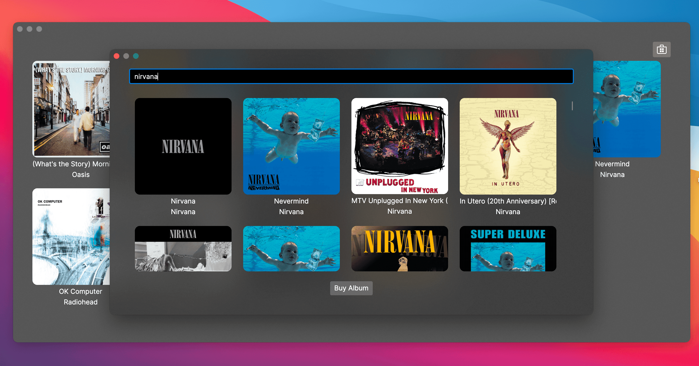
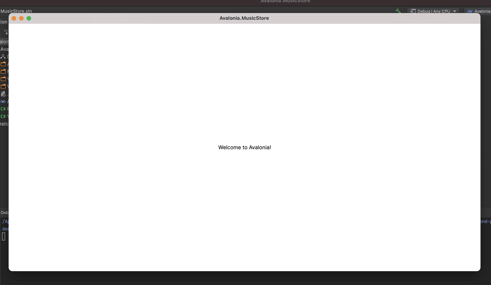
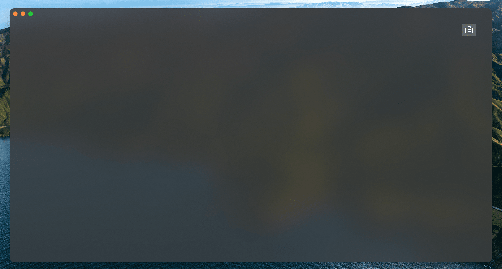

= Music Store App
// --- D O N ' T    T O U C H   T H I S    S E C T I O N ---
ifndef::env-github[]
:toc: left
endif::[]

ifdef::env-github[]
:toc:
:toc-placement!:
endif::[]

ifdef::env-github[]
:tip-caption: :bulb:
:note-caption: :information_source:
:important-caption: :heavy_exclamation_mark:
:caution-caption: :fire:
:warning-caption: :warning:
endif::[]

ifndef::env-github[]
:icons: font
endif::[]
// ----------------------------------------------------------


// Write a short summary here what this examples does
In this tutorial you will create a desktop app based on the idea of a music store.  The app is highly graphical - it presents images of album covers, and uses semi-transparent 'acrylic' blurred window backgrounds to give a very up-to-date look. By the end of the tutorial, you will be able search the iTunes online list of albums, and select albums for your own list.

[[final_result,finished app]]


// --- D O N ' T    T O U C H   T H I S    S E C T I O N ---
toc::[]
// ---------------------------------------------------------


[discrete]
=== Difficulty
// Choose one of the below difficulties. You can just delete the ones you don't need.

🐥 Easy 🐥


[discrete]
=== Buzz-Words

// Write some buzz-words here. You can separate them by ", "

Music Store, Complete App, CommunityToolkit.MVVM, Mvvm.Messaging, Styles, ObservableProperty, Commands, iTunes Api


== Before we start

In this tutorial you will learn how to use the MVVM pattern with the https://learn.microsoft.com/en-us/dotnet/communitytoolkit/mvvm/[[MVVM community toolkit\]] to manage multiple application windows. Also you will use advanced asynchronous techniques to implement the album search and other features, so that application responsiveness is maintained.

WARNING: This is a more advanced tutorial. The 'To Do List App' is a recommended prerequisite if you have limited experience with the MVVM pattern. Read about the 'To Do List App' tutorial link:../../CompleteApps/SimpleToDoList[[here\]].

NOTE: For information and background on the concept of the MVVM pattern, see https://docs.avaloniaui.net/docs/concepts/the-mvvm-pattern/[[here\]].

NOTE: This tutorial contains instructions for using the _Rider_ IDE on macOS; however the steps will be similar on other operating systems, and using other IDEs such as Visual Studio on _Microsoft Windows_.

This sample assumes that you have a basic knowledge about the following topics:

- Some basics about C# and https://docs.avaloniaui.net/docs/get-started/test-drive/[[XAML\]]
- What the link:../../MVVM/BasicMvvmSample[[MVVM -pattern\]] (Model-View-ViewModel) is and how it works
- What a link:../../MVVM/CommandSample[[Command\]] is and how it works
- What a link:https://learn.microsoft.com/en-us/dotnet/api/system.collections.objectmodel.observablecollection-1?view=net-8.0[[ObservableCollection\]] is and how it works

TIP: Some sections are optional. You can skip these if you want to.


// _______ FORMER DOCS::


=== MVVM pattern
For information and background on the concept of the MVVM pattern, refer to the official documentation link:https://docs.avaloniaui.net/docs/concepts/the-mvvm-pattern/[here].


// -- End Former docs
== The Solution

=== 1, Create a New Project

On this page you will lean how to create a new project for the app.

==== JetBrains Rider

Before you start, check you have installed the _Avalonia UI_ solution templates for _JetBrains Rider_.

NOTE: For full instructions on preparing _JetBrains Rider_ for developing with _Avalonia UI_, see https://docs.avaloniaui.net/docs/reference/jetbrains-rider-ide/jetbrains-rider-setup[[here\]].

With the solution templates installed, begin this tutorial by following these instructions:

. On the **Welcome to JetBrains Rider** screen, click **New Solution**.
. From the project types list on the left, locate and click **Avalonia .NET MVVM App**. It will be under the section **Other**.
. In _Advanced Settings_ section change the **MVVM Toolkit** option to CommunityToolkit.
. Enter the **Solution name** as 'Avalonia.MusicStore'.
. Click **Create**.

image::_docs/1_rider_new_proj.png[Create a new project]

A new project will be created with the following solution folders and files:

image::_docs/2_rider_proj_structure.png[This is the structure of the creates project]

Let's make sure you use correct version of CommunityToolkit.Mvvm:
 - Locate project file Avalonia.MusicStore.csproj
 - Right-click on the project name in the Solution Explorer.
 - Select 'Edit' -> 'Edit Avalonia.MusicStore.csproj'

image::_docs/3_rider_update_dependencies.png[Edit the .csproj-file to update the dependencies]

In the opened .csproj file, ensure you have the correct CommunityToolkit.Mvvm package version no older than 8.4.0 and 
Avalonia version no older than 11.3.0.
```xml
<PackageReference Include="Avalonia" Version="11.3.0" />
<PackageReference Include="Avalonia.Desktop" Version="11.3.0" />
<PackageReference Include="Avalonia.Themes.Fluent" Version="11.3.0" />
<PackageReference Include="CommunityToolkit.Mvvm" Version="8.4.0" />
```
In the same file enable preview C# language features:
- Within the _PropertyGroup_ section, add the following line:
```xml
<LangVersion>preview</LangVersion>
```

// TODO: We may want to use nuget package manager here. Need to review this later.  

This setting enables support for the latest C# features required by this tutorial, including partial properties introduced in C# 13.

Now take some time to review the files and folders that the solution template created. You will see that the following the MVVM pattern, these folders were created:

[cols="20h,~"]
|===
| Folder Name |Description 

|Assets
|Contains any embedded assets that are compiled into the program. `Images`, `Icons`, `Fonts` etc, anything that the UI 
Folder Name	Description
might need to display,

|Models
|This is an empty folder for code that is the 'model' part of the MVVM pattern. This often contains everything else the app needs that is not part of the UI. For example: interaction with a database, Web API, or  interfaces with a hardware device. 

|View Models
|This is a folder for all the view models in the project, and it already contains an example. View models contain the application logic in the MVVM pattern. For example: a button is enabled only when the user has typed something; or open a dialog when the user clicks here; or show an error if the user enters too high a number type of logic in this input.

|Views
|This is a folder for all the views in the project, and it already contains the view for the application main window. Views in the MVVM pattern contain only the presentation for the application; that is layout and form, fonts, colors, icons and images. In MVVM they have only enough code to link them to the view model layer. In _Avalonia UI_ there is only enough code to manage windows and dialogs here.
|===


NOTE: To explore the concepts behind the MVVM pattern, and when is appropriate to use it, see https://docs.avaloniaui.net/docs/concepts/the-mvvm-pattern/[[Avalonia-docs\]]

The solution template has created enough files for the application to run. You will meet all of these during the rest of this tutorial.   

==== Run the Project

Press the debug button (  ) top-right of the IDE to compile and run the project.

This will show a window that looks like:



It is a little plain - but you now have a running application, and a blank canvas to start developing with. On the next page you will learn how to add a modern-looking acrylic blur dark background.

=== Window Styling

Now, you will make the main window look modern by applying a dark theme, and an acrylic blur to the window background.

==== Dark Mode

Follow this procedure to style the main window in 'dark' mode:

- Stop the app if it is still running.
- Locate and open the file **App.axaml**.
- In the XAML, change the `RequestedThemeVariant` attribute in the `<Application>` element from "Default" to "Dark"

```xml
<Application ...
    RequestedThemeVariant="Dark">
```

- Now locate and open the **MainWindow.axaml** file in the **/Views** folder.

NOTE: Notice that the preview pane is still showing the window in 'light' mode. The application will require a rebuild for the new mode to show in the preview pane. 

- Click **Build Startup Project** on the **Build** menu.

The preview pane now changes to the dark mode.

image:_docs/6_DarkMode.png[Previewer showing the dark mode]

==== Acrylic Blur

Follow this procedure to style the background of the main window with an acrylic blur:

- Locate and open the **MainWindow.axaml** file in the **/Views** folder.
- Find the end of the opening tag of the `<Window>` element.
- After the `Title="Avalonia.MusicStore"` attribute, add two new attributes as follows:

```xml
<Window ...
        Title="Avalonia.MusicStore"

        TransparencyLevelHint="AcrylicBlur"
        Background="Transparent">
```

- To apply the acrylic effect to the whole window, replace the `<TextBlock>` element in the content zone of the main window with the following XAML for a panel:

```xml
<Window ... >
       <Panel>
           <ExperimentalAcrylicBorder IsHitTestVisible="False">
               <ExperimentalAcrylicBorder.Material>
                   <ExperimentalAcrylicMaterial
                       BackgroundSource="Digger"
                       TintColor="Black"
                       TintOpacity="1"
                       MaterialOpacity="0.65" />
               </ExperimentalAcrylicBorder.Material>
           </ExperimentalAcrylicBorder>
       </Panel>
   </Window>
```

- Click **Debug** (top right of the IDE) to compile and run the project.

image:_docs/7_AcrylicBlur.png[Acrylic materia applied]

Notice that, as expected, the acrylic window effect covers the content zone of the main window. However the effect does not yet extend to the title bar.

WARNING: Note that _Linux_ users can not yet take advantage of the following code due to limitations of the X11 version. The tutorial code will run and the window will still work on _Linux_, but the full effect will not be realised.

Follow this procedure to extend the acrylic blur effect onto the title bar:

- Stop the app if is still running.
- Find the end of the opening tag of the `<Window>` element again.
- Add the `ExtendClientAreaToDecorationsHint` attribute as shown:

```xml
   <Window ...
           TransparencyLevelHint="AcrylicBlur"
           Background="Transparent"

           ExtendClientAreaToDecorationsHint="True">
```

- Click **Debug** to compile and run the project.

image:_docs/8_FullAcrylicWindow.png[Fully acrylic window]

Now you have the acrylic blur effect extending into the title bar.


=== Add and Layout Controls

The main window of the app will eventually show a list of album covers in the user's collection, with a button at its top-right corner to allow the user to add a new album. The button will open a search dialog window to find new albums to add.

On this page you will learn how to layout the main window so that the button appears at its top-right corner, as required.

==== Button Layout

To display a button in the content zone of the main window, follow this procedure:

- Stop the app if it is still running.
- Locate and open the **MainWindow.axaml** file.
- Inside the panel element, add the following XAML for a button. The panel XAML should look like this:

```xml
<Panel>
    <ExperimentalAcrylicBorder IsHitTestVisible="False">
        <ExperimentalAcrylicBorder.Material>
            <ExperimentalAcrylicMaterial
                 BackgroundSource="Digger"
                 TintColor="Black"
                 TintOpacity="1"
                 MaterialOpacity="0.65" />
        </ExperimentalAcrylicBorder.Material>
     </ExperimentalAcrylicBorder>

     <Button Content="Buy Music"/>
</Panel>
```

- Click **Debug** to compile and run the project.

image:_docs/9_Button_added_but_wrong_location.png[Added the button to buy new music.]

You will see the button, but it is in the default position and not at the top-right of the window as required.

Follow this procedure to position the button correctly:

- Stop the app if it is still running
- Wrap the button element in a new panel element.
- Add a margin attribute to the new panel element, with a value of 40. 
- Add horizontal and vertical alignment attributes to the button element, as shown:

```xml
<Panel Margin="40">
  <Button Content="Buy Music" 
          HorizontalAlignment="Right" VerticalAlignment="Top" />
</Panel>
```

You should see all these changes reflected in the preview pane as you add them.

==== Button Icon

Have a look back at the image of the <<final_result>>. You will see that the button shows an icon, and not text (as it currently does). This is actually the Microsoft Store icon from the Fluent Icons collection, and _Avalonia UI_ has definitions for all these for you to use.

To use the Microsoft Store icon, follow this procedure:

- Navigate to the _Avalonia UI_ _GitHub_ to find the list of Fluent Icons at https://avaloniaui.github.io/icons.html
- Use your browser's text search to locate the name of the icon 'store\_microsoft\_regular'. There should be some code similar to:

```xml
<StreamGeometry x:Key="store_microsoft_regular">M11.5 9.5V13H8V9.5H11.5Z M11.5 17.5V14H8V17.5H11.5Z M16 9.5V13H12.5V9.5H16Z M16 17.5V14H12.5V17.5H16Z M8 6V3.75C8 2.7835 8.7835 2 9.75 2H14.25C15.2165 2 16 2.7835 16 3.75V6H21.25C21.6642 6 22 6.33579 22 6.75V18.25C22 19.7688 20.7688 21 19.25 21H4.75C3.23122 21 2 19.7688 2 18.25V6.75C2 6.33579 2.33579 6 2.75 6H8ZM9.5 3.75V6H14.5V3.75C14.5 3.61193 14.3881 3.5 14.25 3.5H9.75C9.61193 3.5 9.5 3.61193 9.5 3.75ZM3.5 18.25C3.5 18.9404 4.05964 19.5 4.75 19.5H19.25C19.9404 19.5 20.5 18.9404 20.5 18.25V7.5H3.5V18.25Z</StreamGeometry>
```

- Copy all of the code for the icon.
- In the Rider solution explorer, right-click the project.
- Click **Add**, then click  **Avalonia Resources**

// TODO: <p></p>

- Enter the **Name** 'Icons', press enter.
- Locate and open the new **Icons.axaml** file that is created. The XAML will look like this:

```xml
<ResourceDictionary xmlns="https://github.com/avaloniaui"
                    xmlns:x="http://schemas.microsoft.com/winfx/2006/xaml">
    <Design.PreviewWith>
        <!-- Here we can add some controls for the previewer -->
    </Design.PreviewWith>
    
    <!-- Add the resources here. -->

</ResourceDictionary>
```

- Paste your icon code inside the `<ResourceDictionary>`. 

TIP: Remember that each node needs the `x:Key` provided. 

The icons file now looks like this:

```xml
<ResourceDictionary xmlns="https://github.com/avaloniaui"
                    xmlns:x="http://schemas.microsoft.com/winfx/2006/xaml">
    <Design.PreviewWith>
        <Border Padding="20">
            <StackPanel Spacing="5">
                <PathIcon Data="{StaticResource store_microsoft_regular}"></PathIcon>
                <PathIcon Data="{StaticResource music_regular}"></PathIcon>
            </StackPanel>
        </Border>
    </Design.PreviewWith>
    
    <StreamGeometry x:Key="store_microsoft_regular"> [ ... Add the path data here ... ] </StreamGeometry>
    <StreamGeometry x:Key="music_regular"> [ ... Add the path data here ... ] </StreamGeometry>
    
</ResourceDictionary>
```

TIP: Most of the time the path can be also copied from any svg-path.

With a new icons file prepared, you must now include it in your app.

Follow this procedure to include the icons file:

- Locate and open the **App.axaml** file.
- Add a `<ResourceDictionary>` element with a `<ResourceInclude>` as shown:

```xml
<Application.Resources>
    <ResourceDictionary>
        <ResourceDictionary.MergedDictionaries>
            <ResourceInclude Source="avares://Avalonia.MusicStore/Icons.axaml" />            
        </ResourceDictionary.MergedDictionaries>
    </ResourceDictionary>
</Application.Resources>
```

You need to build the application so that the icons become available to the preview pane.

To change the button from text to icon content, follow this procedure:

- Locate and open the **MainWindow.axaml** file.
- Alter the XAML for the button, as shown:

```xml
<Button HorizontalAlignment="Right" VerticalAlignment="Top">       
    <PathIcon Data="{StaticResource store_microsoft_regular}" /> 
</Button>
```

- Click **Debug** to compile and run the project.



=== Button Command

So far in this tutorial, you have altered only files from the view part of the MVVM pattern (for the main window and app). In this section you will learn how to link the button in the view for the main window, to a command in the view model. This will cause user interaction with the view (in this case a button click) to have an effect in the application logic of the view model.

When you develop with _Avalonia UI_ and the MVVM pattern, the solution template will give you a choice of MVVM toolkits. This tutorial now uses _CommunityToolkit.Mvvm_, and the solution template has already added the necessary packages.

==== RelayCommand

The first step in linking the view and view model is to make the view model able to accept a command. You will achieve this by adding a method to the main window view model and decorating it with the `[RelayCommand]` attribute, which will generate a bindable `ICommand` property, which can be referenced from your view.
Follow this procedure:

- Stop the app if it is still running.
- Locate and open the **MainWindowViewModel.cs** file in the **/ViewModels** folder.
- Delete the existing content of the class, and add the code shown:

```csharp
using CommunityToolkit.Mvvm.ComponentModel;
using CommunityToolkit.Mvvm.Input;
using System.Threading.Tasks;

namespace Avalonia.MusicStore.ViewModels
{
    public partial class MainViewModel : ObservableObject
    {
        public MainViewModel()
        {
            // ViewModel initialization logic.
        }

        [RelayCommand]
        private async Task AddAlbumAsync()
        {
            // Code here will be executed when the button is clicked.
        }
    }
}
```
==== How it works
The `[RelayCommand]` attribute generates a public property for you at compile time named `AddAlbumCommand`, which implements `ICommand`.

This means that even though you only wrote a method named `AddAlbumAsync`, Avalonia's data-binding system can bind directly to `AddAlbumCommand` in your AXAML — without you writing any boilerplate command logic.

- Now place a debug breakpoint at the opening curly brace inside the `AddAlbumAsync()` method.

To complete the link from the view to your new `AddAlbumAsync` view model property, you will add a data binding to the button.

NOTE: For more information about the concept of data binding, see https://docs.avaloniaui.net/docs/basics/data/data-binding[[here\]].

To add the button data binding, follow this procedure:

- Locate and open the **MainWindow.axaml** file.
- Find the XAML for the button and add the command attribute and binding, as shown:

```xml
<Button HorizontalAlignment="Right" VerticalAlignment="Top"
        Command="{Binding AddAlbumCommand}">
    <PathIcon Data="{StaticResource store_microsoft_regular}"/>
</Button>
```

==== Why it is `AddAlbumCommand`?
The `[RelayCommand]` attribute automatically generates command properties based on your method names. If your method name ends with _Async_, the generator removes the _Async_ suffix and appends _Command_ to form the property name.
If the method returns a Task, `[RelayCommand]` automatically generates an `IAsyncRelayCommand` instead of a regular `IRelayCommand`, giving you full support for asynchronous execution.
This means:
- If your method is named `AddAlbumAsync`, the generated property will be called `AddAlbumCommand`.
- If your method is named `AddAlbum`, it also becomes `AddAlbumCommand`.

NOTE: Learn more about asynchronous `RelayCommand` generation in https://learn.microsoft.com/en-us/dotnet/communitytoolkit/mvvm/generators/relaycommand#asynchronous-commands[[the official docs\]].

The `Command` property of an _Avalonia UI_ button determines what happens when the button is clicked. In this case it binds to the `AddAlbumCommand` generated in your view model, causing the `AddAlbumAsync` method to run.

- Click **Debug** to compile and run the project.
- Click the icon button.

You will see the app stop executing at the breakpoint you previously set in the view model.


=== Open a Dialog

On this page you will learn how to open dialog window in your app and exchange data between windows using Mvvm.Messaging. The dialog will be used to search for and select an album to add to a list in the main window.

Several messages will be used in your app:

PurchaseAlbumMessage:: sent by the main view model to request the dialog window be shown and await a result.
MusicStoreClosedMessage:: sent by the dialog's view model when the user selects an album, to return the result and close the dialog.
CheckAlbumAlreadyExistsMessage:: sent by the dialog's view model before sending the `MusicStoreClosedMessage` to the main view model in order to make sure the album is not yet present. This part is optional 
NotificationMessage:: sent by the main view model to display a notification, for example when an album was bought successfully. This part is optional.

Below is a diagram showing the message flow between the components that you are going to implement in the next steps:

// Todo: think about this part further. Maybe a SVG is better suited? 
```mermaid
graph TD;
    A[MainWindowViewModel] -->|Send PurchaseAlbumMessage| B(MainWindow)
    B -->|Show MusicStoreWindow<br>await AlbumViewModel| C[MusicStoreWindow]
    C -->|BuyMusic| D[MusicStoreViewModel]
    D -->|Send MusicStoreClosedMessage<br>with SelectedAlbum| C
    C -->|Close dialog<br>return SelectedAlbum| B
    B -->|Reply with AlbumViewModel| A
```

=== Add a New Dialog Window

There is nothing special about a window view file that makes it into a dialog; that is up to the way in which the window is controlled by the app. You will use Avalonia UI features and _CommunityToolkit.Mvvm_ to manage this. So the first step is to create a new window for the app.

To create a new window, follow this procedure:

- Stop the app if it is still running.
- In the solution explorer, right-click the **/Views** folder and then click **Add**.
- Click **Avalonia Window**.
- When prompted for the name, type 'MusicStoreWindow'
- Press enter.

image:_docs/11_add_new_window.png[Add a new window]

==== Dialog Window Styling

To style the new dialog window so that it matches the main window, follow this procedure:

- Locate and open the **MusicStoreWindow.axaml** file.
- Change this code as follows to add the acrylic blur background, extended into the title bar (as before) as shown:

```xml
<Window xmlns="https://github.com/avaloniaui"
        xmlns:x="http://schemas.microsoft.com/winfx/2006/xaml"
        xmlns:d="http://schemas.microsoft.com/expression/blend/2008"
        xmlns:mc="http://schemas.openxmlformats.org/markup-compatibility/2006"
        mc:Ignorable="d" d:DesignWidth="800" d:DesignHeight="450"
        x:Class="Avalonia.MusicStore.Views.MusicStoreWindow"
        Title="MusicStoreWindow"
        TransparencyLevelHint="AcrylicBlur"
        ExtendClientAreaToDecorationsHint="True">
    <Panel>
        <ExperimentalAcrylicBorder IsHitTestVisible="False">
            <ExperimentalAcrylicBorder.Material>
                <ExperimentalAcrylicMaterial
                    BackgroundSource="Digger"
                    TintColor="Black"
                    TintOpacity="1"
                    MaterialOpacity="0.65" />
            </ExperimentalAcrylicBorder.Material>
        </ExperimentalAcrylicBorder>

        <Panel Margin="40">

        </Panel>
    </Panel>
</Window>
```

==== Dialog Input and Output

The application logic for the dialog will be controlled by its own view model. This will be created and linked to the dialog window view whenever the dialog is to be shown.

Similarly, the result of the users interaction with the dialog will eventually have to be passed back to the application logic for the main window for processing.

At this stage you will create two empty view model classes to act as placeholders for the dialog view model, and the dialog return (selected album) object. To create these view models, follow this procedure:

- In the solution explorer, right-click the **/ViewModels** folder and then click **Add**.
- Click **Class**.
- Name the class 'MusicStoreViewModel' and click **Add**.
- Right-click again the **/ViewModels** folder and then click **Add** a second time.
- Click **Class**.
- Name the class 'AlbumViewModel' and click **Add**.

=== Show Dialog

Now that you have a new window `MusicStoreWindow` and the corresponding view models `MusicStoreViewModel` and `AlbumViewModel`.
You are going to complete the logic so that:

* The main window view model sends a message requesting the dialog to be shown.
* The main window view receives that message, opens the dialog, and returns the result.

Below is how this works step-by-step using the CommunityToolkit.Mvvm messaging API.

==== Define the PurchaseAlbumMessage
- In the project root directory create new folder **/Messages** 
- In the newly created **/Messages** folder add a class **PurchaseAlbumMessage**.

First, you are going to define a message class called `PurchaseAlbumMessage` that carries an `AlbumViewModel` response. 
This message will be sent by the view model when it needs to show the dialog.

- Open **PurchaseAlbumMessage.cs** and add the following code there:

```csharp
using Avalonia.MusicStore.ViewModels;
using CommunityToolkit.Mvvm.Messaging.Messages;

namespace Avalonia.MusicStore.Messages;

public class PurchaseAlbumMessage : AsyncRequestMessage<AlbumViewModel?>;

```
_`AsyncRequestMessage<T>`_ lets you send a request and await a reply of type T (in our case, AlbumViewModel?).

==== Register the Message Handler in  MainWindow
In _MainWindow.axaml.cs_ register a handler for `PurchaseAlbumMessage`. This handler runs whenever the view model sends that message. Its job is to:

- Create the dialog window.
- Assign `MusicStoreViewModel` as its DataContext.
- Call `ShowDialog<AlbumViewModel?>` and pass the result back via m.Reply(...).

Open _MainWindow.axaml.cs_ and add the following code into MainWindow constructor:
```csharp
        public MainWindow()
        {
            InitializeComponent();

            if (Design.IsDesignMode)
                return;
            
            // Whenever 'Send(new PurchaseAlbumMessage())' is called, invoke this callback on the MainWindow instance:
            WeakReferenceMessenger.Default.Register<MainWindow, PurchaseAlbumMessage>(this, static (w, m) =>
            {
                // Create an instance of MusicStoreWindow and set MusicStoreViewModel as its DataContext.
                var dialog = new MusicStoreWindow
                {
                    DataContext = new MusicStoreViewModel()
                };
                // Show dialog window and reply with returned AlbumViewModel or null when the dialog is closed.
                m.Reply(dialog.ShowDialog<AlbumViewModel?>(w));
            });
        }
```

==== Send the Message from the ViewModel
Now, update the `AddAlbumAsync()` method inside `MainWindowViewModel` to send `PurchaseAlbumMessage` when the user clicks on the store button.
- Open **MainWindowViewModel.cs**
- Locate the `AddAlbumAsync()` method that we added in the previous steps.
- Edit `AddAlbumAsync()` as shown:
```csharp
[RelayCommand]
private async Task AddAlbumAsync()
{
    // Send the message to the previously registered handler and await the selected album
    var album = await WeakReferenceMessenger.Default.Send(new PurchaseAlbumMessage());
}
```
Now:
- Click **Debug** to compile and run the project.
- Click the icon button.

It all works - but the dialog window opens at the same size as the main window, and offset from it.

==== Dialog Position and Size

In the last step here, you will make the dialog smaller that the main window, and open centered on it. You will also make the main window open in the center of the user's screen.

Follow this procedure:

- Stop the app if it is still running.
- Locate and open the **MainWindow.axaml** file.
- Add an attribute to the `<Window>` element to set the start-up position:

```xml
<Window ...
    WindowStartupLocation="CenterScreen">
```

- Locate and open the **MusicStoreWindow.axaml** file.
- Add attributes for the width and height of the dialog, set at 1000 and 550 respectively.
- Add the start-up position attribute set to `CenterOwner`, as shown:

```xml
<Window ...
    Width="1000" Height="550"
    WindowStartupLocation="CenterOwner">
```

- Click **Debug** to compile and run the project.
- Click the icon button.

image:_docs/12_opened_dialog.png[dialog window shows up for the first time]

The dialog window is now opened centered inside the main window.


== Related 

This sample has shown some basics about custom controls. If you want to use this control in production you may want to improve it further, for example:

- Add it into a controls library
- Add keyboard support
- Add unit tests
- Add animations
- Add an event for value changed
