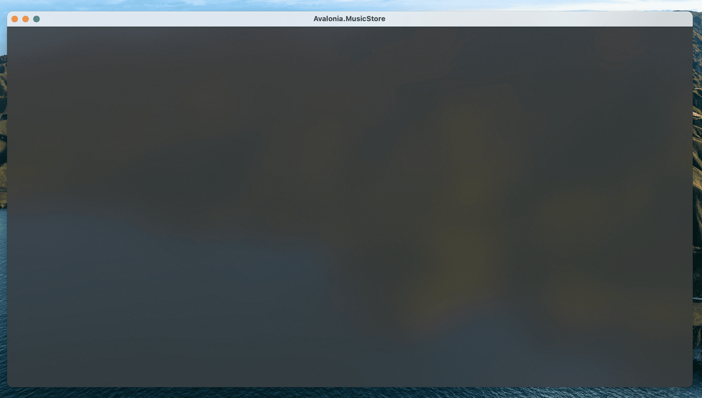
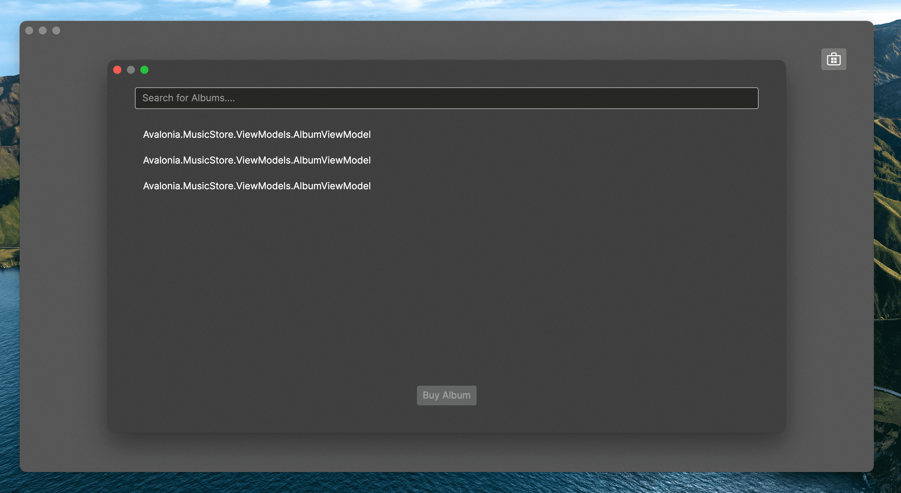

= Music Store App
// --- D O N ' T    T O U C H   T H I S    S E C T I O N ---
ifndef::env-github[]
:toc: left
endif::[]

ifdef::env-github[]
:toc:
:toc-placement!:
endif::[]

ifdef::env-github[]
:tip-caption: :bulb:
:note-caption: :information_source:
:important-caption: :heavy_exclamation_mark:
:caution-caption: :fire:
:warning-caption: :warning:
endif::[]

ifndef::env-github[]
:icons: font
endif::[]
// ----------------------------------------------------------


// Write a short summary here what this examples does
In this tutorial you will create a desktop app based on the idea of a music store.  The app is highly graphical - it presents images of album covers, and uses semi-transparent 'acrylic' blurred window backgrounds to give a very up-to-date look. By the end of the tutorial, you will be able search the iTunes online list of albums, and select albums for your own list.

[[final_result,finished app]]
image::_docs/initial_preview.png[This is how the final App should look like]

// --- D O N ' T    T O U C H   T H I S    S E C T I O N ---
toc::[]
// ---------------------------------------------------------


[discrete]
=== Difficulty
// Choose one of the below difficulties. You can just delete the ones you don't need.

🐥 Easy 🐥


[discrete]
=== Buzz-Words

// Write some buzz-words here. You can separate them by ", "

Music Store, Complete App, CommunityToolkit.MVVM, Mvvm.Messaging, Styles, ObservableProperty, Commands, iTunes Api


== Before we start

In this tutorial you will learn how to use the MVVM pattern with the https://learn.microsoft.com/en-us/dotnet/communitytoolkit/mvvm/[[MVVM community toolkit\]] to manage multiple application windows. Also you will use advanced asynchronous techniques to implement the album search and other features, so that application responsiveness is maintained.

WARNING: This is a more advanced tutorial. The 'To Do List App' is a recommended prerequisite if you have limited experience with the MVVM pattern. Read about the 'To Do List App' tutorial link:../../CompleteApps/SimpleToDoList[[here\]].

NOTE: For information and background on the concept of the MVVM pattern, see https://docs.avaloniaui.net/docs/concepts/the-mvvm-pattern/[[here\]].

NOTE: This tutorial contains instructions for using the _Rider_ IDE on macOS; however the steps will be similar on other operating systems, and using other IDEs such as Visual Studio on _Microsoft Windows_.

This sample assumes that you have a basic knowledge about the following topics:

- Some basics about C# and https://docs.avaloniaui.net/docs/get-started/test-drive/[[XAML\]]
- What the link:../../MVVM/BasicMvvmSample[[MVVM -pattern\]] (Model-View-ViewModel) is and how it works
- What a link:../../MVVM/CommandSample[[Command\]] is and how it works
- What a link:https://learn.microsoft.com/en-us/dotnet/api/system.collections.objectmodel.observablecollection-1?view=net-8.0[[ObservableCollection\]] is and how it works

TIP: Some sections are optional. You can skip these if you want to.


// _______ FORMER DOCS::


=== MVVM pattern
For information and background on the concept of the MVVM pattern, refer to the official documentation link:https://docs.avaloniaui.net/docs/concepts/the-mvvm-pattern/[here].


// -- End Former docs
== The Solution

=== 1, Create a New Project

On this page you will lean how to create a new project for the app.

==== JetBrains Rider

Before you start, check you have installed the _Avalonia UI_ solution templates for _JetBrains Rider_.

NOTE: For full instructions on preparing _JetBrains Rider_ for developing with _Avalonia UI_, see https://docs.avaloniaui.net/docs/reference/jetbrains-rider-ide/jetbrains-rider-setup[[here\]].

With the solution templates installed, begin this tutorial by following these instructions:

. On the **Welcome to JetBrains Rider** screen, click **New Solution**.
. From the project types list on the left, locate and click **Avalonia .NET MVVM App**. It will be under the section **Other**.
. In _Advanced Settings_ section change the **MVVM Toolkit** option to CommunityToolkit.
. Enter the **Solution name** as 'Avalonia.MusicStore'.
. Click **Create**.


A new project will be created with the following solution folders and files:

image::_docs/2_rider_proj_structure.png[This is the structure of the creates project]

Let's make sure you use correct version of CommunityToolkit.Mvvm:
 - Locate project file Avalonia.MusicStore.csproj
 - Right-click on the project name in the Solution Explorer.
 - Select 'Edit' -> 'Edit Avalonia.MusicStore.csproj'


[[prepare-project-for-partial-properties, Setup the project]]
In the opened .csproj file, ensure you have the correct CommunityToolkit.Mvvm package version no older than 8.4.0 and 
Avalonia version no older than 11.3.0.
```xml
<PackageReference Include="Avalonia" Version="11.3.0" />
<PackageReference Include="Avalonia.Desktop" Version="11.3.0" />
<PackageReference Include="Avalonia.Themes.Fluent" Version="11.3.0" />
<PackageReference Include="CommunityToolkit.Mvvm" Version="8.4.0" />
```
In the same file enable preview C# language features:
- Within the _PropertyGroup_ section, add the following line:
```xml
<LangVersion>preview</LangVersion>
```

// TODO: We may want to use nuget package manager here. Need to review this later.  

This setting enables support for the latest C# features required by this tutorial, including partial properties introduced in C# 13.

Now take some time to review the files and folders that the solution template created. You will see that the following the MVVM pattern, these folders were created:

[cols="20h,~"]
|===
| Folder Name |Description 

|Assets
|Contains any embedded assets that are compiled into the program. `Images`, `Icons`, `Fonts` etc, anything that the UI 
Folder Name	Description
might need to display,

|Models
|This is an empty folder for code that is the 'model' part of the MVVM pattern. This often contains everything else the app needs that is not part of the UI. For example: interaction with a database, Web API, or  interfaces with a hardware device. 

|View Models
|This is a folder for all the view models in the project, and it already contains an example. View models contain the application logic in the MVVM pattern. For example: a button is enabled only when the user has typed something; or open a dialog when the user clicks here; or show an error if the user enters too high a number type of logic in this input.

|Views
|This is a folder for all the views in the project, and it already contains the view for the application main window. Views in the MVVM pattern contain only the presentation for the application; that is layout and form, fonts, colors, icons and images. In MVVM they have only enough code to link them to the view model layer. In _Avalonia UI_ there is only enough code to manage windows and dialogs here.
|===


NOTE: To explore the concepts behind the MVVM pattern, and when is appropriate to use it, see https://docs.avaloniaui.net/docs/concepts/the-mvvm-pattern/[[Avalonia-docs\]]

The solution template has created enough files for the application to run. You will meet all of these during the rest of this tutorial.   

==== Run the Project

Press the debug button ( image:_docs/4_rider_debug_button.png[Debug Button] ) top-right of the IDE to compile and run the project.

This will show a window that looks like:

image::_docs/5_first_run.png[First run]

It is a little plain - but you now have a running application, and a blank canvas to start developing with. On the next page you will learn how to add a modern-looking acrylic blur dark background.

=== Window Styling

Now, you will make the main window look modern by applying a dark theme, and an acrylic blur to the window background.

==== Dark Mode

Follow this procedure to style the main window in 'dark' mode:

- Stop the app if it is still running.
- Locate and open the file **App.axaml**.
- In the XAML, change the `RequestedThemeVariant` attribute in the `<Application>` element from "Default" to "Dark"

```xml
<Application ...
    RequestedThemeVariant="Dark">
```

- Now locate and open the **MainWindow.axaml** file in the **/Views** folder.

NOTE: Notice that the preview pane is still showing the window in 'light' mode. The application will require a rebuild for the new mode to show in the preview pane. 

- Click **Build Startup Project** on the **Build** menu.

The preview pane now changes to the dark mode.

image:_docs/6_DarkMode.png[Previewer showing the dark mode]

==== Acrylic Blur

Follow this procedure to style the background of the main window with an acrylic blur:

- Locate and open the **MainWindow.axaml** file in the **/Views** folder.
- Find the end of the opening tag of the `<Window>` element.
- After the `Title="Avalonia.MusicStore"` attribute, add two new attributes as follows:

```xml
<Window ...
        Title="Avalonia.MusicStore"

        TransparencyLevelHint="AcrylicBlur"
        Background="Transparent">
```

- To apply the acrylic effect to the whole window, replace the `<TextBlock>` element in the content zone of the main window with the following XAML for a panel:

```xml
<Window ... >
       <Panel>
           <ExperimentalAcrylicBorder IsHitTestVisible="False">
               <ExperimentalAcrylicBorder.Material>
                   <ExperimentalAcrylicMaterial
                       BackgroundSource="Digger"
                       TintColor="Black"
                       TintOpacity="1"
                       MaterialOpacity="0.65" />
               </ExperimentalAcrylicBorder.Material>
           </ExperimentalAcrylicBorder>
       </Panel>
   </Window>
```

- Click **Debug** (top right of the IDE) to compile and run the project.



Notice that, as expected, the acrylic window effect covers the content zone of the main window. However the effect does not yet extend to the title bar.

WARNING: Note that _Linux_ users can not yet take advantage of the following code due to limitations of the X11 version. The tutorial code will run and the window will still work on _Linux_, but the full effect will not be realised.

Follow this procedure to extend the acrylic blur effect onto the title bar:

- Stop the app if is still running.
- Find the end of the opening tag of the `<Window>` element again.
- Add the `ExtendClientAreaToDecorationsHint` attribute as shown:

```xml
   <Window ...
           TransparencyLevelHint="AcrylicBlur"
           Background="Transparent"

           ExtendClientAreaToDecorationsHint="True">
```

- Click **Debug** to compile and run the project.

image:_docs/8_FullAcrylicWindow.png[Fully acrylic window]

Now you have the acrylic blur effect extending into the title bar.


=== Add and Layout Controls

The main window of the app will eventually show a list of album covers in the user's collection, with a button at its top-right corner to allow the user to add a new album. The button will open a search dialog window to find new albums to add.

On this page you will learn how to layout the main window so that the button appears at its top-right corner, as required.

==== Button Layout

To display a button in the content zone of the main window, follow this procedure:

- Stop the app if it is still running.
- Locate and open the **MainWindow.axaml** file.
- Inside the panel element, add the following XAML for a button. The panel XAML should look like this:

```xml
<Panel>
    <ExperimentalAcrylicBorder IsHitTestVisible="False">
        <ExperimentalAcrylicBorder.Material>
            <ExperimentalAcrylicMaterial
                 BackgroundSource="Digger"
                 TintColor="Black"
                 TintOpacity="1"
                 MaterialOpacity="0.65" />
        </ExperimentalAcrylicBorder.Material>
     </ExperimentalAcrylicBorder>

     <Button Content="Buy Music"/>
</Panel>
```

- Click **Debug** to compile and run the project.

image:_docs/9_Button_added_but_wrong_location.png[Added the button to buy new music.]

You will see the button, but it is in the default position and not at the top-right of the window as required.

Follow this procedure to position the button correctly:

- Stop the app if it is still running
- Wrap the button element in a new panel element.
- Add a margin attribute to the new panel element, with a value of 40. 
- Add horizontal and vertical alignment attributes to the button element, as shown:

```xml
<Panel Margin="40">
  <Button Content="Buy Music" 
          HorizontalAlignment="Right" VerticalAlignment="Top" />
</Panel>
```

You should see all these changes reflected in the preview pane as you add them.

==== Button Icon

Have a look back at the image of the <<final_result>>. You will see that the button shows an icon, and not text (as it currently does). This is actually the Microsoft Store icon from the Fluent Icons collection, and _Avalonia UI_ has definitions for all these for you to use.

To use the Microsoft Store icon, follow this procedure:

- Navigate to the _Avalonia UI_ _GitHub_ to find the list of Fluent Icons at https://avaloniaui.github.io/icons.html
- Use your browser's text search to locate the name of the icon 'store\_microsoft\_regular'. There should be some code similar to:

```xml
<StreamGeometry x:Key="store_microsoft_regular">M11.5 9.5V13H8V9.5H11.5Z M11.5 17.5V14H8V17.5H11.5Z M16 9.5V13H12.5V9.5H16Z M16 17.5V14H12.5V17.5H16Z M8 6V3.75C8 2.7835 8.7835 2 9.75 2H14.25C15.2165 2 16 2.7835 16 3.75V6H21.25C21.6642 6 22 6.33579 22 6.75V18.25C22 19.7688 20.7688 21 19.25 21H4.75C3.23122 21 2 19.7688 2 18.25V6.75C2 6.33579 2.33579 6 2.75 6H8ZM9.5 3.75V6H14.5V3.75C14.5 3.61193 14.3881 3.5 14.25 3.5H9.75C9.61193 3.5 9.5 3.61193 9.5 3.75ZM3.5 18.25C3.5 18.9404 4.05964 19.5 4.75 19.5H19.25C19.9404 19.5 20.5 18.9404 20.5 18.25V7.5H3.5V18.25Z</StreamGeometry>
```

- Copy all of the code for the icon.
- In the Rider solution explorer, right-click the project.
- Click **Add**, then click  **Avalonia Resources**

// TODO: <p></p>

- Enter the **Name** 'Icons', press enter.
- Locate and open the new **Icons.axaml** file that is created. The XAML will look like this:

```xml
<ResourceDictionary xmlns="https://github.com/avaloniaui"
                    xmlns:x="http://schemas.microsoft.com/winfx/2006/xaml">
    <Design.PreviewWith>
        <!-- Here we can add some controls for the previewer -->
    </Design.PreviewWith>
    
    <!-- Add the resources here. -->

</ResourceDictionary>
```

- Paste your icon code inside the `<ResourceDictionary>`. 

TIP: Remember that each node needs the `x:Key` provided. 

The icons file now looks like this:

```xml
<ResourceDictionary xmlns="https://github.com/avaloniaui"
                    xmlns:x="http://schemas.microsoft.com/winfx/2006/xaml">
    <Design.PreviewWith>
        <Border Padding="20">
            <StackPanel Spacing="5">
                <PathIcon Data="{StaticResource store_microsoft_regular}"></PathIcon>
                <PathIcon Data="{StaticResource music_regular}"></PathIcon>
            </StackPanel>
        </Border>
    </Design.PreviewWith>
    
    <StreamGeometry x:Key="store_microsoft_regular"> [ ... Add the path data here ... ] </StreamGeometry>
    <StreamGeometry x:Key="music_regular"> [ ... Add the path data here ... ] </StreamGeometry>
    
</ResourceDictionary>
```

TIP: Most of the time the path can be also copied from any svg-path.

With a new icons file prepared, you must now include it in your app.

Follow this procedure to include the icons file:

- Locate and open the **App.axaml** file.
- Add a `<ResourceDictionary>` element with a `<ResourceInclude>` as shown:

```xml
<Application.Resources>
    <ResourceDictionary>
        <ResourceDictionary.MergedDictionaries>
            <ResourceInclude Source="avares://Avalonia.MusicStore/Icons.axaml" />            
        </ResourceDictionary.MergedDictionaries>
    </ResourceDictionary>
</Application.Resources>
```

You need to build the application so that the icons become available to the preview pane.

To change the button from text to icon content, follow this procedure:

- Locate and open the **MainWindow.axaml** file.
- Alter the XAML for the button, as shown:

```xml
<Button HorizontalAlignment="Right" VerticalAlignment="Top">       
    <PathIcon Data="{StaticResource store_microsoft_regular}" /> 
</Button>
```

- Click **Debug** to compile and run the project.

image:_docs/10_Button_with_icon.png[Button with icon]

=== Button Command

So far in this tutorial, you have altered only files from the view part of the MVVM pattern (for the main window and app). In this section you will learn how to link the button in the view for the main window, to a command in the view model. This will cause user interaction with the view (in this case a button click) to have an effect in the application logic of the view model.

When you develop with _Avalonia UI_ and the MVVM pattern, the solution template will give you a choice of MVVM toolkits. This tutorial now uses _CommunityToolkit.Mvvm_, and the solution template has already added the necessary packages.

==== RelayCommand

The first step in linking the view and view model is to make the view model able to accept a command. You will achieve this by adding a method to the main window view model and decorating it with the `[RelayCommand]` attribute, which will generate a bindable `ICommand` property, which can be referenced from your view.
Follow this procedure:

- Stop the app if it is still running.
- Locate and open the **MainWindowViewModel.cs** file in the **/ViewModels** folder.
- Delete the existing content of the class, and add the code shown:

```csharp
using CommunityToolkit.Mvvm.ComponentModel;
using CommunityToolkit.Mvvm.Input;
using System.Threading.Tasks;

namespace Avalonia.MusicStore.ViewModels
{
    public partial class MainViewModel : ObservableObject
    {
        public MainViewModel()
        {
            // ViewModel initialization logic.
        }

        [RelayCommand]
        private async Task AddAlbumAsync()
        {
            // Code here will be executed when the button is clicked.
        }
    }
}
```
==== How it works
The `[RelayCommand]` attribute generates a public property for you at compile time named `AddAlbumCommand`, which implements `ICommand`.

This means that even though you only wrote a method named `AddAlbumAsync`, Avalonia's data-binding system can bind directly to `AddAlbumCommand` in your AXAML — without you writing any boilerplate command logic.

- Now place a debug breakpoint at the opening curly brace inside the `AddAlbumAsync()` method.

To complete the link from the view to your new `AddAlbumAsync` view model property, you will add a data binding to the button.

NOTE: For more information about the concept of data binding, see https://docs.avaloniaui.net/docs/basics/data/data-binding[[here\]].

To add the button data binding, follow this procedure:

- Locate and open the **MainWindow.axaml** file.
- Find the XAML for the button and add the command attribute and binding, as shown:

```xml
<Button HorizontalAlignment="Right" VerticalAlignment="Top"
        Command="{Binding AddAlbumCommand}">
    <PathIcon Data="{StaticResource store_microsoft_regular}"/>
</Button>
```

==== Why it is `AddAlbumCommand`?
The `[RelayCommand]` attribute automatically generates command properties based on your method names. If your method name ends with _Async_, the generator removes the _Async_ suffix and appends _Command_ to form the property name.
If the method returns a Task, `[RelayCommand]` automatically generates an `IAsyncRelayCommand` instead of a regular `IRelayCommand`, giving you full support for asynchronous execution.
This means:
- If your method is named `AddAlbumAsync`, the generated property will be called `AddAlbumCommand`.
- If your method is named `AddAlbum`, it also becomes `AddAlbumCommand`.

NOTE: Learn more about asynchronous `RelayCommand` generation in https://learn.microsoft.com/en-us/dotnet/communitytoolkit/mvvm/generators/relaycommand#asynchronous-commands[[the official docs\]].

The `Command` property of an _Avalonia UI_ button determines what happens when the button is clicked. In this case it binds to the `AddAlbumCommand` generated in your view model, causing the `AddAlbumAsync` method to run.

- Click **Debug** to compile and run the project.
- Click the icon button.

You will see the app stop executing at the breakpoint you previously set in the view model.


=== Open a Dialog

On this page you will learn how to open dialog window in your app and exchange data between windows using Mvvm.Messaging. The dialog will be used to search for and select an album to add to a list in the main window.

Several messages will be used in your app:

PurchaseAlbumMessage:: sent by the main view model to request the dialog window be shown and await a result.
MusicStoreClosedMessage:: sent by the dialog's view model when the user selects an album, to return the result and close the dialog.
CheckAlbumAlreadyExistsMessage:: sent by the dialog's view model before sending the `MusicStoreClosedMessage` to the main view model in order to make sure the album is not yet present. This part is optional 
NotificationMessage:: sent by the main view model to display a notification, for example when an album was bought successfully. This part is optional.

Below is a diagram showing the message flow between the components that you are going to implement in the next steps:

// Todo: think about this part further. Maybe a SVG is better suited? 
```mermaid
graph TD;
    A[MainWindowViewModel] -->|Send PurchaseAlbumMessage| B(MainWindow)
    B -->|Show MusicStoreWindow<br>await AlbumViewModel| C[MusicStoreWindow]
    C -->|BuyMusic| D[MusicStoreViewModel]
    D -->|Send MusicStoreClosedMessage<br>with SelectedAlbum| C
    C -->|Close dialog<br>return SelectedAlbum| B
    B -->|Reply with AlbumViewModel| A
```

=== Add a New Dialog Window

There is nothing special about a window view file that makes it into a dialog; that is up to the way in which the window is controlled by the app. You will use Avalonia UI features and _CommunityToolkit.Mvvm_ to manage this. So the first step is to create a new window for the app.

To create a new window, follow this procedure:

- Stop the app if it is still running.
- In the solution explorer, right-click the **/Views** folder and then click **Add**.
- Click **Avalonia Window**.
- When prompted for the name, type 'MusicStoreWindow'
- Press enter.


==== Dialog Window Styling

To style the new dialog window so that it matches the main window, follow this procedure:

- Locate and open the **MusicStoreWindow.axaml** file.
- Change this code as follows to add the acrylic blur background, extended into the title bar (as before) as shown:

```xml
<Window xmlns="https://github.com/avaloniaui"
        xmlns:x="http://schemas.microsoft.com/winfx/2006/xaml"
        xmlns:d="http://schemas.microsoft.com/expression/blend/2008"
        xmlns:mc="http://schemas.openxmlformats.org/markup-compatibility/2006"
        mc:Ignorable="d" d:DesignWidth="800" d:DesignHeight="450"
        x:Class="Avalonia.MusicStore.Views.MusicStoreWindow"
        Title="MusicStoreWindow"
        TransparencyLevelHint="AcrylicBlur"
        ExtendClientAreaToDecorationsHint="True">
    <Panel>
        <ExperimentalAcrylicBorder IsHitTestVisible="False">
            <ExperimentalAcrylicBorder.Material>
                <ExperimentalAcrylicMaterial
                    BackgroundSource="Digger"
                    TintColor="Black"
                    TintOpacity="1"
                    MaterialOpacity="0.65" />
            </ExperimentalAcrylicBorder.Material>
        </ExperimentalAcrylicBorder>

        <Panel Margin="40">

        </Panel>
    </Panel>
</Window>
```

==== Dialog Input and Output

The application logic for the dialog will be controlled by its own view model. This will be created and linked to the dialog window view whenever the dialog is to be shown.

Similarly, the result of the users interaction with the dialog will eventually have to be passed back to the application logic for the main window for processing.

At this stage you will create two empty view model classes to act as placeholders for the dialog view model, and the dialog return (selected album) object. To create these view models, follow this procedure:

- In the solution explorer, right-click the **/ViewModels** folder and then click **Add**.
- Click **Class**.
- Name the class 'MusicStoreViewModel' and click **Add**.
- Right-click again the **/ViewModels** folder and then click **Add** a second time.
- Click **Class**.
- Name the class 'AlbumViewModel' and click **Add**.

=== Show Dialog

Now that you have a new window `MusicStoreWindow` and the corresponding view models `MusicStoreViewModel` and `AlbumViewModel`.
You are going to complete the logic so that:

* The main window view model sends a message requesting the dialog to be shown.
* The main window view receives that message, opens the dialog, and returns the result.

Below is how this works step-by-step using the CommunityToolkit.Mvvm messaging API.

==== Define the PurchaseAlbumMessage
- In the project root directory create new folder **/Messages** 
- In the newly created **/Messages** folder add a class **PurchaseAlbumMessage**.

First, you are going to define a message class called `PurchaseAlbumMessage` that carries an `AlbumViewModel` response. 
This message will be sent by the view model when it needs to show the dialog.

- Open **PurchaseAlbumMessage.cs** and add the following code there:

```csharp
using Avalonia.MusicStore.ViewModels;
using CommunityToolkit.Mvvm.Messaging.Messages;

namespace Avalonia.MusicStore.Messages;

public class PurchaseAlbumMessage : AsyncRequestMessage<AlbumViewModel?>;

```
_`AsyncRequestMessage<T>`_ lets you send a request and await a reply of type T (in our case, AlbumViewModel?).

==== Register the Message Handler in  MainWindow
In _MainWindow.axaml.cs_ register a handler for `PurchaseAlbumMessage`. This handler runs whenever the view model sends that message. Its job is to:

- Create the dialog window.
- Assign `MusicStoreViewModel` as its DataContext.
- Call `ShowDialog<AlbumViewModel?>` and pass the result back via m.Reply(...).

Open _MainWindow.axaml.cs_ and add the following code into MainWindow constructor:
```csharp
        public MainWindow()
        {
            InitializeComponent();

            if (Design.IsDesignMode)
                return;
            
            // Whenever 'Send(new PurchaseAlbumMessage())' is called, invoke this callback on the MainWindow instance:
            WeakReferenceMessenger.Default.Register<MainWindow, PurchaseAlbumMessage>(this, static (w, m) =>
            {
                // Create an instance of MusicStoreWindow and set MusicStoreViewModel as its DataContext.
                var dialog = new MusicStoreWindow
                {
                    DataContext = new MusicStoreViewModel()
                };
                // Show dialog window and reply with returned AlbumViewModel or null when the dialog is closed.
                m.Reply(dialog.ShowDialog<AlbumViewModel?>(w));
            });
        }
```

==== Send the Message from the ViewModel
Now, update the `AddAlbumAsync()` method inside `MainWindowViewModel` to send `PurchaseAlbumMessage` when the user clicks on the store button.
- Open **MainWindowViewModel.cs**
- Locate the `AddAlbumAsync()` method that we added in the previous steps.
- Edit `AddAlbumAsync()` as shown:
```csharp
[RelayCommand]
private async Task AddAlbumAsync()
{
    // Send the message to the previously registered handler and await the selected album
    var album = await WeakReferenceMessenger.Default.Send(new PurchaseAlbumMessage());
}
```
Now:
- Click **Debug** to compile and run the project.
- Click the icon button.

It all works - but the dialog window opens at the same size as the main window, and offset from it.

==== Dialog Position and Size

In the last step here, you will make the dialog smaller that the main window, and open centered on it. You will also make the main window open in the center of the user's screen.

Follow this procedure:

- Stop the app if it is still running.
- Locate and open the **MainWindow.axaml** file.
- Add an attribute to the `<Window>` element to set the start-up position:

```xml
<Window ...
    WindowStartupLocation="CenterScreen">
```

- Locate and open the **MusicStoreWindow.axaml** file.
- Add attributes for the width and height of the dialog, set at 1000 and 550 respectively.
- Add the start-up position attribute set to `CenterOwner`, as shown:

```xml
<Window ...
    Width="1000" Height="550"
    WindowStartupLocation="CenterOwner">
```

- Click **Debug** to compile and run the project.
- Click the icon button.

image:_docs/12_opened_dialog.png[dialog window shows up for the first time]

The dialog window is now opened centered inside the main window.


=== Add Dialog Content

Now you will learn how to add some content to the dialog window. This will be some controls for the search and a dialog close button; together with a list of placeholders for the album covers - these will eventually be loaded as the results of the search.

To arrange the dialog controls, you will use the dock panel layout control, that is part of the _Avalonia UI_ built-in controls. This will keep the search controls at the top of the dialog, and the button at the bottom, whatever the height. The list will be the 'fill' area of the dock panel, so it will always take up all the remaining content zone.

image:_docs/13_search_album_dialog_sketch.png[A sketch showing how the dialog window will be laid out]

NOTE: For full information on the dock panel control, see the reference https://docs.avaloniaui.net/docs/reference/controls/dockpanel[[here\]].

The dock panel itself will be located on an _Avalonia UI_ user control. This is so the code that shows the dialog can be separated from the code that operates the controls within the dialog.

NOTE: This is a common pattern of UI Composition, to read about this concept, see https://docs.avaloniaui.net/docs/concepts/ui-composition[[here\]].

Follow this procedure to add the user control and constituent controls for the dialog:

- Stop the app if it is still running.
- In the solution explorer, right-click the **/Views** folder and then click **Add**.
- Click **Avalonia User Control**.
- When prompted for the name, type 'MusicStoreView'.
- Press enter.
- Alter the XAML for the user control's content zone as follows:

```xml
<UserControl ... >
  <DockPanel>
    <StackPanel DockPanel.Dock="Top">
      <TextBox Watermark="Search for Albums...." />
      <ProgressBar IsIndeterminate="True"  />
    </StackPanel>
      <Button Content="Buy Album" 
              DockPanel.Dock="Bottom" 
              HorizontalAlignment="Center" />
      <ListBox/>
  </DockPanel>
</UserControl>
```

Inside the dialog the user will be able to search for albums, but this will use a Web API, and may take some time to return. It is for this reason that you have added a progress bar. The progress bar will be active during the search - to provide visual feedback to the user.

Also, to ensure that the app remains responsive during the search, you will implement the operation itself as both asynchronous and cancellable. You will add this functionality later in the tutorial.

Now the next step is for you to add the new user control to the content zone of the dialog window.

To add the user control, follow this procedure:

- Locate and open the **MusicStoreWindow.axaml** file.
- Add the namespace for the views to the `<Window>` element:

```xml
<Window ...
        xmlns:views="using:Avalonia.MusicStore.Views" >    
```

- Inside the panel element, add an element for new user control:

```xml
<Panel Margin="40">
   <views:MusicStoreView/>
</Panel>
```

You will see the controls appear in the preview pane.


=== Mock Search

In this section you will create the view model for the album search feature, and then bind it to the controls on the new user control. At this stage you will use a mock of the search itself, so that you can concentrate on the view model.

==== MVVM Toolkit View Model

The _CommunityToolkit.Mvvm_ framework provides _Avalonia UI_ with support for its data binding system. You add this support by deriving your view model from the `ObservableObject` class, via the `ViewModelBase` class that was added to your project at the start, by the solution template.

Follow this procedure to derive from the `ObservableObject` class:

- Locate and open the **MusicStoreViewModel.cs** file.
- Add the code to derive the class from `ViewModelBase` and make the class `partial`.

```csharp
namespace Avalonia.MusicStore.ViewModels
{
    public partial class MusicStoreViewModel : ViewModelBase
    {
    }
}
```
This setup allows you to use attributes like `[ObservableProperty]`, which automatically generate backing fields and property change notifications needed for UI binding.

NOTE: You can learn more about `[ObservableProperty]` and `INotifyPropertyChanged` https://docs.avaloniaui.net/docs/guides/data-binding/inotifypropertychanged[[here\]].

At this stage, you will create two properties for the search application logic:

* A text string that is the search criteria,
* A Boolean that indicates whether the search is busy.

Add the following properties using the  `[ObservableProperty]` attribute:

```csharp
using CommunityToolkit.Mvvm.ComponentModel;

namespace Avalonia.MusicStore.ViewModels
{
    public partial class MusicStoreViewModel : ViewModelBase
    {
       [ObservableProperty] public partial string? SearchText { get; set; }
        
       [ObservableProperty] public partial bool IsBusy { get; private set; }
    }
}
```
NOTE: Note that the partial property syntax was introduced in C# 13 Community Toolkit 8.4, visit <<prepare-project-for-partial-properties>> for correct setup.

==== Data Binding

Next you will add a data binding to link the view to the view model. The text box will be bound to the search text, and whether the progress bar is visible to the user will  be bound to the Boolean.

Follow this procedure to add data binding to the view:

- Locate and open the **MusicStoreView.axaml** file.
- Add the binding expressions shown:

```xml
<UserControl ...
    xmlns:vm="clr-namespace:Avalonia.MusicStore.ViewModels"
    x:DataType="vm:MusicStoreViewModel">
    <!-- ... -->
    <DockPanel>
      <StackPanel DockPanel.Dock="Top">
          <TextBox Watermark="Search for Albums...." Text="{Binding SearchText}" />
        <ProgressBar IsIndeterminate="True" IsVisible="{Binding IsBusy}" />
      </StackPanel>
      <Button Content="Buy Album"
              DockPanel.Dock="Bottom"
              HorizontalAlignment="Center" />
      <ListBox/>
    </DockPanel>
    <!-- ... -->
</UserControl>
```

==== Album Search and Selection

Your next step is to create the music store view model properties needed to process albums. These are:

* a collection of album view models to represent the albums that the search might find,
* and a property to hold an album if the user selects one.

Here you will use the `ObservableCollection` - this is a collection is capable of notification, and it is provided by the .NET framework.

Follow this procedure to add the above properties:

- Locate and open the **MusicStoreViewModel.cs** file.
- Add the following code to the class:

```csharp
[ObservableProperty] public partial AlbumViewModel? SelectedAlbum { get; set; }

public ObservableCollection<AlbumViewModel> SearchResults { get; } = new();
```

Next to bind these properties to the list box in the view, follow this procedure:

- Locate and open the **MusicStoreView.axaml** file.
- Add the binding expressions shown to the `<ListBox>` element:

```xml
<ListBox ItemsSource="{Binding SearchResults}" SelectedItem="{Binding SelectedAlbum}" />
```

==== Mock Data

Now, to test the app at this stage, you will add some mock data directly to the view model.

Follow this procedure:

- Locate and open the **MusicStoreViewModel.cs** file again.
- Add a constructor to the class, as shown:

```csharp
public MusicStoreViewModel()
{
    SearchResults.Add(new AlbumViewModel());
    SearchResults.Add(new AlbumViewModel());
    SearchResults.Add(new AlbumViewModel());
}
```

- Click **Debug** to compile and run the project.


<p></p>

This shows that the data binding from the list to the album collection in the view model is working, but the view is not graphical yet. 


=== Album View

In this paragraph you will continue developing the search results list for the app by replacing the text currently shown with graphical album tiles.

==== Icon Resource

The first step here is to add a resource for the 'music note' icon. You will use this to act as a placeholder icon for the album covers in the app - they will eventually be replaced by the downloaded album cover artwork. 

To add the music note icon resource, follow this procedure:

- Stop the app if it is still running.
- Navigate to the _Avalonia UI_ _GitHub_ to find the list of Fluent Icons at https://avaloniaui.github.io/icons.html
- Use your browser's text search to locate the name of the icon 'music_regular'. There should be some code similar to:

```xml
<StreamGeometry x:Key="music_regular">M11.5,2.75 C11.5,2.22634895 12.0230228,1.86388952 12.5133347,2.04775015 L18.8913911,4.43943933 C20.1598961,4.91511241 21.0002742,6.1277638 21.0002742,7.48252202 L21.0002742,10.7513533 C21.0002742,11.2750044 20.4772513,11.6374638 19.9869395,11.4536032 L13,8.83332147 L13,17.5 C13,17.5545945 12.9941667,17.6078265 12.9830895,17.6591069 C12.9940859,17.7709636 13,17.884807 13,18 C13,20.2596863 10.7242052,22 8,22 C5.27579485,22 3,20.2596863 3,18 C3,15.7403137 5.27579485,14 8,14 C9.3521238,14 10.5937815,14.428727 11.5015337,15.1368931 L11.5,2.75 Z M8,15.5 C6.02978478,15.5 4.5,16.6698354 4.5,18 C4.5,19.3301646 6.02978478,20.5 8,20.5 C9.97021522,20.5 11.5,19.3301646 11.5,18 C11.5,16.6698354 9.97021522,15.5 8,15.5 Z M13,3.83223733 L13,7.23159672 L19.5002742,9.669116 L19.5002742,7.48252202 C19.5002742,6.75303682 19.0477629,6.10007069 18.3647217,5.84393903 L13,3.83223733 Z</StreamGeometry>
```

- Copy all of the code for the icon.
- Locate and open the **Icons.axaml** file that you created earlier.
- Paste the copied`<StreamGeometry>` element inside `<Resources>` element.

==== Album View

The next step is to create a graphical 'tile' view for an album. You will then cause this to be used instead of the text that currently shows for each album in the list.

To create the graphical 'tile' view, follow this procedure:

- In the solution explorer, right-click the **/Views** folder and then click **Add**. 
- Click **Avalonia User Control**.
- When prompted for the name, type 'AlbumView'.
- Press enter.
- Add the attribute `Width="200"` to the `<UserControl>` element.
- Alter the XAML for the user control's content zone as follows:

```xml
<StackPanel Spacing="5" Width="200">
    <Border CornerRadius="10" ClipToBounds="True">
        <Panel Background="#7FFF22DD">
            <Image Width="200" Stretch="Uniform" />
            <Panel Height="200">
                <PathIcon Height="75" Width="75" Data="{StaticResource music_regular}" />
            </Panel>
        </Panel>
    </Border>    
</StackPanel>
```

The preview pane will now show the new tile view with the music note icon placed in the center.

==== View Locator

The album view model will eventually contain data for the name of an album, the artist, and its downloaded cover art, but at this stage you will continue to use just the placeholder music note icon. 

As you saw on the last page, at this point the album list currently just shows the (fully qualified) name of the album view model class.

image:_docs/15_Album_view_before_template.png[Album view before template]

In this step you will be using the view locator class (**ViewLocator.cs** file) that was added to the project by the solution template. This class was registered (by the solution template) as a data template at the highest level in the app in the **App.axaml** file. The data template registration looks like this:

```xml
<Application ...
             xmlns:local="using:Avalonia.MusicStore"
             ... >
    <Application.DataTemplates>
        <local:ViewLocator/>
    </Application.DataTemplates>
    ...
</Application>
```

The view locator can therefore always be found by _Avalonia UI,_ when it searches for a data template.

NOTE: For more details about the **data template** concept, see https://docs.avaloniaui.net/docs/concepts/templates/[[here\]].

The view locator acts as a data template for a view model (in this case the album view model) under the conditions that:

* the view model inherits from the `ViewModelBase` class,
* and there is a view that exists with the same base name.

The view `AlbumView` and the view model `AlbumViewModel` already have the same base name 'Album' and the view `AlbumView` exists. So the only remaining condition for the view locator to work is that the view model has to inherit from the `ViewModelBase` class.

Follow this procedure:

- Locate and open the **AlbumViewModel.cs** file you created earlier.
- Add the code for the class to inherit from `ViewModelBase` as shown and make the class `partial`:

```csharp
public partial class AlbumViewModel : ViewModelBase
{        
}
```

- Click **Debug** to compile and run the project.
- Click the icon button.

image:_docs/16_Album_view_stack_layout.png[Album view with stack panel]

The view locator is finding the view `AlbumView` to use as a data template for the list items.

==== List Items Panel Template

In this step you will tidy up the list display so that the album covers wrap around to fill all the space available.

A list box has a property that contains a template control for laying out the list items. By default this is a stack panel. To make the album covers wrap around to fill all the space, you can change the panel template to be a wrap panel.

You will also add some style attributes to the list box.

To tidy up the list, follow this procedure:

- Stop the app if it is still running.
- Locate and open the **MusicStoreView.axaml** file.
- Expand the `<ListBox>` element so that it has start and end tags.
- Add the `<ListBox.ItemsPanel>` XAML shown:

```xml
<ListBox ItemsSource="{Binding SearchResults}" SelectedItem="{Binding SelectedAlbum}"
    Background="Transparent" Margin="0 20">
    <ListBox.ItemsPanel>
        <ItemsPanelTemplate>
            <WrapPanel />
        </ItemsPanelTemplate>
    </ListBox.ItemsPanel>
</ListBox>
```

- Click **Debug** to compile and run the project.
- Click the icon button.

image:_docs/17_Album_view_wrap_layout.png[Album view with wrap layout]

=== Album Service

Below, you will add some business logic to the app. This will allow you to replace the mock data and get some real album data from the search. This business logic code forms the 'Model' part of the MVVM pattern.

To implement a real album search in the app, you will use a _NuGet_ package that can call the _Apple iTunes_ Web API album search.

Firstly, let's remove the constructor for mock search that we will not need anymore. 
- Go to **MusicStoreViewModel.cs** file.
- Remove constructor.
```csharp
public MusicStoreViewModel()
{
    SearchResults.Add(new AlbumViewModel());
    SearchResults.Add(new AlbumViewModel());
    SearchResults.Add(new AlbumViewModel());
}
```
This constructor was only used for testing the UI with mock data and is no longer needed.

==== Apple Web API Package

Follow this procedure to add the required _NuGet_ package:

- Stop the app if it is still running.
- Right-click the project.
- Click **Manage NuGet Packages**.

image:_docs/18_iTunes_search_nuget.png[iTunes-API nuget package]

- Type 'itunes' in the search box (top-left).
- Click **iTunesSearch**, then click **Install**.

==== MVVM Model

In this tutorial the application is simple, and you can implement the business services required for the 'Model' part of the MVVM pattern, in one class. This class will contain both the data model for an album, and the method needed for the search.

Follow this procedure to add the album business logic:

- In the solution explorer, right-click the **/Models** folder and then click **Add**. 
- Click **Class**.
- When prompted for the name, type 'Album'.
- Add the following code:

```csharp
using iTunesSearch.Library;
using System.Collections.Generic;
using System.Linq;
using System.Threading.Tasks;

namespace Avalonia.MusicStore.Models
{
    public class Album
    {
        private static iTunesSearchManager s_SearchManager = new();

        public string Artist { get; set; }
        public string Title { get; set; }
        public string CoverUrl { get; set; }

        public Album(string artist, string title, string coverUrl)
        {
            Artist = artist;
            Title = title;
            CoverUrl = coverUrl;
        }

        public static async Task<IEnumerable<Album>> SearchAsync(string? searchTerm)
        {
            if (string.IsNullOrWhiteSpace(searchTerm))
            {
                return Enumerable.Empty<Album>();
            }
            
            var query = await s_SearchManager.GetAlbumsAsync(searchTerm)
                .ConfigureAwait(false);
                
            return query.Albums.Select(x =>
                new Album(x.ArtistName, x.CollectionName, 
                    x.ArtworkUrl100.Replace("100x100bb", "600x600bb")));
        }
    }  
}
```

==== Album View Model

In order to display the data from the Web API for each album (data model) in the search results list, you will create an album view model, and this will be bound to the album view (tile) for display.

Your album view model is currently empty. It will need to be able to store the album data from the search, and have some properties for the artist name and album title. These will then be bound to the view for display.

In this step you will use a common pattern for the dependent relationship between a view model and a (business logic) model. This is where the view model contains an instance of the data model, and then exposes certain of its properties, as required for display.

Follow this procedure to prepare the album view model:

- Locate and open the **AlbumViewModel.cs** file.
- Add the code as shown:

```csharp
private readonly Album _album;

public AlbumViewModel(Album album)
{
    _album = album;
}

public string Artist => _album.Artist;

public string Title => _album.Title;
```

Note that as the view model properties will not change in the UI during runtime, they have no setter and a plain getter.

==== Start the Search

In this step, you’ll add the ability to search for albums in real-time as the user types in the music store dialog. When it finishes, the search places its results in the observable collection `SearchResults`. This collection is already bound to the list box, so with a small adjustment to the album view, the results of the search will display as the tiles you prepared earlier.  

Follow this procedure to trigger the search with a short delay when the search text changes:
- Locate and open the **MusicStoreView.axaml** file.
- Find the line with SearchText binding and add a Delay property as shown below:
```xml
<TextBox Watermark="Search for Albums...." Text="{Binding SearchText, Delay=400}" />
```
`Delay=400` ensures that input is only propagated to the view model after the user pauses for 400ms, preventing unnecessary search calls.

Now:
- Locate and open the **MusicStoreViewModel.cs** file.
- Add the following method there:

```csharp
partial void OnSearchTextChanged(string? value)
{
    _ = DoSearch(SearchText);
}
```
This method is automatically called whenever the SearchText property changes.

- Add `DoSearch` implementation:
```csharp
private async Task DoSearch(string? term)
{
    IsBusy = true;
    SearchResults.Clear();

    var albums = await Album.SearchAsync(term);

    foreach (var album in albums)
    {
        var vm = new AlbumViewModel(album);
        SearchResults.Add(vm);
    }

    IsBusy = false;
}
```
This method:
- Sets a busy flag to show the loading spinner in the UI.
- Clears existing results.
- Calls the album model's `SearchAsync` method to fetch data from the iTunes API.
- Wraps each result in an `AlbumViewModel` and adds it to `SearchResults`.

Now your **MusicStoreViewModel** file should now look like this:
```csharp
using System;
using System.Collections.ObjectModel;
using System.Linq;
using System.Threading;
using System.Threading.Tasks;
using Avalonia.MusicStore.Messages;
using Avalonia.MusicStore.Models;
using CommunityToolkit.Mvvm.ComponentModel;
using CommunityToolkit.Mvvm.Input;
using CommunityToolkit.Mvvm.Messaging;

namespace Avalonia.MusicStore.ViewModels
{
    public partial class MusicStoreViewModel : ViewModelBase
    {
        [ObservableProperty]
        public partial string? SearchText { get; set; }

        [ObservableProperty]
        public partial bool IsBusy { get; private set; }

        [ObservableProperty]
        public partial AlbumViewModel? SelectedAlbum { get; set; }

        public ObservableCollection<AlbumViewModel> SearchResults { get; } = new();

        private async Task DoSearch(string? term)
        {
            IsBusy = true;
            SearchResults.Clear();

            var albums = await Album.SearchAsync(term);

            foreach (var album in albums)
            {
                var vm = new AlbumViewModel(album);
                SearchResults.Add(vm);
            }

            IsBusy = false;
        }

        partial void OnSearchTextChanged(string value)
        {
            _ = DoSearch(SearchText);
        }
    }
}
```

==== Bind the Album View

Your work on the previous page to format the album 'tile' view did not add any way to display the text results of the search.

Follow this procedure to add the album name and artist name to the tile:

- Locate and open the **AlbumView.axaml** file.
- Add the two text block controls with their data bindings, as shown:
- To have compiled binding working, you need to indicate the datatype used in the view : `AlbumViewModel`.

```xml
<UserControl ...
  xmlns:vm="using:Avalonia.MusicStore.ViewModels"
  x:DataType="vm:AlbumViewModel" >

  <StackPanel Spacing="5" Width="200">
    <Border CornerRadius="10" ClipToBounds="True">
      <Panel Background="#7FFF22DD">
        <Image Width="200" Stretch="Uniform" />
        <Panel Height="200">
          <PathIcon Height="75" Width="75" Data="{StaticResource music_regular}" />
        </Panel>
      </Panel>
    </Border>
    <TextBlock HorizontalAlignment="Center" Text="{Binding Title}"/>
    <TextBlock HorizontalAlignment="Center" Text="{Binding Artist}"/>
  </StackPanel>
</UserControl>
```

- Click **Debug** to compile and run the project.
- Click the icon button.
- Type some search text.

image:_docs/19_Album_search_results.png[Search results example]


=== Displaying Images

You will now learn how to retrieve the cover art bitmap for each album in the search results. You will then be able to display the image on each album tile view instead of the placeholder note icon.

==== Album Service

Your first step is to modify the business service to retrieve the album cover art from the _Apple iTunes_ Web API.

Follow this procedure to get the album cover art from the Web API:

- Stop the app if it is still running.
- Locate and open the **Album.cs** file in the **/Models** folder.
- Add the code as shown:

```csharp
private static HttpClient s_httpClient = new();
private string CachePath => $"./Cache/{SanitizeFileName(Artist)} - {SanitizeFileName(Title)}";

public async Task<Stream> LoadCoverBitmapAsync()
{
    if (File.Exists(CachePath + ".bmp"))
    {
        return File.OpenRead(CachePath + ".bmp");
    }
    else
    {
        var data = await s_httpClient.GetByteArrayAsync(CoverUrl);
        return new MemoryStream(data);
    }
}

private static string SanitizeFileName(string input)
{
    foreach (var c in Path.GetInvalidFileNameChars())
    {
        input = input.Replace(c, '_');
    }
    return input;
}
```

Method `LoadCoverBitmapAsync()` returns a stream that can be used to load a bitmap from, either from a cache file or from the API.
Method  `SanitizeFileName()` sanitizes input to replace characters that cannot be used in the file name with `_`.

NOTE: Note that the cache is not active at this time, you will implement it later in the tutorial.

- So that you will see as soon as the cache becomes active, place a debug breakpoint at the following line:

```csharp
return File.OpenRead(CachePath + ".bmp");
```

==== Album View Model

In this step , you will add a property to the album view model to store the cover art as a bitmap.

WARNING: Please note that you must reference `Avalonia.Media.Imaging` in the album view model because you must use the _Avalonia UI_ bitmap here, and **not** the .NET `System.Bitmap`.

Follow this procedure to update the album view model:

- Locate and open the **AlbumViewModel.cs** file.
- Add the `using Avalonia.Media.Imaging;` reference.
- Add the extra code for the album cover, as shown:

```csharp
using Avalonia.Media.Imaging;
using System.Threading.Tasks;
using CommunityToolkit.Mvvm.ComponentModel;
...

public partial class AlbumViewModel : ViewModelBase
{
    ...
    
    [ObservableProperty] public partial Bitmap? Cover { get; private set; }
    
    public async Task LoadCover()
    {
        await using (var imageStream = await _album.LoadCoverBitmapAsync())
        {
            Cover = await Task.Run(() => Bitmap.DecodeToWidth(imageStream, 400));
        }
    }
}   
```

Take some time to examine this code because it gives an insight into manipulating images with _Avalonia UI._ For example, the above uses the `DecodeToWidth` method to convert the image stream for display in _Avalonia UI_. This method can convert a stream for a large high resolution image into a smaller bitmap, at a specified width and while maintaining the aspect ratio.

This means that you will not waste large amounts of memory to display the album cover art, even though the Web API returns quite large files.

Also notice how the `LoadCover` method is coded to run asynchronously, and on a background thread. This is so that the UI thread does not get blocked and make the UI unresponsive.

==== Load Cover Art

In this step you will alter the album search (in the music store view model) so that the cover art is loaded for each album that is found. To maintain the responsiveness of the app, you will make this process both asynchronous and cancellable.

Firstly, you will need to add a method that can start loading the album covers whenever search results are returned. You will make this method asynchronous and cancellable.

To add the method to load album cover art, follow this procedure:

- Locate and open the **MusicStoreViewModel.cs** file.
- Add the code as shown:

```csharp
private async void LoadCovers(CancellationToken cancellationToken)
{
    foreach (var album in SearchResults.ToList())
    {
        await album.LoadCover();
        if (cancellationToken.IsCancellationRequested)
        {
            return;
        }
    }
}
```

WARNING: Important note: this method iterates through a **copy** of the search results collection  (created by the `ToList` method). This is because it runs asynchronously on its own thread, and the original  results collection could get changed at any time by another thread.

The cancellation token argument will allow you to stop the method loading album covers whenever needed.

==== Cancellable Image Load

In this step you will call the `LoadCovers` method in the `DoSearch` method (in the music store view model) but with full cancellation management.

Follow this procedure:

- Add this field to the **MusicStoreViewModel.cs** file.

```csharp
private CancellationTokenSource? _cancellationTokenSource;
```

- Modify the code at the beginning of the `DoSearch` method to set up the cancellation token:

```csharp
_cancellationTokenSource?.Cancel();
_cancellationTokenSource = new CancellationTokenSource();
var cancellationToken = _cancellationTokenSource.Token;
```

So if there is an existing request still loading album art, this will cancel it. Again, because `_cancellationTokenSource` might be replaced asynchronously by another thread, you have to work with a copy stored as a local variable.

- Add the following code to the end of `DoSearch` method:

```csharp
if (!cancellationToken.IsCancellationRequested)
{
    LoadCovers(cancellationToken);
}
```

At this stage, your `DoSearch` method should look like this:

```csharp
private async Task DoSearch(string? term)
{
    _cancellationTokenSource?.Cancel();
    _cancellationTokenSource = new CancellationTokenSource();
    var cancellationToken = _cancellationTokenSource.Token;

    IsBusy = true;
    SearchResults.Clear();

    var albums = await Album.SearchAsync(term);

    foreach (var album in albums)
    {
        var vm = new AlbumViewModel(album);
        SearchResults.Add(vm);
    }

    if (!cancellationToken.IsCancellationRequested)
    {
        LoadCovers(cancellationToken);
    }

    IsBusy = false;
}
```

==== Album View

In the last step here, you will alter the data bindings in the album view so that the tile can display the album cover image. You will also add a test so that the placeholder panel is visible only when the album cover image is not available (is null).

Follow this procedure:

- Locate and open the **AlbumView.axaml** file.
- Add the data binding `Source="{Binding Cover}"` to the `<Image>` element as shown below:
```
<Image Width="200" Stretch="Uniform" Source="{Binding Cover}" />
```
- Add data binding and converter to the panel element below as shown:

```
<Panel Height="200" IsVisible="{Binding Cover, Converter={x:Static ObjectConverters.IsNull}}">
```

A converter is an extension of a data binding expression that can convert the binding value before it is passed to the bound control. The `IsNull` converter returns a Boolean that is true when the value object is null.

TIP: For more information about the _Avalonia UI_ built-in binding converters, see the reference https://docs.avaloniaui.net/docs/reference/built-in-data-binding-converters[[here\]].

- Click **Debug** to compile and run the project.
- Click the icon button.
- Type some search text.

image::_docs/20_displaying_images.png[Displaying images for the albums]

Notice how the album covers load one by one, and the UI remains responsive.

=== Dialog Return

Next, you’ll complete the logic for returning a selected album from the search dialog `MusicStoreWindow` back to the main window. This will be done using the _CommunityToolkit.Mvvm_ messaging system, allowing the dialog to communicate back without tight coupling.

==== Create the MusicStoreClosedMessage Class
Firstly, let's create a message class that will carry the selected album from the dialog to the window handler.
- In the previously created **/Messages** folder add new class `MusicStoreClosedMessage`.
- In the newly created file add the following code:
```csharp
using Avalonia.MusicStore.ViewModels;

namespace Avalonia.MusicStore.Messages;

public class MusicStoreClosedMessage(AlbumViewModel selectedAlbum)
{
    public AlbumViewModel SelectedAlbum { get; } = selectedAlbum;
}
```

==== Register the Message Handler in MusicStoreWindow
To close the dialog and return the selected album to the main window, you’ll register a handler that listens for a `MusicStoreClosedMessage`.
- Locate and open the **MusicStoreWindow.axaml.cs** file.
- Add the following code to the constructor:

```csharp
using Avalonia.Controls;
using Avalonia.MusicStore.Messages;
using CommunityToolkit.Mvvm.Messaging;

namespace Avalonia.MusicStore.Views
{
    public partial class MusicStoreWindow : Window
    {
        public MusicStoreWindow()
        {
            InitializeComponent();

            // Register a handler to listen for the message sent by the view model.
            WeakReferenceMessenger.Default.Register<MusicStoreWindow, MusicStoreClosedMessage>(this,
                static (window, message) =>
                {
                    // Close the dialog and return the selected album.
                    window.Close(message.SelectedAlbum);
                });
        }
    }
}

```
When `MusicStoreViewModel` sends a `MusicStoreClosedMessage`, this handler will close the dialog and return the selected album using Avalonia’s dialog result system.

==== Define the Command in MusicStoreViewModel

Now you will add a relay command to the music store view model. You will bind this command to the **Buy Album** button on the music store view.  

- Locate and open the **MusicStoreViewModel.cs** file.
- Add the following RelayCommand method to the class, as shown:

```csharp
[RelayCommand]
private void BuyMusic()
{
    if (SelectedAlbum != null)
    {
        WeakReferenceMessenger.Default.Send(new MusicStoreClosedMessage(SelectedAlbum));
    }
}

```
This command is exposed to the view as `BuyMusicCommand`. When invoked, it sends a `MusicStoreClosedMessage` with the currently selected album.

==== Bind the Command to the Button

Your next step is bind the **Buy Album** button to the relay command in the music store view model, follow this procedure:

- Locate and open the **MusicStoreView.axaml** file. 
- Add the data binding `Command="{Binding BuyMusicCommand}"` to the button element.
- Click **Debug** to compile and run the project.
- Click the icon button.
- Type some search text.
- Click an album to select it.
- Click **Buy Album**.

You will see the dialog close, but nothing happens in the main window! 


=== Add Items to the User's Collection

On this page you will implement a collection of albums that the user has selected using the search dialog and the **Buy Album** button, and display them in the main window.

==== Observable Collection

Your first step here is to add an observable collection to the main window view model. This will hold the albums that the user has selected using the search dialog.

Follow this procedure:

- Stop the app if it is running.
- Locate and open the **MainWindowViewModel.cs** file.
- Add an observable collection, as shown:

```csharp
public ObservableCollection<AlbumViewModel> Albums { get; } = new();
```

==== Process the Dialog Result

Your next step is to alter the `AddAlbumAsync` command so that it adds the dialog return object (an `AlbumViewModel`) to the observable collection. Follow this procedure:

- In the same **MainWindowViewModel.cs** file update the `AddAlbumAsync()` command method:

```csharp
[RelayCommand]
private async Task AddAlbumAsync()
{
    var album = await WeakReferenceMessenger.Default.Send(new PurchaseAlbumMessage());
    if (album is not null)
    {
        Albums.Add(album);
    }
}
```

==== Main Window View

Next you will add XAML to the main window view to display the items in the observable collection. Again you will use a **data template**, this time inside an `ItemsControl`. The items control is actually  the base class for controls that display multiple items (like the list box), so some of this will already be familiar.

To add the items control and its data template, follow this procedure:

- Locate and open the **MainWindow.axaml** file.
- Add the following namespace declaration to the `<Window>` element:

```xml
xmlns:views="clr-namespace:Avalonia.MusicStore.Views"
```

- Under the button element, add the XAML as shown:

```xml
<ScrollViewer VerticalScrollBarVisibility="Auto" Margin="0 40 0 0">
  <ItemsControl ItemsSource="{Binding Albums}">
    <ItemsControl.ItemsPanel>
      <ItemsPanelTemplate>
        <WrapPanel />
      </ItemsPanelTemplate>
    </ItemsControl.ItemsPanel>

    <ItemsControl.ItemTemplate>
      <DataTemplate>
        <views:AlbumView Margin="0 0 20 20" />
      </DataTemplate>
    </ItemsControl.ItemTemplate>
  </ItemsControl>
</ScrollViewer>
```

- Click **Debug** to compile and run the project.
- Click the icon button.
- Type some search text.
- Click an album to select it.
- Click **Buy Album**.
- Repeat another time.

image::_docs/21_user_album_collection.png[User's bought albums]

You will see the user's album collection building as you search and select. However, if you stop the app running and then start it again, the collection reverts to empty.


=== Add Data Persistence

Finally. you will add some code to the album model (business service) to save the user's album collection to disk, so that it can be recovered when the app next runs.

As a welcome side-effect, this will also activate the album cover cache - so that album cover images can be retrieved from disk (if they exist), rather than from the Web API.

==== Album Model 

Follow this procedure to add persistence services (save and load) to the album model:

- Stop the app if it is running.
- Locate and open the **Album.cs** file in the **/Models** folder.
- Add the code to implement save to disk, as shown:

```csharp
public async Task SaveAsync()
{
    if (!Directory.Exists("./Cache"))
    {
        Directory.CreateDirectory("./Cache");
    }

    using (var fs = File.OpenWrite(CachePath))
    {
        await SaveToStreamAsync(this, fs);
    }
}

public Stream SaveCoverBitmapStream()
{
    return File.OpenWrite(CachePath + ".bmp");
}

private static async Task SaveToStreamAsync(Album data, Stream stream)
{
    await JsonSerializer.SerializeAsync(stream, data).ConfigureAwait(false);
}
```

- Add the code to implement load from disk, as shown:

```csharp
public static async Task<Album> LoadFromStream(Stream stream)
{
    return (await JsonSerializer.DeserializeAsync<Album>(stream).ConfigureAwait(false))!;
}

public static async Task<IEnumerable<Album>> LoadCachedAsync()
{
    if (!Directory.Exists("./Cache"))
    {
        Directory.CreateDirectory("./Cache");
    }

    var results = new List<Album>();

    foreach (var file in Directory.EnumerateFiles("./Cache"))
    {
        if (!string.IsNullOrWhiteSpace(new DirectoryInfo(file).Extension)) continue;

        await using var fs = File.OpenRead(file);
        results.Add(await Album.LoadFromStream(fs).ConfigureAwait(false));
    }

    return results;
}
```

==== Album View Model

Your next step is to add a method to the album view model that it can call the business service persistence save methods:

`SaveAsync` - persists the album text data as a JSON file,

`SaveCoverBitmapStream` - saves the cover art as a bitmap (.BMP) file.

To alter the album view model , follow this procedure:

- Locate and open the **AlbumViewModel.cs** file.
- Add the method as shown:

```csharp
public async Task SaveToDiskAsync()
{
    await _album.SaveAsync();

    if (Cover != null)
    {
        var bitmap = Cover;

        await Task.Run(() =>
        {
            using (var fs = _album.SaveCoverBitmapStream())
            {
                bitmap.Save(fs);
            }
        });
    }
}
```

Once again, you will notice that the bitmap is saved from a copy in case the `Cover` property gets changed mid-operation by another thread.

==== Main Window View Model

Lastly, you will call the new album view model persistence method `SaveToDiskAsync` whenever the dialog returns with a non-null result.

To alter the main window view model, follow this procedure:

- Locate and open the **MainWindowViewModel.cs** file.
- Add the code `await result.SaveToDiskAsync();` as shown below.

Your code to initialize the relay command will now look like this:

```csharp
[RelayCommand]
private async Task AddAlbumAsync()
{
    var album = await WeakReferenceMessenger.Default.Send(new PurchaseAlbumMessage());
    if (album is not null)
    {
        Albums.Add(album);
        await album.SaveToDiskAsync(); // Add this line
    }
}
```

- Click **Debug** to compile and run the project.
- Click the icon button.
- Type some search text.
- Click an album to select it.
- Click **Buy Album**.
- Repeat another time for a different album.

You will not see any difference in the app yet. But you can check to see that the persistence files are being written. To do this open the project location and browse to the **/bin/Debug** folder. Open the folder for your .NET version, and you will find the **/Cache** folder there. You will see two cache files for each of the albums that you just selected.

==== Bitmap Cache Activated

Notice that because the `SaveToDiskAsync` method writes both the JSON data and the album cover art bitmap to the cache folder, this step has effectively activated the bitmap loading cache behaviour that you built earlier. This is where: if an album cover has already been retrieved from the Web API and saved to the cache, the next bitmap load will be from the file not the API - saving time and making the app more responsive.

To show that the bitmap loading cache is now in operation, follow this procedure:

- Stop the app if it is running.
- Locate and open the **Album.cs** file in the **/Models** folder.
- Check to see that there is still a debug breakpoint in the `LoadCoverBitmapAsync` method at this line:

```csharp
return File.OpenRead(CachePath + ".bmp");
```

* Click **Debug** to compile and run the project.
* Click the icon button.
* Type the same search text you just used.
* Select one of the _same_ albums from the previous test run.
* Click **Buy Album**

The debug breakpoint should stop the app. This demonstrates that the album art is about to be read from disk, rather than retrieved from the Web API.


=== Load Data at Start-up

But wait, the data is not restored on start-up yet. So you will add code to load the user's album collection from disk when the app starts.

You have already added code to the business service that can load both the files you will need from disk. All that remains for you to do, is to add some code to the main window view model to handle the start-up.

Follow this procedure to add a method to load the user's album collection from disk:

- Stop the app if it is running
- Locate and open the **MainWindowViewModel.cs** file.
- Add the code as shown:

```csharp
private async void LoadAlbums()
{
    var albums = (await Album.LoadCachedAsync()).Select(x => new AlbumViewModel(x)).ToList();
    foreach (var album in albums)
    {
        Albums.Add(album);
    }
    var coverTasks = albums.Select(album => album.LoadCover());
    await Task.WhenAll(coverTasks);
}

```

As you can see this method uses the business service to load the list of albums from the disk cache. It then transforms each data model (`Album` class) into a view model (`AlbumViewModel` class). After this all the album view models are added to the observable collection - this will instantly update the UI with the text data for the albums.

You will notice that after the JSON album files are loaded, the second loop loads the cover art image files. This provides your user with visual feedback as quickly as possible (in the form of album tiles with text and the placeholder music note icon) about what albums are in the collection. The cover art is then loaded asynchronously. This ensures that the app remains responsive during the image loading process.

Your next step is to schedule the `LoadAlbum` method to run when the app starts:

- Keep the **MainWindowViewModel.cs** file open.
- Call LoadAlbums() from the MainWindowViewModel constructor:

```csharp
public MainWindowViewModel()
{
    LoadAlbums();
}
```
With this change, now the app will automatically load previously added albums every time it starts.

- Click **Debug** to compile and run the project.

image::_docs/22_final_result.png[Final result]

=== Conclusion

In this tutorial you have seen how _Avalonia UI_ can be used to create a highly graphical desktop app.
For the full source code of the Music Store App tutorial, visit the [GitHub repository](https://github.com/AvaloniaUI/MusicStoreTutorial).

==== Application Solution Architecture

This tutorial has used an application solution architecture that uses the MVVM pattern with the help of the _CommunityToolkit.Mvvm_ framework. It manages multiple windows from the code-behind files.

Application state is kept in the 'top level' view model, and can be persisted to disk. The main window and search dialog are composed from in _Avalonia UI_ window controls, built-in controls and user controls.

This tutorial application targets a windowing platform such as _Apple Mac OS_ or _Windows_.

TIP: To learn more about targeting applications for iOS (Apple) platforms, see https://docs.avaloniaui.net/docs/guides/platforms/ios[[here\]].

TIP: To learn more about targeting applications for Android mobile devices, see https://docs.avaloniaui.net/docs/guides/platforms/android[[here\]]

