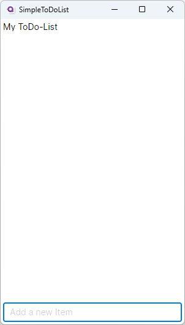
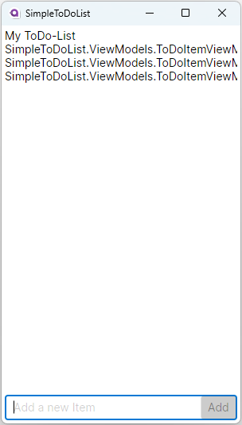
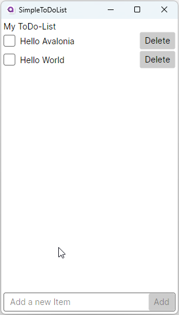
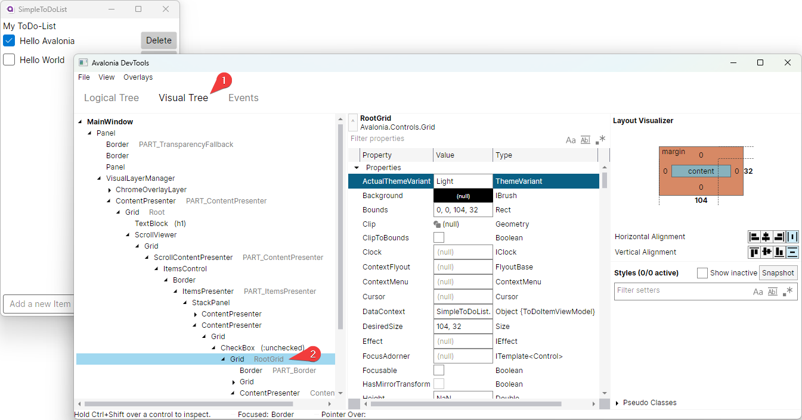
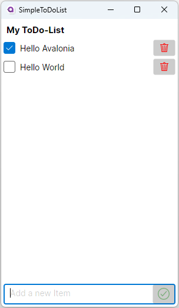

= Simple ToDo-List
// --- D O N ' T    T O U C H   T H I S    S E C T I O N ---
:toc:
:toc-placement!:
:tip-caption: :bulb:
:note-caption: :information_source:
:important-caption: :heavy_exclamation_mark:
:caution-caption: :fire:
:warning-caption: :warning:
// ----------------------------------------------------------

// Write a short summary here what this example does
This example will show you how a simple ToDo-List App can be build using Avalonia in combination with the MVVM-Community-Toolkit.

// --- D O N ' T    T O U C H   T H I S    S E C T I O N ---
toc::[]
// ---------------------------------------------------------

=== Difficulty
// Choose one of the below difficulties. You can just delete the ones you don't need.

🐥 Easy 🐥

=== Buzz-Words

// Write some buzzwords here. You can separate them by ", "
ToDo-List, complete app, MVVM, CommunityToolkit.MVVM, source generator, styles, commands

== Before we start

This sample assumes that you have a basic knowledge about the following topics:

- How to create a https://docs.avaloniaui.net/docs/get-started/test-drive/create-a-project[[new Avalonia project\]]
- Some basics about C# and https://docs.avaloniaui.net/docs/get-started/test-drive/[[XAML\]]
- What the link:../../MVVM/BasicMvvmSample[[MVVM -pattern\]] (Model-View-ViewModel) is and how it works
- What a link:../../MVVM/CommandSample[[Command\]] is and how it works
- What a link:https://learn.microsoft.com/en-us/dotnet/api/system.collections.objectmodel.observablecollection-1?view=net-8.0[[ObservableCollection\]] is and how it works

TIP: Some sections are optional. You can skip these if you want to.

=== CommunityToolkit.MVVM

The https://learn.microsoft.com/en-us/dotnet/communitytoolkit/mvvm/[[CommunityToolkit.MVVM\]]-package is one of many third-party packages for MVVM-Apps. We will use it in this sample as it is very lightweight. In addition, it comes with built-in source generators which allows us to write less boilerplate code.

[TIP]
====
For example, we can annotate private fields with the `[ObservableProperty]`-attribute which will let the source generator create a property for us:

[source,cs]
----
// Using the source generator:
[ObservableProperty]
private bool _isChecked;

// Without using the source generator we would need to write:
private bool _isChecked;

public bool IsChecked
{
    get { return _isChecked; }
    set { SetProperty(ref _isChecked, value); }
}
----
====
NOTE: If you want to learn more about how these source generators work, please see https://learn.microsoft.com/en-us/dotnet/communitytoolkit/mvvm/generators/overview[[here\]] and https://learn.microsoft.com/en-us/dotnet/csharp/roslyn-sdk/source-generators-overview[[here\]].

=== Preparation work

Before we start with the actual implementation of the App, we need to define a list of requirements and a sketch of the UI.

**Must-Haves**

- The user must be able to view a list of to-do items
- All items must be easily discoverable
- The user must be able to check and uncheck the to-do items
- The user must be able to add new items
- The user must be able to delete an existing item

**Nice-To-Haves**

- The user should have a visual feedback when hovering a to-do item
- The user should have a visual feedback if a new item can be added or not
- The user should be able to save and load a to-do-list (not a scope of this tutorial)
- The user should be able to edit an existing item (not a scope of this tutorial)

**Draft UI Layout**

It would be nice to have a single page user interface (UI) where the user can interact with the to-do list. We will use the operating system's window frame to present our App. In the bottom of the page, the user will have a `TextBox` where they can type any new item content to add. A `Watermark` or `ToolTip` shall indicate that visually. As soon as we receive valid input for a new item, a `Button` next to the input field should be enabled. If the user invokes this `Button`, the new item will be added into our list. The list itself will fill the rest of our available space. In case the space is not enough to render all items, a `ScrollBar` will enable vertical scrolling.
Each item in the list is going to be represented by a `CheckBox` followed by the content and a `Button` to delete the item.

image::_docs/Sketch.png[alt="Sketch of the UI", title="Sketch of the UI"]

== The Solution

NOTE: In this sample we will use the MVVM (Model-View-ViewModel) approach, where we will start with the Model and ViewModel first.

=== Step 1: Create and set up a new project

Choose your favorite IDE to create a new Avalonia-MVVM project.

NOTE: Depending on the IDE used to create your project, you may see a file structure that differs from the one seen in this tutorial.

By default, the Avalonia-MVVM template installs `Avalonia.ReactiveUI` as the MVVM framework. However, we want to use another MVVM framework. Therefor we will uninstall that package and instead install the `CommunityToolkit.Mvvm` package. We need to edit two files to get the changes applied:

**Program.cs**:
[source,diff]
----
    using Avalonia;
-   using Avalonia.ReactiveUI; // remove this using
    using System;

[...]

    public static AppBuilder BuildAvaloniaApp()
        => AppBuilder.Configure<App>()
            .UsePlatformDetect()
            .WithInterFont()
            .LogToTrace();
-           .UseReactiveUI(); // remove this line
----

**ViewModels/ViewModelBase**
[source,diff]
----
-   using ReactiveUI;
+   using CommunityToolkit.Mvvm.ComponentModel;

    namespace GetStartedApp.ViewModels;

-   public class ViewModelBase : ReactiveObject
+   public class ViewModelBase : ObservableObject
    {
    }
----

=== Step 2: Set up the Model

TIP: In our case we need the model for I/O operations. If you have no use for the model in your own App, feel free to skip that part.

NOTE: In case the folder `Models` is missing on your side, just add it to your project.

The Model will be quite simple in our case. We want to have one class called `ToDoItem`, which has two `Properties`. This model will also be used to save and restore the users ToDo-List later on. Inside the folder `Models`, add a new class called `ToDoItem`:

[source,cs]
.Models/ToDoItem.cs
----
/// 

/// This is our Model for a simple ToDoItem.
/// 

public class ToDoItem
{
    /// 

    /// Gets or sets the checked status of each item
    /// 

    public bool IsChecked { get; set; }

    /// 

    /// Gets or sets the content of the to-do item
    /// 

    public string? Content { get; set; }
}
----

=== Step 3: Setup the ViewModel

==== The ToDoItem-ViewModel

Our next task is to create a `ViewModel` for our to-do-items, which we will use as an intermediate layer between the `View` and the `Model`. Inside the folder `ViewModels` add a new class `ToDoItemViewModel` which inherits `ViewModelBase`.

IMPORTANT: If you want to use the source generators, remember to mark the class as `partial`.

[source,cs]
.ViewModels/ToDoItemViewModel.cs
----
/// 

/// This is a ViewModel which represents a <see cref="Models.ToDoItem"/>
/// 

public partial class ToDoItemViewModel : ViewModelBase
{
    /// 

    /// Gets or sets the checked status of each item
    /// 

    [ObservableProperty]
    private bool _isChecked;

    /// 

    /// Gets or sets the content of the to-do item
    /// 

    [ObservableProperty]
    private string? _content;
}
----

Our `ViewModel` is not yet connected to our `Model`. In order to create a new `ToDoItemViewModel` from an existing `ToDoItem`, we can add a constructor that takes the `ToDoItem` as an argument.

NOTE: We also want to be able to create a new, empty `ToDoItemViewModel`. Therefore, we also add a parameterless constructor.

[source,cs]
----
/// 

/// Creates a new blank ToDoItemViewModel
/// 

public ToDoItemViewModel()
{
    // empty
}

/// 

/// Creates a new ToDoItemViewModel for the given <see cref="Models.ToDoItem"/>
/// 

/// <param name="item">The item to load</param>
public ToDoItemViewModel(ToDoItem item)
{
    // Init the properties with the given values
    IsChecked = item.IsChecked;
    Content = item.Content;
}
----

Okay, now we also need a way to get the updated `Model` back, if the user made some changes. We can do this for example using a read-only property or a method like shown below:

[source,cs]
----
/// 

/// Gets a ToDoItem of this ViewModel
/// 

/// <returns>The ToDoItem</returns>
public ToDoItem GetToDoItem()
{
    return new ToDoItem()
    {
        IsChecked = this.IsChecked,
        Content = this.Content
    };
}
----

==== The MainViewModel

Depending on the template used to create the project you should see a file called `MainViewModel` or `MainWindowViewModel`. Open this file in order to edit it.

TIP: If you see a property called `Greetings`, feel free to delete it as we don't need that in our App.

Let's add an `ObservableCollection` called `ToDoItems`. As the collection will notify the UI whenever an item was added or removed, we can make this property readonly. Thus, a getter is enough here.

[source,cs]
.ViewModels/MainViewModel.cs
----
/// 

/// Gets a collection of <see cref="ToDoItem"/> which allows adding and removing items
/// 

public ObservableCollection<ToDoItemViewModel> ToDoItems { get; } = new ObservableCollection<ToDoItemViewModel>();
----

Well, now we have a collection of `ToDoItems` but how can we add new items to it? In our case this is quite simple as we only expect a non-empty `string` as content to construct a new item. We will add a helper property called `NewItemContent`. If that `string` is not empty, a command called `AddItemCommand` will be enabled.

NOTE: The command and the properties will be created using the source generator provided by the MVVM-toolkit we use. Remember to make the `MainViewModel` `partial`.

[source,cs]
----
/// 

/// Gets or set the content for new Items to add. If this string is not empty, the AddItemCommand will be enabled automatically
/// 

[ObservableProperty]
[NotifyCanExecuteChangedFor(nameof(AddItemCommand))] // This attribute will invalidate the command each time this property changes
private string? _newItemContent;
----

Next step is to create a method or a property that returns a `bool` indicating whether the `AddItemCommand` can execute:

[source,cs]
----
/// 

/// Returns if a new Item can be added. We require to have the NewItem some Text
/// 

private bool CanAddItem() => !string.IsNullOrWhiteSpace(NewItemContent);
----

Last but not least we can add the `Command`. If we annotate a `void` or a `Task` with the https://learn.microsoft.com/en-us/dotnet/communitytoolkit/mvvm/generators/relaycommand[[`RelayCommand`-attribute\]], a new `RelayCommand` will be generated for us. In our case we use a `void` called `AddItem` which will add a new item into `ToDoItems`-collection. After that we want to reset the `NewItemContent`, so that the input field is cleared for the next item to be added.

[source,cs]
----
/// 

/// This command is used to add a new Item to the List
/// 

[RelayCommand (CanExecute = nameof(CanAddItem))]
private void AddItem()
{
    // Add a new item to the list
    ToDoItems.Add(new ToDoItemViewModel() {Content = NewItemContent});

    // reset the NewItemContent
    NewItemContent = null;
}
----

Adding items is possible now, but we also want to be able to remove items. So we will add another `Command` for that. However, we need to know which item to remove. So we will pass the item to remove as a `CommandParameter`.

NOTE: According to our App draft, we want to add the `Delete-Button` next to each item. Therefore, we can be sure that always a valid `CommandParameter` is sent to the `Command`. Therefore, we don't need to set `CanExecute` in this case.

[source, cs]
----
/// 

/// Removes the given Item from the list
/// 

/// <param name="item">the item to remove</param>
[RelayCommand]
private void RemoveItem(ToDoItemViewModel item)
{
    // Remove the given item from the list
    ToDoItems.Remove(item);
}
----

=== Step 4: Set up the View

NOTE: Depending on the template you used to create your project, you may see a file called `MainView` alongside `MainWindow`. In this case, please use `MainView` to add the content shown below. `MainWindow` will present this view for you.

Let's recall the App-design we planned:

image::_docs/Sketch.png[title="Our sketch of the App-design", alt="Our sketch of the App-design"]

As shown above we need a header at the top, a presentation of the items in the middle (which takes as much space as possible) and a footer with an input-field for adding new items. In Avalonia we use https://docs.avaloniaui.net/docs/basics/user-interface/building-layouts/#panels[[`Panels`\]] to achieve diffrent layouts. In our case we can use a `DockPanel` or a `Grid`. We will use a `Grid` as this offers the most flexible layout.

[TIP]
====
A `Grid-Row` or `Grid-Column` can have different `GridSizes`:

- https://docs.avaloniaui.net/docs/reference/controls/grid/#absolute-size-definitions[Absolute Size Definition]
- https://docs.avaloniaui.net/docs/reference/controls/grid/#proportional-size-definitions[Proportional Size Definitions]
- https://docs.avaloniaui.net/docs/reference/controls/grid/#automatic-size-definitions[Automatic Size Definitions]
====

NOTE: You can set `Grid.Row` and `Grid.Column`-attached properties on every child control to define the exact cell where the control should be shown.

Here is our basic layout:

[source,xml]
.Views/MainWindow.axaml
----
<!-- Leave the root-Node untouched beside setting Width, Height and Padding -->
<Window xmlns="https://github.com/avaloniaui"
        xmlns:x="http://schemas.microsoft.com/winfx/2006/xaml"
        xmlns:vm="using:SimpleToDoList.ViewModels"
        xmlns:d="http://schemas.microsoft.com/expression/blend/2008"
        xmlns:mc="http://schemas.openxmlformats.org/markup-compatibility/2006"
        mc:Ignorable="d"
        Width="300" Height="500" Padding="4"
        x:Class="SimpleToDoList.Views.MainWindow"
        x:DataType="vm:MainViewModel"
        Icon="/Assets/avalonia-logo.ico"
        Title="SimpleToDoList">
    <!-- We give a name to the root grid in order to access it later -->
    <Grid RowDefinitions="Auto, *, Auto"
          x:Name="Root">

        <!-- This is our title text block.  -->
        <TextBlock Text="My ToDo-List" />

        <ScrollViewer Grid.Row="1">
            <!-- This ItemsControl show all added ToDoItems. -->
            <!-- It needs to be placed inside a ScrollViewer because other than a ListBox it has not its own -->
            <ItemsControl ItemsSource="{Binding ToDoItems}">
            </ItemsControl>
        </ScrollViewer>

        <!-- This TextBox can be used to add new ToDoItems -->
        <TextBox Grid.Row="2"
                 Text="{Binding NewItemContent}"
                 Watermark="Add a new Item">
        </TextBox>
    </Grid>
</Window>
----

We are now good to go and run our App for the first time. You should see something similar to this:

We can see the title `TextBlock` is there and also the entry field for new items to add. We can add some text into the `TextBox`, however we have no button to add it into our list yet. Let's fix that.

In Avalonia a TextBox has the option to add `InnerLeftContent` and `InnerRightContent`, which can be used to add any content you like. For example, we can add a button to it. The `Button` will execute the `AddItemCommand`. For convenience, we also want to allow adding items using the keyboard. That is what https://docs.avaloniaui.net/docs/concepts/input/hotkeys[[`KeyBindings` and `HotKeys`\]] can be used for.

TIP: We use `KeyBindings` here as a `HotKey` would be available for the whole view, where we want it only to work when the `TextBox` is focused.

Here is how our modified input box looks like:

[source,xml]
----
<TextBox Grid.Row="2"
         Text="{Binding NewItemContent}"
         Watermark="Add a new Item">
    <TextBox.InnerRightContent>
        <Button Command="{Binding AddItemCommand}" >
            Add
            <!-- <PathIcon Data="{DynamicResource AcceptIconData}" Foreground="Green" /> -->
        </Button>
    </TextBox.InnerRightContent>
    <!--  KeyBindings allow us to define keyboard gestures  -->
    <TextBox.KeyBindings>
        <KeyBinding Command="{Binding AddItemCommand}" Gesture="Enter" />
    </TextBox.KeyBindings>
</TextBox>
----

Now, if you run your App again, you will notice that we have a Button which is grayed out if the input field is empty and gets enabled as soon as you start typing. Invoking the `Button` will add a new item to our list above.

Great, we can add new items to our list. However, they don't display themself as we wanted them to do. Instead of showing the content, we see the name of the `ItemViewModel`. We can fix that by defining the `ItemTemplate` for the `ItemsControl`.

NOTE: If you want to learn more about `DataTemplates`, see these samples: https://github.com/AvaloniaUI/Avalonia.Samples?tab=readme-ov-file#%EF%B8%8F-datatemplate-samples[[DataTemplate-Samples\]]

Our `DataTemplate` uses a `CheckBox` where the `Content` is bound to `ToDoItemViewModel.Content` and `IsChecked` is bound to `ToDoItemViewModel.IsChecked`. Next to it, we will add a `Button` which is there to delete the given item. The `Command` is bound to the `MainViewModel.DeleteCommand` and the `CommandParameter` is the `ToDoItemViewModel` itself.

NOTE: Inside the `ItemTemplate` we can only use members of our `ItemViewModel`. However, the `DeleteCommand` is part of our `MainViewModel`. We can access this by accessing the parents or named controls `DataContext`. As we use compiled bindings, we have to https://docs.avaloniaui.net/docs/basics/data/data-binding/compiled-bindings#type-casting[[cast the `DataContext`\]]

[source,xml]
----
<ItemsControl ItemsSource="{Binding ToDoItems}">
    <ItemsControl.ItemTemplate>
        <!--  The ItemTemplate defines how each item should be represented  -->
        <!--  Our Item will be represented by a CheckBox and a Delete-Button  -->
        <DataTemplate DataType="vm:ToDoItemViewModel">
            <Grid ColumnDefinitions="*, Auto">
                <CheckBox Content="{Binding Content}"
                          IsChecked="{Binding IsChecked}" />

                <!--  Note how we use the Root-Grid to get the MainViewModel here. As we use compiled bindings we have to cast the DataContext  -->
                <Button Command="{Binding #Root.((vm:MainViewModel)DataContext).RemoveItemCommand}"
                        CommandParameter="{Binding .}"
                        Grid.Column="1">
                    Delete
                </Button>
            </Grid>
        </DataTemplate>
    </ItemsControl.ItemTemplate>
</ItemsControl>
----

If we now run the App once again, we will see that the items are now displayed as intended. Moreover, we can now check and uncheck them as well as delete them.

=== Step 5 (Optional): Add some Styles to improve the UI

While our App is now fully functional and we are done with all must-haves, we can still improve the user experience. The following parts of our UI are not really user-friendly:

- The Title looks exactly as any other content, this should be improved
- The Buttons have English-only content. Having symbols would make them more understandable for all folks.
- It would be nice, if the item that the pointer is over would be highlighted. This would help the user to click the intended item.

For the header text we can use https://docs.avaloniaui.net/docs/reference/styles/style-selector-syntax#by-style-class[[`Style.Classes`\]].
In `App.axaml` add following Style:

[source,xml]
.App.axaml
----
<Application.Styles>
    <!-- Do not touch this -->
    <FluentTheme />

    <!--  Some custom Styles  -->
    <!--  Our header Style  -->
    
</Application.Styles>
----

Usage:

[source,xml]
.Views/MainWindow.axaml
----
<!--  This is our title text block. We use Style.Classes to style it accordingly  -->
<TextBlock Classes="h1" Text="My ToDo-List" />
----

For the `CheckBox` we want to add two different `Styles`. One that applies to each `CheckBox` and sets the `HorizontalAlignment` to fill the entire available space and another one that sets a highlight color to it's background on pointer-over.

TIP: Avalonia has pseudo-class selectors that can be used to style a control according to its visual state. See https://docs.avaloniaui.net/docs/reference/styles/pseudo-classes[[docs\]] for more info.

[TIP]
====
Sometimes you need to apply a style to a visual child of the control template (see https://docs.avaloniaui.net/docs/reference/styles/pseudo-classes[[docs\]]).
To understand which selector to use, you may use https://docs.avaloniaui.net/docs/guides/implementation-guides/developer-tools[[developer tools\]] (use the visual tree tab).
Moreover, you can look up the original styles on https://github.com/AvaloniaUI/Avalonia/tree/master/src/Avalonia.Themes.Fluent/Controls[[GitHub in source\]]

Press `[F12]` and you can expand the visual tree to see the visual children of all controls in your view

====

TIP: Instead of hard-coding colors and brushes, you can use https://docs.avaloniaui.net/docs/guides/styles-and-resources/resources#using-resources[[`DynamicResources`\]] which will make sure style follows the overall App-design. To explore the available ones from `FluentTheme`, look them up on https://github.com/AvaloniaUI/Avalonia/tree/master/src/Avalonia.Themes.Fluent/Accents[[GitHub in source\]]

[source,xml]
.App.axaml
----

<Application.Styles>
    <!-- ... other styles ... -->
    <!--  We want our CheckBox to be stretched horizontally (the default is left-aligned)  -->
    

    <!--  These styles add some useful feedback for the user  -->
    
</Application.Styles>
----

To display icons we can use `PathIcon` which accepts any path-data. This data can be taken from a svg-file.

WARNING: If you use an icon from one of several online available icon galleries, make sure the license suits your needs.

[source,xml]
.App.axaml
----
<Application.Resources>
    <!--  These are re-usable Icon data. You can get the path data from svg-files for example  -->
    <StreamGeometry x:Key="DeleteIconData">The path data</StreamGeometry>
    <StreamGeometry x:Key="AcceptIconData">The path data</StreamGeometry>
</Application.Resources>
----

To display the icons in our App we add them as our `Buttons` content:

[source,xml]
.Views/MainWindow.axaml
----
<!-- The same applies for the Delete-Button -->
<Button Command="{Binding AddItemCommand}">
    <PathIcon Data="{DynamicResource AcceptIconData}" Foreground="Green" />
</Button>
----

We want our icons to become semi-transparent if a `Button` is disabled. We can use yet another `Style` for that:

[source,xml]
.App.axaml
----
<Application.Styles>
    <!-- ... -->

    <!-- This style will make the icon semi-transparent, it a button is disabled -->
    
</Application.Styles>
----

And here is the final result:

=== Step 7 (Optional): Data Persistence

NOTE: We will be storing the data as a https://learn.microsoft.com/en-us/dotnet/api/system.text.json?view=net-8.0[[JSON-File\]]. You can apply the same approach to any other file-format you prefer.

Right now everytime we close the App, all data is lost. For a simple demo that is all fine, but what if we wanted to start using this App for our daily to-do's? Well, we can add basic data persistence as we already made sure our `Model` is able to handle that. For the actual file-operations we will use a helper class which is used as a service. So add a folder called `Services` and inside a new class called `ToDoListFileService.cs`.

TIP: We can make this class `static` in our case. In a more complex App this may better be handled using https://learn.microsoft.com/en-us/dotnet/core/extensions/dependency-injection[[Dependency Injection\]]

WARNING: We use a hard-coded filename here. This may not be the perfect solution, as the path may vary by user settings or platform limitations. However, this is not a part we want to cover in this sample

This is how we can save a list of `Todo-Items`:

[source,c#]
.Services/ToDoListFileService
----
using System;
using System.Collections.Generic;
using System.IO;
using System.Text.Json;
using System.Threading.Tasks;
using SimpleToDoList.Models;

public static class ToDoListFileService
{
    // This is a hard coded path to the file. It may not be available on every platform. In your real world App you may
    // want to make this configurable
    private static string _jsonFileName =
        Path.Combine(Environment.GetFolderPath(Environment.SpecialFolder.ApplicationData),
        "Avalonia.SimpleToDoList", "MyToDoList.txt");

    /// 

    /// Stores the given items into a file on disc
    /// 

    /// <param name="itemsToSave">The items to save</param>
    public static async Task SaveToFileAsync(IEnumerable<ToDoItem> itemsToSave)
    {
        // Ensure all directories exists
        Directory.CreateDirectory(Path.GetDirectoryName(_jsonFileName)!);

        // We use a FileStream to write all items to disc
        using (var fs = File.Create(_jsonFileName))
        {
            await JsonSerializer.SerializeAsync(fs, itemsToSave);
        }
    }
}
----

To actually save the file, we need a way to call the `SaveToFileAsync`-method when the App is terminating. As we only target `Desktop`, we can do so in an event called `ShutdownRequested`. Moreover, we need a reference to the `MainViewModel` to be accessible form the event, and thus we store it in a private field instead of creating in inline.

[source,c#]
.App.axaml.cs
----
// This is a reference to our MainViewModel which we use to save the list on shutdown. You can also use Dependency Injection
// in your App.
private readonly MainViewModel _mainViewModel = new MainViewModel();

public override void OnFrameworkInitializationCompleted()
{
if (ApplicationLifetime is IClassicDesktopStyleApplicationLifetime desktop)
{
    desktop.MainWindow = new MainWindow
    {
        DataContext = _mainViewModel // Remember to change this line to use our private reference to the MainViewModel
    };

    // Listen to the ShutdownRequested-event
    desktop.ShutdownRequested += DesktopOnShutdownRequested;
}

base.OnFrameworkInitializationCompleted();
}
----

In the event itself we cancel the event as long as `_canClose` is not set to true.

NOTE: It is highly recommended to run I/O-operations https://learn.microsoft.com/en-us/dotnet/standard/io/asynchronous-file-i-o[[`async`\]].

[source]
.App.axaml.cs
----
// We want to save our ToDoList before we actually shutdown the App. As File I/O is async, we need to wait until file is closed
// before we can actually close this window

private bool _canClose; // This flag is used to check if window is allowed to close
private async void DesktopOnShutdownRequested(object? sender, ShutdownRequestedEventArgs e)
{
    e.Cancel = !_canClose; // cancel closing event first time

    if (!_canClose)
    {
        // To save the items, we map them to the ToDoItem-Model which is better suited for I/O operations
        var itemsToSave = _mainViewModel.ToDoItems.Select(item => item.GetToDoItem());
        await ToDoListFileService.SaveToFileAsync(itemsToSave);

        // Set _canClose to true and Close this Window again
        _canClose = true;
        if (ApplicationLifetime is IClassicDesktopStyleApplicationLifetime desktop)
        {
            desktop.Shutdown();
        }
    }
}
----

If you run the App, add some items and close it, you should see a new file in `%APPDATA%\Avalonia.SimpleToDoList` called `MyToDoList.txt` with a content similar to this:

[source,json]
.MyToDoList.txt
----
[
    {
        "Content": "Hello Avalonia",
        "IsChecked": true
    },
    {
        "Content": "Hello World",
        "IsChecked": false
    }
]
----

Loading the stored file can also be done in a similar way:

[source,c#]
.Services/ToDoListFileService
----
public static class ToDoListFileService
{
    // ...

    /// 

    /// Loads the file from disc and returns the items stored inside
    /// 

    /// <returns>An IEnumerable of items loaded or null in case the file was not found</returns>
    public static async Task<IEnumerable<ToDoItem>?> LoadFromFileAsync()
    {
        try
        {
            // We try to read the saved file and return the ToDoItemsList if successful
            using (var fs = File.OpenRead(_jsonFileName))
            {
                return await JsonSerializer.DeserializeAsync<IEnumerable<ToDoItem>>(fs);
            }
        }
        catch (Exception e) when (e is FileNotFoundException || e is DirectoryNotFoundException)
        {
            // In case the file was not found, we simply return null
            return null;
        }
    }
}
----

[source,c#]
.App.axaml.cs
----
public override async void OnFrameworkInitializationCompleted()
{
    // ...

    // Init the MainViewModel
    await InitMainViewModelAsync();
}

// Optional: Load data from disc
private async Task InitMainViewModelAsync()
{
    // get the items to load
    var itemsLoaded = await ToDoListFileService.LoadFromFileAsync();

    if (itemsLoaded is not null)
    {
        foreach (var item in itemsLoaded)
        {
            _mainViewModel.ToDoItems.Add(new ToDoItemViewModel(item));
        }
    }
}
----

== Related

If you want to explore more samples, please also visit https://github.com/AvaloniaCommunity/awesome-avalonia.

// Any related information or further readings goes here.

// --------------- Ascii-Doc Cheat-Sheet ------------------

// visit: https://asciidoc.org 
// visit: https://powerman.name/doc/asciidoc-compact

// VS-Code has a great Add-In for Ascii docs: https://github.com/asciidoctor/asciidoctor-vscode/