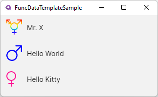

= FuncDataTemplate Sample
// --- D O N ' T    T O U C H   T H I S    S E C T I O N ---
:toc:
:toc-placement!:
:tip-caption: :bulb:
:note-caption: :information_source:
:important-caption: :heavy_exclamation_mark:
:caution-caption: :fire:
:warning-caption: :warning:
// ----------------------------------------------------------

// Write a short summary here what this examples does
This example will show you how to use a `FuncDataTemplate` to create an advanced `DataTemplate` in code. 

// --- D O N ' T    T O U C H   T H I S    S E C T I O N ---
toc::[]
// ---------------------------------------------------------

=== Difficulty
// Choose one of the below difficulties. You can just delete the ones you don't need.

🐔 Normal 🐔

=== Buzz-Words

// Write some buzz-words here. You can separate them by ", "
FuncDataTemplate, DataTemplate, C#, Binding from code

== Before we start

You should already know what a `DataTemplate` is and how it works in Avalonia. If not, read more about it in the link:..\BasicDataTemplateSample[[Basic DataTemplate Sample\]].

=== FuncDataTemplate

The class `FuncDataTemplate` provides a `DataTemplate` for a given `object`. Most of the time you will want to use the generic version. You can pass lambda expressions for building the template and if the given `object` matches to this `DataTemplate`. Please see the http://reference.avaloniaui.net/api/Avalonia.Controls.Templates/FuncDataTemplate_1/[[API Reference\]] for more information. 

NOTE: If you are not familiar with lambda expressions, please visit the https://learn.microsoft.com/en-us/dotnet/csharp/language-reference/operators/lambda-expressions[[Microsoft Docs\]] for more information.

== The Solution

=== Step 1: Setup the model

The model is build up similar to the Basic DataTemplate Sample. We have one class called `Person` and one `enum` called `Sex`:

Person.cs::
[source,cs]
----
public class Person
{
    /// 

    /// Gets or sets the first name of the person. You can only set this property on init. 
    /// 

    public string? FirstName { get; init; }

    /// 

    /// Gets or sets the last name of the person. You can only set this property on init. 
    /// 

    public string? LastName { get; init; }

    /// 

    /// Gets or sets the sex of the person. You can only set this property on init. 
    /// 

    public Sex Sex { get; init; }

    // Override ToString()
    public override string ToString()
    {
        return $"{FirstName} {LastName}";
    }
}
----

Sex.cs::
[source,cs]
----
// Feel free to add or reorder the entries based on your needs.
public enum Sex
{
    Diverse,
    Female,
    Male
}
----

=== Step 2: Setup the ViewModel

In the file `ViewModels ► MainWindowViewModel` we add a list of Persons:

[source,cs]
----
public List<Person> People { get; } = new List<Person>()
{
    new Person
    {
        FirstName = "Mr.",
        LastName = "X",
        Sex=Sex.Diverse
    },
    new Person
    {
        FirstName = "Hello",
        LastName = "World",
        Sex= Sex.Male
    },
    new Person
    {
        FirstName = "Hello",
        LastName = "Kitty",
        Sex= Sex.Female
    }
};
----

=== Step 3: Create a FuncDataTemplate

In your project create a new directory called `DataTemplates`. Inside this directory you can add a `static` `class` called `DataTemplateProvider.cs`. This file can hold several `FuncDataTemplates`. In this sample we will only add one. 

NOTE: We make this class static as nothing is depending on instance members. If you need to access instance members, don't make it static. 

To make it easier for maintaining, we will first write a function which takes a `Person` and returns the `IControl`, which represents the data the way we want. 

[source,cs]
----
// This private function will return a control that represents our persons sex as a gender symbol.
private static IControl BuildGenderPresenter(Person person)
{
    // Create a new Path as a presenter. You can also use any other Control. 
    // If you want to add more than one control, remember to wrap them inside a Panel.
    Path path = new Path()
    {
        Width = 32,
        Height = 32,

        // We set Stretch to Uniform. That way our Path will be made as big as needed while keeping the aspect ratio.
        Stretch = Stretch.Uniform,

        // Create a Binding for the ToolTip
        [!ToolTip.TipProperty] = new Binding(nameof(person.Sex))
    };

    switch (person.Sex)
    {
        case Sex.Diverse:
            // We use StreamGeometry.Parse() to get the needed Data.
            path.Data = StreamGeometry.Parse("...");

            // We can set Fill to any Brush. We can also look up a Brush in Resources, if needed. 
            path.Fill = new LinearGradientBrush
            {
                StartPoint = new RelativePoint(0, 0, RelativeUnit.Relative),
                EndPoint = new RelativePoint(0, 1, RelativeUnit.Relative),
                GradientStops =
                {
                    new GradientStop(Colors.Red, 0),
                    new GradientStop(Colors.Orange, 0.2),
                    new GradientStop(Colors.Yellow, 0.4),
                    new GradientStop(Colors.DarkTurquoise, 0.6),
                    new GradientStop(Colors.Blue, 0.8),
                    new GradientStop(Colors.Violet, 1),
                }
            };
            break;
        case Sex.Female:
            path.Data = StreamGeometry.Parse("...");
            path.Fill = new SolidColorBrush(Colors.DeepPink);
            break;
        case Sex.Male:
            path.Data = StreamGeometry.Parse("...");
            path.Fill = new SolidColorBrush(Colors.Blue);
            break;
        default:
            // Fall-back value
            return new TextBlock { Text = "NOT SUPPORTED" };
    }

    return path;
}
----

NOTE: The `Path.Data` is not shown in the above sample code. Please refer to the source code for the needed path data. 

[TIP] 
===============================
For the `ToolTip` we create a binding in the controls constructor. In that case we can use the following notation: 
[source,cs]
----
[!MyProperty] = new Binding("The Binding Path");
----

Read more about binding in code in the https://docs.avaloniaui.net/docs/data-binding/binding-from-code[[Docs\]]
===============================

We can now add our `FuncDataTemplate` which will consume the function we wrote above: 

[source,cs]
----
// This FuncDataTemplate can be static, as it will not change over time.
public static FuncDataTemplate<Person> GenderDataTemplate { get; } 
    = new FuncDataTemplate<Person>(
        // Check if we have a valid object and return true if it is valid. 
        (person) => person is not null,

        // Avalonia will provide the Person automatically as the functions parameter.
        // We can also write (person) => BuildGenderPresenter(person)
        BuildGenderPresenter);
----

=== Step 4: See it in action

If you `Run` or `Debug` the App you should see the following output:

