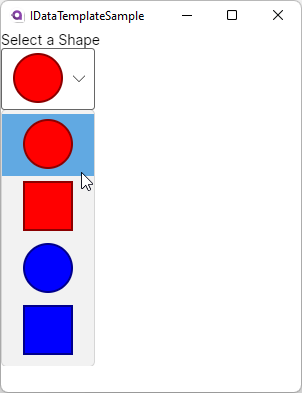

= Implementing IDataTemplate
// --- D O N ' T    T O U C H   T H I S    S E C T I O N ---
:toc:
:toc-placement!:
:tip-caption: :bulb:
:note-caption: :information_source:
:important-caption: :heavy_exclamation_mark:
:caution-caption: :fire:
:warning-caption: :warning:
// ----------------------------------------------------------

// Write a short summary here what this examples does
This example will show you how to implement `IDataTemplate` in your own class to have full control over your `DataTemplates`. Other than WPF, Avalonia does *not* have a https://learn.microsoft.com/en-us/dotnet/api/system.windows.controls.datatemplateselector?view=windowsdesktop-7.0[[`DataTemplateSelector`\]]. Therefore you will learn in this sample how you can mimic it's behavior in Avalonia, if needed.

// --- D O N ' T    T O U C H   T H I S    S E C T I O N ---
toc::[]
// ---------------------------------------------------------

=== Difficulty
// Choose one of the below difficulties. You can just delete the ones you don't need.

🐔 Normal 🐔

=== Buzz-Words

// Write some buzz-words here. You can separate them by ", "
IDataTemplate, DataTemplate, DataTemplateSelector

== Before we start

You should already have a basic knowledge of `DataTemplates`.

=== IDataTemplate

http://reference.avaloniaui.net/api/Avalonia.Controls.Templates/IDataTemplate/[[`IDataTemplate`\]] is an interface which you can implement into your own class in order to be used as a `DataTemplate`. It has the following members:

bool Match(object?)::
Use this function to return if the given object matches to your `DataTemplate`.

Control Build(object?)::
Use this function to build the control which represents the given object.

== The Solution

We will create a convenient way to select a matching `DataTemplate` based on an `enum` value. The possible `DataTemplates` can be defined in `XAML` which should feel familiar to most developers. 

NOTE: Also if we use an `enum` in this sample, it can be any object in your implementation.

=== Step 1: Create a new Avalonia Project

Create a new Project using the `Avalonia MVVM Project` template. 

=== Step 2: Setup the Model

Inside the `Models` directory add an `enum` called `ShapeTypes.cs`:

[source,cs]
----
// Feel free to add more shapes based on your needs.
public enum ShapeType
{
    RedCircle,
    RedSquare,
    BlueCircle,
    BlueSquare
}
----

=== Step 3: Setup the ViewModel

In the file `ViewModels ► MainWindowViewModel.cs` we will add a Property `SelectedShape` and an `Array` of available shapes called `AvailableShapes`:

[source,cs]
----
public class MainWindowViewModel : ViewModelBase
{

    private ShapeType _SelectedShape;

    /// 

    /// Gets or sets the selected ShapeType
    /// 

    public ShapeType SelectedShape
    {
        get { return _SelectedShape; }
        set { this.RaiseAndSetIfChanged(ref _SelectedShape, value); }
    }

    /// 

    ///  Gets an array of all available ShapeTypes
    /// 

    public ShapeType[] AvailableShapes { get; } = Enum.GetValues<ShapeType>();
}
----

NOTE: To get the array of available enum members we can use `Enum.GetValues`. Learn more in the https://learn.microsoft.com/en-us/dotnet/api/system.enum.getvalues?view=net-7.0[[Microsoft Docs\]].

=== Step 4: Add the DataTemplateSelector

Add a new directory called `DataTemplates`. Inside this directory add a new file called `ShapesTemplateSelector.cs`. This class should implement `IDataTemplate`. We will use a `Dictionary` where the `keys` are a `string` and the values are of type `IDataTemplate`. This dictionary will be decorated with the http://reference.avaloniaui.net/api/Avalonia.Metadata/ContentAttribute/[[`ContentAttribute`\]] which will make it easy to add several items in the `XAML` later. 

We need to implement <<IDataTemplate>> in this class. Inside the `Match`-function we will check if the provided item is inside our `Dictionary`. If that is the case can use `Build` to build the control. As the values of our `Dictionary` are `IDataTemplates` on their own, we can just call their `Build`-function and return the result. 

[source,cs]
----
// Remember to add the needed usings
using Avalonia.Controls.Templates;
using Avalonia.Controls;
using Avalonia.Metadata;
using System;
using System.Collections.Generic;
using IDataTemplateSample.Models;

public class ShapesTemplateSelector : IDataTemplate
{
    // This Dictionary should store our shapes. We mark this as [Content], so we can directly add elements to it later.
    [Content]
    public Dictionary<string, IDataTemplate> AvailableTemplates { get; } = new Dictionary<string, IDataTemplate>();

    // Build the DataTemplate here
    public Control Build(object? param)
    {
        var key = param?.ToString(); // Our Keys in the dictionary are strings, so we call .ToString() to get the key to look up
        if (key is null) // If the key is null, we throw an ArgumentNullException
        {
            throw new ArgumentNullException(nameof(param));
        }
        return AvailableTemplates[key].Build(param); // finally we look up the provided key and let the System build the DataTemplate for us
    }

    // Check if we can accept the provided data
    public bool Match(object? data)
    {
        // Our Keys in the dictionary are strings, so we call .ToString() to get the key to look up
        var key = data?.ToString();

        return data is ShapeType                        // the provided data needs to be our enum type
                && !string.IsNullOrEmpty(key)           // and the key must not be null or empty
                && AvailableTemplates.ContainsKey(key); // and the key must be found in our Dictionary
    }
} 
----

=== Step 5: Setup the View

Open the file `Views ► MainWindow.axaml` and create a new `ShapesTemplateSelector` inside `Window.DataTemplates`: 

[source,xml]
----
<!-- Remember to add the needed namespaces
xmlns:model="using:IDataTemplateSample.Models"
xmlns:dataTemplates="using:IDataTemplateSample.DataTemplates" -->

<Window.DataTemplates>
    <dataTemplates:ShapesTemplateSelector>
        <DataTemplate x:Key="RedCircle" DataType="model:ShapeType">
            <Ellipse Width="50"
                     Height="50"
                     Fill="Red"
                     Stroke="DarkRed"
                     StrokeThickness="2" />
        </DataTemplate>
        <DataTemplate x:Key="BlueCircle" DataType="model:ShapeType">
            <Ellipse Width="50"
                     Height="50"
                     Fill="Blue"
                     Stroke="DarkBlue"
                     StrokeThickness="2" />
        </DataTemplate>
        <DataTemplate x:Key="RedSquare" DataType="model:ShapeType">
            <Rectangle Width="50"
                       Height="50"
                       Fill="Red"
                       Stroke="DarkRed"
                       StrokeThickness="2" />
        </DataTemplate>
        <DataTemplate x:Key="BlueSquare" DataType="model:ShapeType">
            <Rectangle Width="50"
                       Height="50"
                       Fill="Blue"
                       Stroke="DarkBlue"
                       StrokeThickness="2" />
        </DataTemplate>
    </dataTemplates:ShapesTemplateSelector>
</Window.DataTemplates>
----

NOTE: Each item in the `Dictionary` must have an `x:Key`. This key must represent the name of the `enum`-member in our case.

NOTE: You can also define the `ShapesTemplateSelector` in `App.DataTemplates` or any other `DataTemplates` section.

Now we can add the content we like to our `Window`. In our case we just add a `TextBlock` and a `ComboBox`:

[source,xml]
----
<StackPanel>
    <TextBlock Text="Select a Shape" />

    <ComboBox ItemsSource="{Binding AvailableShapes}"
              SelectedIndex="0"
              SelectedItem="{Binding SelectedShape}" />
</StackPanel>
----

=== Step 6: Run the App

Now you should be able to press `Run` or `Debug` in your IDE. You should see the following output: 

== Related 

You can also implement `IDataTemplate` if you want to create your own `ViewLocator`. If you use the Avalonia MVVM-Template a file called `ViewLocator.cs` is created for you. You can change or extend it to your needs. We will cover this topic in a different sample. 