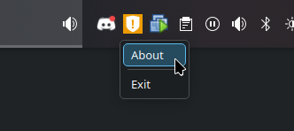

# TrayIcon

Sample application that shows a tray icon.

* The tray icon must have an associated icon. The icon should be included in the project as an `<AvaloniaResource>`.
* This sample sets the `DataContext` for `App` to `this`, which allows the command to be defined in the same class and then bound in the `.axaml` file. Consider using a separate view model in production code.

