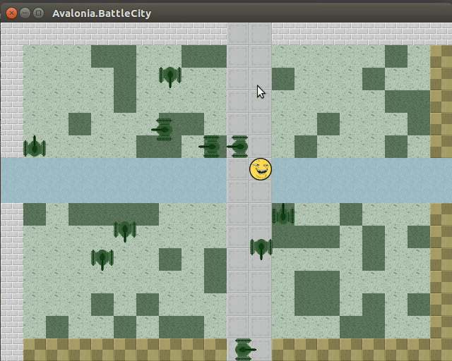

= BattleCity

Port of https://github.com/hacklex/PekaCity to Avalonia.
2D game stub rendered completely by AvaloniaUI.

== What is this? Why?

This is a stub for a 2D game. The purpose of the project is to demonstrate that one can write a 2D game in AvaloniaUI without writing any rendering code.

== Features

- 2D tiles
- Cell-aligned game objects
- Basic implementation of a typical game loop
- No custom rendering code; everything is done via AvaloniaUI data binding and a few value converters

