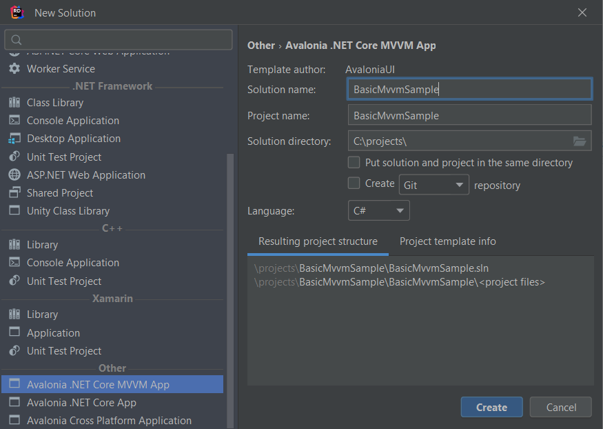
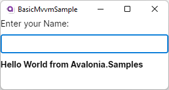
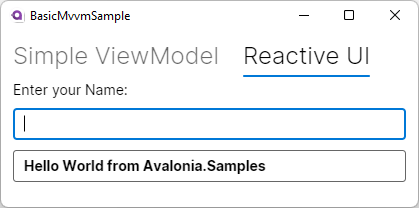

= Basic MVVM Sample
:toc:
:toc-placement!:
:tip-caption: :bulb:
:note-caption: :information_source:
:important-caption: :heavy_exclamation_mark:
:caution-caption: :fire:
:warning-caption: :warning:

This sample will show you how you can use the `MVVM`-pattern to receive and process text input by the user. Our sample App will have one `TextBox` where the users can enter their name and another `TextBox` where we will present some personal greetings.

toc::[]

=== Difficulty

🐣 Beginner 🐣

=== Buzz-Words

MVVM, Model-View-ViewModel, ReactiveUI, INotifyPropertyChanged, XAML, Binding


== Before we start

=== Prepare your IDE
Please make sure you have setup your IDE according to the [https://docs.avaloniaui.net/docs/get-started/set-up-an-editor[docs,window=_blank]]. Moreover you should have read the [https://docs.avaloniaui.net/docs/welcome[Getting Started guide,window=_blank]]. 

=== The MVVM Pattern in short

We will use the `MVVM`-pattern in this sample. `MVVM` is short for **M**odel - **V**iew - **V**iew**M**odel and describes a software architectural pattern that will split the code base into three pieces:.

====

Model:: The `Model` will store and handle your data. The model doesn't know anything about your `View` or `ViewModel`.
View:: The `View` can be thought as the **U**ser **I**nterface and will interact with your `ViewModel`. 
ViewModel:: The `ViewModel` can be seen as a mediator between the `View` and the `Model`. It will know about the `Model` and is known by the `View`, but it doesn't know anything about the `View`. It can transform and convert the data provided by the `Model`, if needed.

====


The `MVVM` pattern helps us to focus on either of the three parts. If we get new values in our `Model`, the `ViewModel` will notify the `View` about it and the `View` can update itself. We don't have to do it manually. If you want to read more about it, here is a collection of useful links:

- https://docs.avaloniaui.net/docs/concepts/the-mvvm-pattern/[[Avalonia Docs\],window=_blank]
- https://en.wikipedia.org/wiki/Model%E2%80%93view%E2%80%93viewmodel[[Wikipedia\],window=_blank]
- https://www.codeproject.com/Articles/278901/MVVM-Pattern-Made-Simple[[CodeProject\],window=_blank]
- https://www.tutorialspoint.com/mvvm/index.htm[[tutorialspoint\],window=_blank]

=== Properties, Fields, Classes, and Interfaces

C# uses `Interfaces` to define contracts that `Classes` can satisfy by providing an implementation for the `Members` defined in the specific `Interface`. `Members` of a `Class` are comprised of `Fields` and `Methods`. `Methods` are code blocks that can be executed. `Fields` are simply variables that can hold data. `Properties` are used to read, write, or compute the value of private `Fields`.

- More on Interfaces: https://docs.microsoft.com/en-us/dotnet/csharp/language-reference/keywords/interface[[Microsoft Docs\],window=_blank]
- More on Classes: https://docs.microsoft.com/en-us/dotnet/csharp/language-reference/keywords/class[[Microsoft Docs\],window=_blank]
- More on Members: https://docs.microsoft.com/en-us/dotnet/csharp/programming-guide/classes-and-structs/members[[Microsoft Docs\],window=_blank]
- More on Methods: https://docs.microsoft.com/en-us/dotnet/csharp/programming-guide/classes-and-structs/methods[[Microsoft Docs\],window=_blank]
- More on Fields: https://docs.microsoft.com/en-us/dotnet/csharp/programming-guide/classes-and-structs/fields[[Microsoft Docs\],window=_blank]
- More on Properties: https://docs.microsoft.com/en-us/dotnet/csharp/programming-guide/classes-and-structs/properties[[Microsoft Docs\],window=_blank]

=== INotifyPropertyChanged

Our `View` needs a way to know when a `Property` has changed and that the `View` should update itself. To achieve this there is an `Interface` called `INotifyPropertyChanged` which implements the event `PropertyChanged`. If our `ViewModel` implements this interface, we can send update notifications to our `View` or any other class listening to that event. 

More: https://docs.microsoft.com/en-US/dotnet/api/system.componentmodel.inotifypropertychanged?view=net-6.0[[Microsoft Docs\],window=_blank]

=== Bindings

Avalonia uses `Controls` to represent functional components of a GUI Layout.  Example `Controls` include https://docs.avaloniaui.net/docs/reference/controls/scrollbar[[`ScrollBar`\]], [https://docs.avaloniaui.net/docs/reference/controls/buttons/button[[`Button`,window=_blank]], and [https://docs.avaloniaui.net/docs/reference/controls/detailed-reference/textbox[`TextBox`,window=_blank]]. `Properties` (like the `Text`-property of a `TextBox`) describe and allow interaction with the `Controls`.

We need a way to connect the `Properties` of our controls with the `Properties` in our `ViewModel`. Luckily we have  [https://docs.avaloniaui.net/docs/basics/data/data-binding/[`Bindings`,window=_blank]] which will do this for us. The `Binding` will update the `View` whenever the `ViewModel` reports changes and will also update the `ViewModel` whenever the user interacts with the `View`.

=== Create a new Project

Create a new Avalonia MVVM Application using one of the following procedures, depending on your preferred development environment.

==== Microsoft Visual Studio

Create a new "Avalonia MVVM Application" Project via `File ► New Project ► Avalonia MVVM Project`:

image::_docs/NewProjectVS.png[New Project dialog in Microsoft Visual Studio]

==== JetBrains Rider

Create a new "Avalonia .NET Core MVVM App" Project via `File ► New... ► Avalonia .NET Core MVVM App`:



==== Command Line

```txt
dotnet new avalonia.mvvm -o BasicMvvmSample
cd BasicMvvmSample
```

== Approach 1 : Implement INotifyPropertyChanged on our own

In this sample we will show you how you can implement and use the interface `INotifyPropertyChanged` on your own. 

=== Step 1: Create SimpleViewModel

Add a new class called "SimpleViewModel" to the `ViewModels` project folder. This class should implement `INotifyPropertyChanged` as shown below: 

```cs
// Remember to add this to your usings 
using System.ComponentModel;

namespace BasicMvvmSample.ViewModels
{
    // This is our simple ViewModel. We need to implement the interface "INotifyPropertyChanged"
    // in order to notify the View if any of our properties changed.
    public class SimpleViewModel : INotifyPropertyChanged
    {
        // This event is implemented by "INotifyPropertyChanged" and is all we need to inform 
        // our view about changes.
        public event PropertyChangedEventHandler? PropertyChanged;
    }
}
```

For convenience we will now add a method to our class, which will raise the event for us. We need to provide the name of the property which has changed. If we add `[CallerMemberName]` to the method argument, the compiler will add the property name for us. Add the `using` statement to the top of `SimpleViewModel.cs` and the method inside the `SimpleViewModel` class.

```cs
// Remember to add this to your usings
using System.Runtime.CompilerServices;

[...]

private void RaisePropertyChanged([CallerMemberName] string? propertyName = null)
{
    PropertyChanged?.Invoke(this, new PropertyChangedEventArgs(propertyName));
}
```

=== Step 2: Add Properties to our ViewModel

We want the user to be able to enter their name. This text will later be used to greet the user. So let's add the properties `Name` and `Greeting` to our `ViewModel`.  Add the following code inside the `SimpleViewModel` class.

```cs
private string? _Name; // This is our backing field for Name

public string? Name
{
    get 
    {
        return _Name; 
    }
    set
    {
        // We only want to update the UI if the Name actually changed, so we check if the value is actually new
        if (_Name != value)
        {
            // 1. update our backing field
            _Name = value;

            // 2. We call RaisePropertyChanged() to notify the UI about changes. 
            // We can omit the property name here because [CallerMemberName] will provide it for us.  
            RaisePropertyChanged();

            // 3. Greeting also changed. So let's notify the UI about it. 
            RaisePropertyChanged(nameof(Greeting));
        }
    }
}

// Greeting will change based on a Name.
public string Greeting
{
    get
    {
        if (string.IsNullOrEmpty(Name))
        {
            // If no Name is provided, use a default Greeting
            return "Hello World from Avalonia.Samples";
        }
        else
        {
            // else greet the User.
            return $"Hello {Name}";
        }
    }
}
```

=== Step 3: Add SimpleViewModel to MainWindowViewModel

Remember that the `View` implements the User Interface. Our view will only consist of one [https://docs.avaloniaui.net/docs/concepts/toplevel[`Window`,window=_blank]] called `MainWindow`. Its [https://docs.avaloniaui.net/docs/basics/data/data-binding/data-context[`DataContext`,window=_blank]], which describes the default location where controls should look values when binding, is the class `MainWindowViewModel` which was already added by the template when we first created our project. We will just add an instance of our `SimpleViewModel` to it. Add the following code to the `MainWindowViewlModel` class in `MainWindowViewModel.cs`.

```cs
// Add our SimpleViewModel.
// Note: We need at least a get-accessor for our Properties.
public SimpleViewModel SimpleViewModel { get; } = new SimpleViewModel();
```

NOTE:: Depending on the template and setting used to create your project you may find a class called `MainViewModel` instead of `MainWindowViewModel`. In this case please make sure the correct name.

=== Step 4: Setup the View 

Now we can start with the UI layout. Our View will be written in [https://docs.avaloniaui.net/guides/basics/introduction-to-xaml[`XAML`,window=_blank]] which is an XML-based markup language that is used by many UI frameworks. The code modifications shown below will be applied to `MainWindow.axaml`.

==== Setup the Window

Replace the content of `MainWindow.axaml` with the following code.

```xml
<Window xmlns="https://github.com/avaloniaui"
        xmlns:x="http://schemas.microsoft.com/winfx/2006/xaml"
        xmlns:vm="using:BasicMvvmSample.ViewModels"
        xmlns:d="http://schemas.microsoft.com/expression/blend/2008"
        xmlns:mc="http://schemas.openxmlformats.org/markup-compatibility/2006"
        mc:Ignorable="d" d:DesignWidth="800" d:DesignHeight="450"
        x:CompileBindings="True" 
        x:DataType="vm:MainWindowViewModel"
        x:Class="BasicMvvmSample.Views.MainWindow"
        Icon="/Assets/avalonia-logo.ico"
        Title="BasicMvvmSample">
</Window>
```

NOTE: Note that the lines `x:CompileBindings="True"` and `x:DataType="vm:MainWindowViewModel"` enables [https://docs.avaloniaui.net/docs/data-binding/compiledbindings[`CompiledBindings`,window=_blank]] in our `Window`. Enabling `CompiledBindings` is completely optional but has many benefits such as better performance and a better debugging experience. 

==== Add the Content to MainWindow

Our `View` will be built using two [https://docs.avaloniaui.net/docs/controls/textbox[`TextBoxes`,window=_blank]]: one for the user to enter their name and another one to present the greeting. As a `Window` can only have one child, we need to wrap our controls in a [https://docs.avaloniaui.net/docs/layout[`Panel`,window=_blank]]. We will choose a [https://docs.avaloniaui.net/docs/controls/stackpanel[`StackPanel`,window=_blank]], but you can use any other `Panel` variant to give you greater control over the layout. 

The `StackPanel`'s `DataContext` will [https://docs.avaloniaui.net/docs/data-binding/bindings[bind,window=_blank]] to our `SimpleViewModel`. As the `DataContext` is inherited from the parent control, our `TextBoxes` will have the same `DataContext`. Therefore we can just bind `TextBox.Text` to `Name` and `Greeting` respectively.  The complete `MainWindow.axaml` code is shown below:

```xml
<Window xmlns="https://github.com/avaloniaui"
        xmlns:x="http://schemas.microsoft.com/winfx/2006/xaml"
        xmlns:vm="using:BasicMvvmSample.ViewModels"
        xmlns:d="http://schemas.microsoft.com/expression/blend/2008"
        xmlns:mc="http://schemas.openxmlformats.org/markup-compatibility/2006"
        mc:Ignorable="d" d:DesignWidth="800" d:DesignHeight="450"
        x:CompileBindings="True"
        x:DataType="vm:MainWindowViewModel"
        x:Class="BasicMvvmSample.Views.MainWindow"
        Icon="/Assets/avalonia-logo.ico"
        Title="BasicMvvmSample">
    	
	<!-- This is just used by the designer / previewer -->
	<Design.DataContext>
        	<vm:MainWindowViewModel/>
    	</Design.DataContext>

	<!-- Our Simple ViewModel-->
	<StackPanel DataContext="{Binding SimpleViewModel}" Spacing="10">
		<TextBlock>Enter your Name:</TextBlock>
		<TextBox Text="{Binding Name}" />
		<TextBox Text="{Binding Greeting, Mode=OneWay}"
				 IsReadOnly="True"
				 FontWeight="Bold" />
	</StackPanel>
</Window>
``` 

Please note that we use `Mode=OneWay` in the `Binding` for `Greeting`, because `Greeting` is read-only and the default `Mode` of `TextBox.Text` is `TwoWay`. Moreover we made this `TextBox` read-only, so the user will not be able to change the `Text` by accident. 

=== Step 5: See it in Action

In your IDE hit `Run` or `Debug`. You should see the following result: 



== Approach 2 : Using ReactiveUI

We don't need to implement all the boilerplate code on our own over and over again. Instead, we can use any existing `MVVM` framework out there. [https://www.reactiveui.net[ReactiveUI,window=_blank]] is a popular MVVM framework designed for `.NET`.  If you create a new Avalonia MVVM Project, you will have `ReactiveUI` (or `CommunityToolkit.Mvvm` based on your choice) installed by default. So let's see how we can use `ReactiveUI` to achieve the same results as **Approach 1** above.

=== Step 1: Create ReactiveViewModel

As before, we start by adding a new class called "ReactiveViewModel" into the `ViewModels` folder. This time we will use `ReactiveObject` as our base class. This base class already implements `INotifyPropertyChanged`, so we don't need to implement it again.  Make sure your `ReactiveViewModel.cs` file looks like the code below:

```cs
using ReactiveUI;
using System;

namespace BasicMvvmSample.ViewModels
{
    // Instead of implementing "INotifyPropertyChanged" on our own we use "ReactiveObject" as 
    // our base class. Read more about it here: https://www.reactiveui.net
    public class ReactiveViewModel : ReactiveObject
    {
    }
}
```

=== Step 2: Add Properties to our ViewModel

Our `Name`-property now has less boilerplate code in the setter, as we can use ReactiveUI's `RaiseAndSetIfChanged` method. Add the code below to the `ReactiveViewModel` class in `ReactiveViewModel.cs`

```cs
private string? _Name; // This is our backing field for Name

public string? Name
{
    get
    {
        return _Name;
    }
    set
    {
        // We can use "RaiseAndSetIfChanged" to check if the value changed and automatically notify the UI
        this.RaiseAndSetIfChanged(ref _Name, value);
    }
}
```

`Greeting` does not need to be modified and can be copied from `SimpleViewModel`.  So either copy the code below or copy the same code from `SimpleViewModel` and place it in the `ReactiveViewModel` class in `ReactiveViewModel.cs`.

```cs
// Greeting will change based on a Name.
public string Greeting
{
    get
    {
        if (string.IsNullOrEmpty(Name))
        {
            // If no Name is provided, use a default Greeting
            return "Hello World from Avalonia.Samples";
        }
        else
        {
            // else greet the User.
            return $"Hello {Name}";
        }
    }
}
```

But wait, how do we notify the `View` that `Greeting` should update? In ReactiveUI we can use [https://www.reactiveui.net/docs/handbook/when-any/#whenanyvalue[`WhenAnyValue`,window=_blank]] to listen and react to property changes. We will setup that listener in the constructor of our `ReactiveViewModel`.  Add the construtor code shown below to the `ReactiveViewModel` class.

```cs
public ReactiveViewModel()
{
    // We can listen to any property changes with "WhenAnyValue" and do whatever we want in "Subscribe".
    this.WhenAnyValue(o => o.Name)
        .Subscribe(o => this.RaisePropertyChanged(nameof(Greeting)));
}
```

To explain the above code in short: `WhenAnyValue` will listen to changes of the property specified in the [https://docs.microsoft.com/en-us/dotnet/csharp/language-reference/operators/lambda-expressions[lambda,window=_blank]]. In `Subscribe` we define what should happen if the value has changed. In our case, we want to `RaisePropertyChanged` for `Greeting`.

=== Step 3: Add ReactiveViewModel to MainWindowViewModel

Similarly to how we added `SimpleViewModel` we can add `ReactiveViewModel` to `MainWindowViewModel`. Add the code below to the `MainWindowViewModel` class in `MainWindowViewModel.cs` 

```cs
// Add our RactiveViewModel
public ReactiveViewModel ReactiveViewModel { get; } = new ReactiveViewModel();
```

=== Step 4: Modify the View 

We can use both `ViewModels` side by side. To demonstrate this, we will wrap both `Views` in a `TabControl`. As our properties have the same names, we can just copy & paste the view we have and modify the `DataContext`.  Modify `MainWindow.axaml` to add the `ReactiveUI` view and to wrap both the `ReactiveUI` and `SimpleViewModel` controls in a `TabControl` as shown below:

```xml
<Window xmlns="https://github.com/avaloniaui"
        xmlns:x="http://schemas.microsoft.com/winfx/2006/xaml"
        xmlns:vm="using:BasicMvvmSample.ViewModels"
        xmlns:d="http://schemas.microsoft.com/expression/blend/2008"
        xmlns:mc="http://schemas.openxmlformats.org/markup-compatibility/2006"
        mc:Ignorable="d" d:DesignWidth="800" d:DesignHeight="450"
        x:CompileBindings="True"
        x:DataType="vm:MainWindowViewModel"
        x:Class="BasicMvvmSample.Views.MainWindow"
        Icon="/Assets/avalonia-logo.ico"
        Title="BasicMvvmSample">

	<!-- This is just used by the designer / previewer -->
    	<Design.DataContext>
        	<vm:MainWindowViewModel/>
    	</Design.DataContext>

	<TabControl>
		
		<!-- Our Simple ViewModel -->
		<TabItem Header="Simple ViewModel" >
			<StackPanel DataContext="{Binding SimpleViewModel}" Spacing="10">
				<TextBlock>Enter your Name:</TextBlock>
				<TextBox Text="{Binding Name}" />
				<TextBox Text="{Binding Greeting, Mode=OneWay}"
						 IsReadOnly="True"
						 FontWeight="Bold" />
			</StackPanel>
		</TabItem>

		<!-- Our ReactiveViewModel -->
		<TabItem Header="Reactive UI" >
			<StackPanel DataContext="{Binding ReactiveViewModel}" Spacing="10">
				<TextBlock>Enter your Name:</TextBlock>
				<TextBox Text="{Binding Name}" />
				<TextBox Text="{Binding Greeting, Mode=OneWay}"
						 IsReadOnly="True"
						 FontWeight="Bold" />
			</StackPanel>
		</TabItem>
		
	</TabControl>
</Window>
```
=== Step 5: See it in action

In your IDE hit `Run` or `Debug`. You should see the following result: 



== Approach 3 : Use any other MVVM Framework

Even though Avalonia ships ReactiveUI by default, you are not tied to it. You can use it side by side with other MVVM Frameworks or can completely replace it. Among others here is a short list of popular MVVM Frameworks for your consideration:

- https://www.reactiveui.net[[ReactiveUI\],window=_blank]
- https://docs.microsoft.com/en-us/windows/communitytoolkit/mvvm/introduction[[CommunityToolkit.MVVM\],window=_blank]
- https://docs.prismlibrary.com/docs/[[Prism\],window=_blank]
- https://caliburnmicro.com"[[Caliburn Micro\],window=_blank]
- ... And many more.

== Related

Are you looking for more advanced tutorials? Find them here: 

- https://docs.avaloniaui.net/docs/tutorials/todo-list-app/[[ToDo List App\],window=_blank]
- https://docs.avaloniaui.net/docs/tutorials/music-store-app/[[Music Store App\],window=_blank]
- https://github.com/AvaloniaCommunity/awesome-avalonia#tutorials[[Awesome-Avalonia\],window=_blank]
