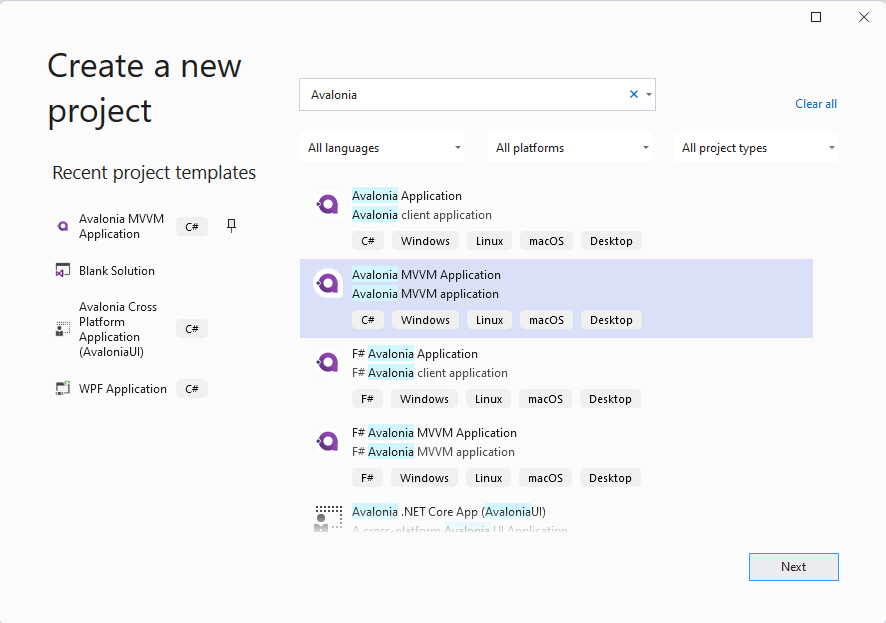

# Basic MVVM Sample

This sample will show you, how you can use the `MVVM`-pattern to receive and process text input by the user. Our sample App will have one `TextBox` where the users can enter their name and one `TextBlock` where we will send some personal greetings.

**Difficulty**

:hatching_chick: Beginner :hatching_chick:

**Buzz-Words**

MVVM, Model-View-ViewModel, ReactiveUI, INotifyPropertyChanged, XAML, Binding

## Before we start

### Prepare your IDE
Please make sure you have setup your IDE according to the [[docs](https://docs.avaloniaui.net/docs/getting-started/ide-support)]. Moreover you should have read the [[Getting Started guide](https://docs.avaloniaui.net/docs/getting-started)]. 

### The MVVM Pattern in short

We will use the `MVVM`-pattern in this sample. `MVVM` is short for **M**odel - **V**iew - **V**iew**M**odel and describes a software architectural pattern that will split the code base into three pieces:

- **Model**: The `Model` will store and handle your data. The model doesn't know your `View` or `ViewModel`.
- **View**: The `View` can be thought as the UserInterface and will interact with your `ViewModel`. 
- **ViewModel**: The `ViewModel` can be seen as a mediator between the `View` and the `Model`. It will know about the `Model` and is known by the `View`, but it doesn't know anything about the `View`. It can transform and convert the data provided by the `Model`, if needed.

This pattern helps us to focus on either of the three parts. If we get new values in our `Model`, the `ViewModel` will notify the `View` about it and the `View` can update itself. We don't have to do it manually. If you want to read more about it, here is a collection of useful links:

- <a href="https://docs.avaloniaui.net/guides/basics/mvvm" target="_blank">[Avalonia Docs]</a>
- <a href="https://en.wikipedia.org/wiki/Model%E2%80%93view%E2%80%93viewmodel" target="_blank">[Wikipedia]</a>
- <a href="https://www.codeproject.com/Articles/278901/MVVM-Pattern-Made-Simple" target="_blank">[CodeProject]</a>
- <a href="https://www.tutorialspoint.com/mvvm/index.htm" target="_blank">[tutorialspoint]</a>

### INotifyPropertyChanged

Our view needs any way to know when a property has changed and the view should update itself. To achieve this there is an interface called `INotifyPropertyChanged` which implements the event `PropertyChanged`. If our `ViewModel` implements this interface, we can send update notifications to our `View` or any other class listening to that event. 

More: <a href="https://docs.microsoft.com/en-US/dotnet/api/system.componentmodel.inotifypropertychanged?view=net-6.0" target="_blank">[Microsoft Docs]</a>

### Create a new Project

Create a new "Avalonia MVVM Application" Project either via `File ► New Project ► Avalonia MVVM Project`:



Or via command line: 

```txt
dotnet new avalonia.mvvm -o BasicMvvmSample
cd BasicMvvmSample
```

## Solution 1 : Implement INotifyPropertyChanged on our own

In this sample we will show you how you can implement and use the interface on your own. 

### Step 1: Create SimpleViewModel

In our project structure we have a folder called `ViewModels`. We will add a new class called "SimpleViewModel" there. This class should implement `INotifyPropertyChanged` like shown below: 

```cs
// Remember to add this to your usings 
using System.ComponentModel;

namespace BasicMvvmSample.ViewModels
{
    // This is our simple ViewModel. We need to implement the interface "INotifyPropertyChanged"
    // in order to notify the View if any of our properties changed.
    public class SimpleViewModel : INotifyPropertyChanged
    {
        // This event is implemented by "INotifyPropertyChanged" and all we need to inform 
        // our view about changes.
        public event PropertyChangedEventHandler? PropertyChanged;
    }
}
```

For convenience we will now add a method to our class, which will raise the event for us. We need to provide the name of the property which has changed. If we add `[CallerMemberName]` to that argument, the compiler will add the property name for us. 

```cs
using System.Runtime.CompilerServices;

[...]

private void RaisePropertyChanged([CallerMemberName] string? propertyName = null)
{
    PropertyChanged?.Invoke(this, new PropertyChangedEventArgs(propertyName));
}
```

### Step 2: Add Properties to our ViewModel

We want the user to be able to enter their name. This text will later be used to greet the user. So let's add `Name` and `Greeting` to your `ViewModel`:

```cs
private string? _Name; // This is our backing field for Name

public string? Name
{
    get 
    {
        return _Name; 
    }
    set
    {
        // We only want to update the UI if the Name actually changed, so we check if the value is actually new
        if (_Name != value)
        {
            // 1. update our backing field
            _Name = value;

            // 2. We call RaisePropertyChanged() to notify the UI about changes. 
            // We can omit the property name here because [CallerMemberName] will provide it for us.  
            RaisePropertyChanged();

            // 3. Greeting also changed. So let's notify the UI about it. 
            RaisePropertyChanged(nameof(Greeting));
        }
    }
}

// Greeting will change based on a Name.
public string Greeting
{
    get
    {
        if (string.IsNullOrEmpty(Name))
        {
            // If no Name is provided, use a default Greeting
            return "Hello World from Avalonia.Samples";
        }
        else
        {
            // else Greet the User.
            return $"Hello {Name}";
        }
    }
}
```

### Step 3: Add SimpleViewModel to MainWindowViewModel

Our view will only consist of one [[`Window`](https://docs.avaloniaui.net/docs/controls/window)] called `MainWindow`. It's [[`DataContext`](https://docs.avaloniaui.net/docs/data-binding/the-datacontext)] is the class `MainWindowViewModel` which was added by the template. We will just add an instance of our `SimpleViewModel` to it: 

```cs
// Add our SimpleViewModel.
// Note: We need at least a get-accessor for our Properties.
public SimpleViewModel SimpleViewModel { get; } = new SimpleViewModel();
```

### Step 4: Setup the View 

Now we can start with the UI layout. Our View will be written in [[`XAML`](https://docs.avaloniaui.net/guides/basics/introduction-to-xaml)]. 

#### Enable Compiled Bindings

> Note: the following step is optional, but highly recommended 

We enable [[`CompiledBindings`](https://docs.avaloniaui.net/docs/data-binding/compiledbindings)] in our `Window` by adding `x:DataType` and `x:CompileBindings`. This has many benefits such as better performance and better debugging experience. 

```xml
<Window xmlns="https://github.com/avaloniaui"
        xmlns:x="http://schemas.microsoft.com/winfx/2006/xaml"
        xmlns:vm="using:BasicMvvmSample.ViewModels"
        xmlns:d="http://schemas.microsoft.com/expression/blend/2008"
        xmlns:mc="http://schemas.openxmlformats.org/markup-compatibility/2006"
        mc:Ignorable="d" d:DesignWidth="800" d:DesignHeight="450"
        x:CompileBindings="True" 
        x:DataType="vm:MainWindowViewModel"
        x:Class="BasicMvvmSample.Views.MainWindow"
        Icon="/Assets/avalonia-logo.ico"
        Title="BasicMvvmSample">
</Window>
```

#### Add the Content to MainWindow

We will use a [[`TextBox`](https://docs.avaloniaui.net/docs/controls/textbox)] for the user to enter their name and a [[`TextBlock`](https://docs.avaloniaui.net/docs/controls/textblock)] to present the greeting. As a `Window` can only have one child, we need to wrap our controls in a [[`Panel`](https://docs.avaloniaui.net/docs/layout)]. We will choose a [[`StackPanel`](https://docs.avaloniaui.net/docs/controls/stackpanel)], but you can use any other Panel as well. 

The `StackPanel`'s `DataContext` will [[bind](https://docs.avaloniaui.net/docs/data-binding/bindings)] to our `SimpleViewModel`. As the DataContext is inherited from the parent control, out `TextBox` and `TextBlock` will have the same `DataContext`. So we can just bind `TextBox.Text` to `Name` and `TextBock.Text` to `Greeting`:

```xml
<Window xmlns="https://github.com/avaloniaui"
        xmlns:x="http://schemas.microsoft.com/winfx/2006/xaml"
        xmlns:vm="using:BasicMvvmSample.ViewModels"
        xmlns:d="http://schemas.microsoft.com/expression/blend/2008"
        xmlns:mc="http://schemas.openxmlformats.org/markup-compatibility/2006"
        mc:Ignorable="d" d:DesignWidth="800" d:DesignHeight="450"
        x:CompileBindings="True"
        x:DataType="vm:MainWindowViewModel"
        x:Class="BasicMvvmSample.Views.MainWindow"
        Icon="/Assets/avalonia-logo.ico"
        Title="BasicMvvmSample">
    
    <!-- This is just used by the designer / previewer -->
	<Design.DataContext>
        <vm:MainWindowViewModel/>
    </Design.DataContext>

	<!-- Our Simplie ViewModel-->
	<StackPanel DataContext="{Binding SimpleViewModel}" Spacing="10">
		<TextBlock>Enter your Name:</TextBlock>
		<TextBox Text="{Binding Name}" />
		<TextBlock Text="{Binding Greeting}" 
				   FontWeight="Bold" />
	</StackPanel>
</Window>
``` 

### Step 5: See it in action

In your IDE hit `Debug [F5]`. You should see the following result: 


## Related

Are you looking for more advanced tutorials? Find them here: 

- <a href="https://docs.avaloniaui.net/tutorials/todo-list-app" target="_blank">[ToDo List App]</a>
- <a href="https://docs.avaloniaui.net/tutorials/music-store-app" target="_blank">[Music Store App]</a>
- <a href="https://github.com/AvaloniaCommunity/awesome-avalonia#tutorials" target="_blank">[Awesome-Avalonia]</a>