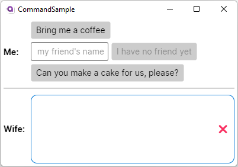

= Commands Example
// --- Don't touch this section ---
:toc:
:toc-placement!:
:tip-caption: :bulb:
:note-caption: :information_source:
:important-caption: :heavy_exclamation_mark:
:caution-caption: :fire:
:warning-caption: :warning:
// ---------------------------------

This example will show you how you can use `Commands` to run methods in your `ViewModel` invoked from your user interface. 

// Don't touch below line. It will render a table of content.
toc::[]

=== Difficulty
// Choose one of the below difficulties. You can just delete the ones you don't need.

🐣 Beginner 🐣

=== Buzz-Words
Command, ICommand, CommandParameter, MVVM, ReactiveCommand, async-await

== Before we start

In this sample we assume that you know what a `Binding` is and that you have a basic knowledge of the `MVVM` concepts. Moreover you should already know how to create a new Avalonia project. 

In case you want to refresh your knowledge, visit the link:../BasicMvvmSample[[Basic MVVM Sample\]]. 

=== ICommand

If a class implements the https://docs.microsoft.com/en-us/dotnet/api/system.windows.input.icommand?view=net-6.0[[`ICommand`\]] interface it can be used to invoke a `Method` in your `ViewModel` from the UI. Moreover the interface allows you to easily enable or disable the `Command`. These interface has three members;

CanExecute(Object):: Defines the method that determines whether the command can execute in its current state.

Execute(Object):: Defines the method to be called when the command is invoked.

CanExecuteChanged-Event:: Occurs when changes occur that affect whether or not the command should execute.

_Definitions copied from https://docs.microsoft.com/en-us/dotnet/api/system.windows.input.icommand?view=net-6.0_

==== ReactiveCommand

In this sample we are not going to implement `ICommand` on our own. Instead we will use the implementations that https://www.reactiveui.net/docs/handbook/commands/[[`ReactiveUI`\]] ships out of the box.

==== Commands and long running Tasks

Some `MVVM`-libs, like `ReactiveUI`, provide an async implementations of the `ICommand` interface. That way we can execute long running tasks from our UI without blocking the UI.

== The Sample 

The sample will show a dialog between you and your wife. You can ask her to bring you and your friend a coffee and bake a cake. Feel free to change wife into your husband, aunt, uncle, grandma, grandpa or whoever you want to interact with 😉. 

=== Step 1: Create a new Avalonia MVVM Application

Create a new Project using the `Avalonia MVVM Application`-Template

=== Step 2: Prepare the MainWindowViewModel

We want to interact with our wife. So our wife needs a way to respond to us. Let's create a method to let her talk to you and a collection to store what she said. We use an https://docs.microsoft.com/en-us/dotnet/api/system.collections.objectmodel.observablecollection-1?view=net-6.0[ [ObservableCollection\]`], because this collection will notify out UI whenever a line was added or removed. In the file `ViewModels ► MainWindowViewModel.cs` add the following lines:

[source,cs]
----
/// 

///  This collection will store what our wife said
/// 

public ObservableCollection<string> WhatYourWifeSaid { get; } = new ObservableCollection<string>();

// Just a helper to add content to WhatYourWifeSaid
private void WifeSays(string content)
{
    WhatYourWifeSaid.Add(content);
}
----

Beside our wife we need to create a friend (can also be your enemy if you want). Our friend will just have a name, so let's add this property: 

[source,cs]
----
/// 

/// Enter the name of your friend here. If the name is null or empty, you have no friend to bring a coffee.
/// 

public string? FriendsName
{
    get => _FriendsName;
    set => this.RaiseAndSetIfChanged(ref _FriendsName, value);
}
----

=== Step 3: Create the "Bring me a coffee" - Command

In the file `ViewModels ► MainWindowViewModel.cs` add a new read-only property of type `ICommand`. We use the interface instead of the specialized class, because it is more flexible. For example You can easily replace it with an async implementation if you need to.

[source,cs]
----
/// 

/// This command will ask our wife to bring us a coffee.
/// 

public ICommand BringMeACoffeeCommand { get; }
----

Now we will create a method which will be executed when the `Command` is invoked:

[source,cs]
----
// The method that will be executed when the command is invoked
private void BringMeACoffee()
{
    WhatYourWifeSaid.Clear();
    WifeSays("Go, get your self a coffee !!");
}
----

Last but not least we need to initialize our `Command` before we can use it. We will do this in our https://docs.microsoft.com/en-us/dotnet/csharp/programming-guide/classes-and-structs/constructors[`[Constructor\]`] as shown below. We create our Commands using https://www.reactiveui.net/docs/handbook/commands/[`[ReactiveCommand.Create())\]`] method which will take a method or a lambda as parameter.

[source,cs]
----
public MainWindowViewModel()
{
    // Init BringMeACoffeeCommand
    BringMeACoffeeCommand = ReactiveCommand.Create(BringMeACoffee);
}
----

=== Step 4: Create the "Bring my friend a coffee" - Command

This `Command` is very similar to the one above. This time we will use a `CommandParameter` which is the name of our friend, but in fact it can be any `object` depending on your needs. We will also use the `CommandParameter` to enable or disable the `Command`, depending on the state of the parameter. 

[source,cs]
----
/// 

/// This command will ask our wife to bring your friend a beer.
/// 

public ICommand BringMyFriendACoffeeCommand { get; }
----

Our method will look like this: 

[source,]
----
private void BringMyFriendACoffee(string? friendsName)
{
    WhatYourWifeSaid.Clear();
    WifeSays($"Dear {friendsName}, here is your coffee :-)");
}
----

TIP: We use string interpolation in the above method. If you want to learn more about it visit https://docs.microsoft.com/en-us/dotnet/csharp/language-reference/tokens/interpolated[[Microsoft Docs\]].

Again we have to initialize our command in the constructor. We will first create an https://docs.microsoft.com/en-us/dotnet/api/system.iobservable-1?view=net-6.0[[`Observable`\]] which will listen to `FriendsName`. The observable will automatically enable our `Command` whenever `FriendsName` is not empty and disable the `Command` whenever `FriendsName` is `null` or empty. Add the following lines to our constructor: 

[source,cs]
----
public MainWindowViewModel()
{
    // The IObservable<bool> is needed to enable or disable the command depending on valid parameters
    // The Observable listens to FriendsName and will enable the Command if the name is not empty.
    IObservable<bool> canExecuteBringMyFriendABeerCommand =
        this.WhenAnyValue(vm => vm.FriendsName, (name) => !string.IsNullOrEmpty(name));

    BringMyFriendACoffeeCommand = 
        ReactiveCommand.Create<string?>(name => BringMyFriendACoffee(name), canExecuteBringMyFriendABeerCommand);
}
----

NOTE: This time we used `ReactiveCommand.Create<string?>`. the part between `<>` defines the expected type of our `CommandParameter` and can be any type you like.

=== Step 5: Create "Bake us a cake" - Command

Baking a cake can take long time and we will have to wait for it. While our wife is working for us, we can do other stuff like watching football. So we need to make sure that the user can interact with the UI while the task is running. In `C#` we can use https://docs.microsoft.com/en-us/dotnet/csharp/programming-guide/concepts/async/[[`async / await`\]] in combination with https://docs.microsoft.com/en-us/dotnet/api/system.threading.tasks.task?view=net-6.0[[`Tasks`\]] if we want to run things in the background while not blocking the UI. Let's add the `Command` and the `Task` to `ViewModels ► MainWindowViewModel.cs`:

[source,cs]
----
// This method is an async Task because baking a cake can take long time.
// We don't want our UI to become unresponsive.
private async Task BakeUsACakeAsync()
{
    WhatYourWifeSaid.Clear();
    WifeSays("Sure, I'll make you an apple pie.");
    // wait a second
    await Task.Delay(1000);

    WifeSays("I'm mixing all the ingredients.");
    await Task.Delay(2000);

    WifeSays("It's in the oven. Wait another 2 seconds.");
    await Task.Delay(2000);

    WifeSays("Here is your cake, fresh from the oven.");
}
----

Initiating the async `Command` in the constructor is very similar to what sync `Command`:

[source,cs]
----
public MainWindowViewModel()
{
    // Init BakeUsACakeCommand
    BakeUsACakeCommand = ReactiveCommand.CreateFromTask(BakeUsACakeAsync);
}
----

TIP: When you execute this command, notice that the `Button` is grayed out until the `Task` finished, so you can't ask for another cake until the first is out of the oven. You 

=== Step 6: Setting up the User Interface

Open the file `Views ► MainWindow.axaml`. We will add three `Buttons` where we bind `Button.Command` to the `ICommands` we prepared in the `ViewModel`. The second `Button` will also get a binding to `Button.CommandParameter`. 

[source,xml]
----
<Window xmlns="https://github.com/avaloniaui"
        xmlns:x="http://schemas.microsoft.com/winfx/2006/xaml"
        xmlns:vm="using:CommandSample.ViewModels"
        xmlns:d="http://schemas.microsoft.com/expression/blend/2008"
        xmlns:mc="http://schemas.openxmlformats.org/markup-compatibility/2006"
        mc:Ignorable="d" 
		Width="400"
		Height="250"
		x:CompileBindings="True"
		x:DataType="vm:MainWindowViewModel"
        x:Class="CommandSample.Views.MainWindow"
        Icon="/Assets/avalonia-logo.ico"
        Title="CommandSample">

    <Design.DataContext>
        <vm:MainWindowViewModel/>
    </Design.DataContext>

	<Grid RowDefinitions="Auto, Auto, *" ColumnDefinitions="Auto, *">
		
		<TextBlock Grid.Column="0" Grid.Row="0"
				   Text="Me:" 
				   FontWeight="Bold" 
				   VerticalAlignment="Center"
		           Margin="5" />
		
		<StackPanel Grid.Column="1" Grid.Row="0" 
					Spacing="5" Margin="5" >

			<!-- This button will ask our wife for a coffee -->
			<Button Command="{Binding BringMeACoffeeCommand}"
					Content="Bring me a coffee" />
			
			<!-- This button will ask our wife for a coffee for our friend -->
			<!-- We use CommandParameter to provide the name of our friend-->
			<!-- Note that the button is automatically disabled if we don't enter a name-->
		    <StackPanel Orientation="Horizontal" Spacing="5">
				<TextBox Text="{Binding FriendsName}" Watermark="my friend's name"  />
			    <Button Command="{Binding BringMyFriendACoffeeCommand}" 
						Content="{Binding FriendsName, StringFormat='Bring {0} a coffee'}"
						CommandParameter="{Binding FriendsName}"/>
			</StackPanel>
			
			<!-- This button will ask our wife to make us a cake -->
			<!-- As this is a long operation, the command is async.-->
			<!-- Our wife will inform us about the current state.-->
			<Button Command="{Binding BakeUsACakeCommand}"
					Content="Can you make a cake for us, please?" />
		</StackPanel>
		
		<Separator Grid.Row="1" Grid.ColumnSpan="2" 
				   HorizontalAlignment="Stretch" 
				   Margin="5"
				   Height="2"
				   Background="LightGray"/>

		<TextBlock Grid.Column="0" Grid.Row="2"
			       Text="Wife:"
				   FontWeight="Bold"
		           Margin="5"
		           VerticalAlignment="Center"/>

		<Border Grid.Column="1" Grid.Row="2"
				CornerRadius="10" Margin="5"
			    BorderThickness="1" BorderBrush="{DynamicResource SystemAccentColor}">
			<Grid ColumnDefinitions="*,Auto">
				<ItemsRepeater Margin="5"
							   Items="{Binding WhatYourWifeSaid}" />
				
				<!-- This button will clear what our wife said recently -->
				<!-- We use ReflectionBinding as we bind to a method instead of a Command here, 
				     which is not supported via CompiledBinding. --> 
				<Button Grid.Column="1"
						VerticalAlignment="Stretch" VerticalContentAlignment="Center"
						Background="Transparent"
						Command="{ReflectionBinding WhatYourWifeSaid.Clear}"
						Content="❌"/>
			</Grid>
		</Border>
	</Grid>
</Window>
----

We can also bind `Button.Command` to any `Method`. To demonstrate that we added another `Button` which we can use to clear what our wife said recently. 

NOTE: Instead of `Binding` we need to use `ReflectionBinding`, because we enabled `CompiledBindings` in the `Window`, which don't support binding to `Methods`. https://docs.avaloniaui.net/docs/data-binding/compiledbindings#known-limitations[[more\]]

=== Step 7: See it in action

In your IDE press `Run` or `Debug` and try the sample out. Notice how the `Buttons` will be enabled and disabled automatically.

== Related 

Beside the `ReactiveCommands` from `Reactive UI`, you can also try out other `ICommand` implementations. Here are a few to try: 

- https://docs.microsoft.com/en-us/windows/communitytoolkit/[[RelayCommand\]] from the `MVVM Toolkit`
- https://prismlibrary.com/docs/commands/commanding.html[[DelegateCommand\]] from `Prism Library`
