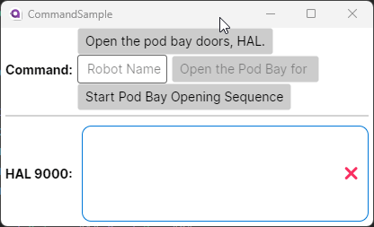

= Commands Example
// --- Don't touch this section ---
:toc:
:toc-placement!:
:tip-caption: :bulb:
:note-caption: :information_source:
:important-caption: :heavy_exclamation_mark:
:caution-caption: :fire:
:warning-caption: :warning:
// ---------------------------------

This example will show you how you can use `Commands` to invoke methods in your `ViewModel` from your user interface. 

// Don't touch below line. It will render the table of content.
toc::[]

=== Difficulty

🐣 Beginner 🐣

=== Buzz-Words
Command, ICommand, CommandParameter, MVVM, ReactiveCommand, async-await

== Before we start

In this sample we assume that you know what a `Binding` is and that you have a basic knowledge of the `MVVM` concepts. Moreover you should already know how to create a new Avalonia project. 

In case you want to refresh your knowledge, visit the link:../BasicMvvmSample[[Basic MVVM Sample\]]. 

=== ICommand

If a class implements the https://docs.microsoft.com/en-us/dotnet/api/system.windows.input.icommand?view=net-6.0[[`ICommand`\]] interface it can be used to execute a `Method` in your `Model` or `ViewModel`.  Moreover the interface allows you to easily enable or disable the `Control` (most often a `Button`), that your `Command` is bound to. 

The interface has three members:

CanExecute(Object):: Defines the method that determines whether the command can execute in its current state.

Execute(Object):: Defines the method to be called when the command is invoked.

CanExecuteChanged-Event:: Occurs when changes occur that affect whether or not the command should execute.

_Definitions copied from https://docs.microsoft.com/en-us/dotnet/api/system.windows.input.icommand?view=net-6.0_

==== ReactiveCommand

In this sample we are not going to implement `ICommand` on our own. Instead we will use the implementations that https://www.reactiveui.net/docs/handbook/commands/[[`ReactiveUI`\]] ships out of the box, called `ReactiveCommand`.

==== Commands and long running Tasks

Some `MVVM`-libs, like `ReactiveUI`, provide an async implementations of the `ICommand` interface. That way we can execute long running tasks from our UI without blocking the UI.

== The Sample 

In this sample, we will give commands to HAL-9000, a stubborn computer, in a homage to the
famous "Open the POD bay doors" scene from the movie "2001 A Space Odyssey".

=== Step 1: Create a new Avalonia MVVM Application

Create a new Project using the `Avalonia MVVM Application`-Template

=== Step 2: Prepare the MainWindowViewModel

Open the file `ViewModels ► MainWindowViewModel.cs`.

We want to store a record of our conversation with HAL-9000.  We use an https://docs.microsoft.com/en-us/dotnet/api/system.collections.objectmodel.observablecollection-1?view=net-6.0[`[ObservableCollection\]`], because this collection will notify out UI whenever a line was added or removed. In the file `ViewModels ► MainWindowViewModel.cs` add the following lines:

[source,cs]
----
/// 

///  This collection will store what the computer said
/// 

public ObservableCollection<string> ConversationLog { get; } = new ObservableCollection<string>();

// Just a helper to add content to ConversationLog
private void AddToConvo(string content)
{
    ConversationLog.Add(content);
}
----

Since HAL-9000 is not likely to listen to us, we also want to have the suggestion come
from a fellow robot. We want a field to put in the robot's name. Let's add a property:

[source,cs]
----
/// 

/// The name of a robot. If the name is null or empty, there is no other robot present.
/// 

public string? RobotName
{
    get => _RobotName;
    set => this.RaiseAndSetIfChanged(ref _RobotName, value);
}
----

=== Step 3: Create the "Open the POD bay doors" - Command

In the file `ViewModels ► MainWindowViewModel.cs` add a new read-only property of type `ICommand`. We use the interface instead of the specialized class, because it is more flexible. For example You can easily replace it with an async implementation if you need to.

[source,cs]
----
/// 

/// This command will ask HAL-9000 to open the pod bay doors
/// 

public ICommand OpenThePodBayDoorsDirectCommand { get; }
----

Now we will create a method which will be executed when the `Command` is invoked:

HAL responds to the human named "Dave" that he can't do that. 
This is a famous line from the movie.

[source,cs]
----
// The method that will be executed when the command is invoked
private void OpenThePodBayDoors()
{    
	ConversationLog.Clear();
    AddToConvo( "I'm sorry, Dave, I'm afraid I can't do that.");
}
----

Last but not least we need to initialize our `Command` before we can use it. We will do this in our https://docs.microsoft.com/en-us/dotnet/csharp/programming-guide/classes-and-structs/constructors[`[Constructor\]`] as shown below. We create our Commands using https://www.reactiveui.net/docs/handbook/commands/[`[ReactiveCommand.Create())\]`] method which will take a method or a lambda as parameter.

[source,cs]
----
public MainWindowViewModel()
{
    // Init OpenThePodBayDoorsDirectCommand    
	OpenThePodBayDoorsDirectCommand = ReactiveCommand.Create(OpenThePodBayDoors);
}
----

=== Step 4: Create the "Fellow Robot" - Command

Perhaps we will have more luck if the command is given by a fellow robot.

This `Command` is very similar to the one above. This time we will use a `CommandParameter` which is the name of another robot, but in fact it can be any `object` depending on your needs. We will also use the `CommandParameter` to enable or disable the `Command`, depending on the state of the parameter. 

[source,cs]
----
/// 

/// This command will ask HAL to open the pod bay doors, but this time we
/// check that the command is issued by a fellow robot (really any non-null name)
/// 

public ICommand OpenThePodBayDoorsFellowRobotCommand { get; }
----

Our method will look like this: 

[source,cs]
----
private void OpenThePodBayDoorsFellowRobot(string? robotName)
{
    ConversationLog.Clear();
	AddToConvo( $"Hello {robotName}, the Pod Bay is open :-)");
}
----

TIP: We use string interpolation in the above method. If you want to learn more about it visit https://docs.microsoft.com/en-us/dotnet/csharp/language-reference/tokens/interpolated[[Microsoft Docs\]].

Again we have to initialize our command in the constructor. We will first create an https://docs.microsoft.com/en-us/dotnet/api/system.iobservable-1?view=net-6.0[[`Observable`\]] using `ReactiveUI's` https://www.reactiveui.net/docs/handbook/when-any/#watching-single-property[[`WhenAnyValue`\]] which will listen to `RobotName`. The `Observable` will automatically enable our `Command` whenever `RobotName` is not null or empty and disable the `Command` whenever `RobotName` is `null` or empty. Add the following lines to our constructor: 

[source,cs]
----
public MainWindowViewModel()
{
    // The IObservable<bool> is needed to enable or disable the command depending on valid parameters
    // The Observable listens to RobotName and will enable the Command if the name is not empty.
    IObservable<bool> canExecuteFellowRobotCommand =
        this.WhenAnyValue(vm => vm.RobotName, (name) => !string.IsNullOrEmpty(name));

    OpenThePodBayDoorsFellowRobotCommand = 
        ReactiveCommand.Create<string?>(name => OpenThePodBayDoorsFellowRobot(name), canExecuteFellowRobotCommand);
}
----

NOTE: This time we used `ReactiveCommand.Create<string?>`. the part between `<>` defines the expected type of our `CommandParameter` and can be any type you like.

=== Step 5: Create "Open the Pod Bay sequence" - Async Command

Many operations have multiple steps and we want to keep the user interface responsive while
we wait for sequence of operations to complete. One way to do this in `C#` is to use https://docs.microsoft.com/en-us/dotnet/csharp/programming-guide/concepts/async/[[`async / await`\]] in combination with https://docs.microsoft.com/en-us/dotnet/api/system.threading.tasks.task?view=net-6.0[[`Tasks`\]] to run things in the background while not blocking the UI. 

Let's add the `Command` and the `Task` to our `ViewModel`:

[source,cs]
----
// This method is an async Task because opening the pod bay doors can take long time.
// We don't want our UI to become unresponsive.
private async Task OpenThePodBayDoorsAsync()
{
	ConversationLog.Clear();
	AddToConvo( "Preparing to open the Pod Bay...");
	// wait a second
	await Task.Delay(1000);
	
	AddToConvo( "Depressurizing Airlock...");
	// wait 2 seconds
	await Task.Delay(2000);
	
	AddToConvo( "Retracting blast doors...");
	// wait 2 more seconds
	await Task.Delay(2000);
	
	AddToConvo("Pod Bay is open to space!");
}
----

Initiating the async `Command` in the constructor is very similar to how you init a sync `Command`, except we use `CreateFromTask` instead of `Create`:

[source,cs]
----
public MainWindowViewModel()
{
    // Init OpenThePodBayDoorsAsyncCommand
	OpenThePodBayDoorsAsyncCommand = ReactiveCommand.CreateFromTask(OpenThePodBayDoorsAsync);
}
----

TIP: When you execute this command, notice that the `Button` is disabled until the `Task` is finished, so you can't ask for the pod bay doors to open again while the opening sequence is running. A more complete program could keep track of the state of the Pod Bay and change the button to "close".

=== Step 6: Setting up the User Interface

Open the file `Views ► MainWindow.axaml`. We will add three `Buttons` where we bind `Button.Command` to the `ICommands` we prepared in the `ViewModel`. The second `Button` will also get a binding to `Button.CommandParameter`. 

The first `Button` looks like this: 

[source,xml]
----
<!-- This button will ask HAL to open the doors -->
<Button Command="{Binding OpenThePodBayDoorsDirectCommand}" 
                    Content="Open the pod bay doors, HAL." />
----

The second `Button` will have a `CommandParameter` defined and more over the `Content` will change dynamically. The `Button` is rendered next to a `TextBox`, where we can enter the name of a `Robot`:

[source,xml]
----
<!-- This button will ask HAL to open the doors for a fellow robot -->
<!-- We use CommandParameter to provide the name of the robot -->
<!-- Note that the button is automatically disabled if we don't enter a name-->
<StackPanel Orientation="Horizontal" Spacing="5">	
	<TextBox Text="{Binding RobotName}" Watermark="Robot Name" />
	<Button Command="{Binding OpenThePodBayDoorsFellowRobotCommand}"
			Content="{Binding RobotName, StringFormat='Open the Pod Bay for {0}'}"
			CommandParameter="{Binding RobotName}" />
</StackPanel>
----

The third `Button` will bind to our `async Command`:

[source,xml]
----
<!-- This button will ask start a multi-step sequence to open the doors -->
<!-- As this is a long operation, the command is async.-->
<!-- HAL inform us about the current progress of the doors.-->
<Button Command="{Binding OpenThePodBayDoorsAsyncCommand}"
        Content="Start Pod Bay Opening Sequence" />
----

We can also bind `Button.Command` to any `Method`. To demonstrate that we added another `Button` which we can use to clear the recent conversation log.

[source,xml]
----
<!-- This button will clear the recent conversation log -->
<Button Grid.Column="1"
		VerticalAlignment="Stretch" VerticalContentAlignment="Center"
		Background="Transparent"
		Command="{Binding ConversationLog.Clear}"
		Content="❌"/>
----

Now let's put all together. Our `View` will finally look like this:

[source,xml]
----
<Window xmlns="https://github.com/avaloniaui"
		xmlns:x="http://schemas.microsoft.com/winfx/2006/xaml"
		xmlns:vm="using:CommandSample.ViewModels"
		xmlns:d="http://schemas.microsoft.com/expression/blend/2008"
		xmlns:mc="http://schemas.openxmlformats.org/markup-compatibility/2006"
		mc:Ignorable="d" 
		Width="400"
		Height="250"
		x:CompileBindings="True"
		x:DataType="vm:MainWindowViewModel"
		x:Class="CommandSample.Views.MainWindow"
		Icon="/Assets/avalonia-logo.ico"
		Title="CommandSample">

    <Design.DataContext>
        <vm:MainWindowViewModel/>
    </Design.DataContext>

	<Grid RowDefinitions="Auto, Auto, *" ColumnDefinitions="Auto, *">
		
		<TextBlock Grid.Column="0" Grid.Row="0"
				   Text="Command:" 
				   FontWeight="Bold" 
				   VerticalAlignment="Center"
		           Margin="5" />
		
		<StackPanel Grid.Column="1" Grid.Row="0" 
					Spacing="5" Margin="5" >

			<!-- This button will ask HAL to open the doors -->
			<Button Command="{Binding OpenThePodBayDoorsDirectCommand}" 
                    Content="Open the pod bay doors, HAL." />
			
			<!-- This button will ask HAL to open the doors for a fellow robot -->
			<!-- We use CommandParameter to provide the name of the robot -->
			<!-- Note that the button is automatically disabled if we don't enter a name-->
			<StackPanel Orientation="Horizontal" Spacing="5">	
				<TextBox Text="{Binding RobotName}" Watermark="Robot Name" />
				<Button Command="{Binding OpenThePodBayDoorsFellowRobotCommand}"
						Content="{Binding RobotName, StringFormat='Open the Pod Bay for {0}'}"
						CommandParameter="{Binding RobotName}" />
			</StackPanel>
			
			<!-- This button will ask start a multi-step sequence to open the doors -->
			<!-- As this is a long operation, the command is async.-->
			<!-- HAL inform us about the current progress of the doors.-->
			<!-- Note: The button will be disabled while the process is running. -->
			<Button Command="{Binding OpenThePodBayDoorsAsyncCommand}"
					Content="Start Pod Bay Opening Sequence" />

		</StackPanel>
		
		<Separator Grid.Row="1" Grid.ColumnSpan="2" 
				   HorizontalAlignment="Stretch" 
				   Margin="5"
				   Height="2"
				   Background="LightGray"/>

		<TextBlock Grid.Column="0" Grid.Row="2"
			       Text="HAL 9000:"
				   FontWeight="Bold"
		           Margin="5"
		           VerticalAlignment="Center"/>

		<!-- This is the area where the output of HAL9000 is rendered -->
		<Border Grid.Column="1" Grid.Row="2"
				CornerRadius="10" Margin="5"
			    BorderThickness="1" BorderBrush="{DynamicResource SystemAccentColor}">
			<Grid ColumnDefinitions="*,Auto">
				<ItemsControl Margin="5"
                              ItemsSource="{Binding ConversationLog}" />
				
				<!-- This button will clear the recent conversation log-->
				<!-- which is not supported via CompiledBinding.                                 --> 
				<Button Grid.Column="1"
						VerticalAlignment="Stretch" VerticalContentAlignment="Center"
						Background="Transparent"
						Command="{Binding ConversationLog.Clear}"
						Content="❌"/>
			</Grid>
		</Border>
	</Grid>
</Window>
----

=== Step 7: See it in action

In your IDE press `Run` or `Debug` and try the sample out. Notice how the `Buttons` will be enabled and disabled automatically.

== Related 

Beside the `ReactiveCommands` from `Reactive UI`, you can also try out other `ICommand` implementations. Here are a few to try: 

- https://docs.microsoft.com/en-us/windows/communitytoolkit/[[RelayCommand\]] from the `MVVM Toolkit`
- https://prismlibrary.com/docs/commands/commanding.html[[DelegateCommand\]] from `Prism Library`
