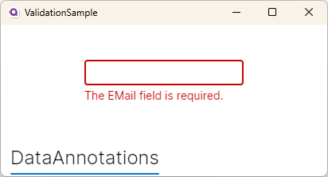
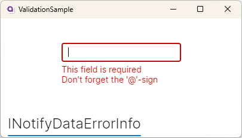
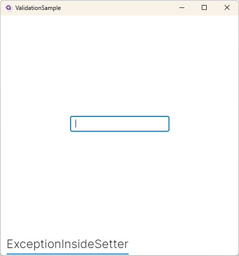

= Data Validation
// --- D O N ' T    T O U C H   T H I S    S E C T I O N ---
:toc:
:toc-placement!:
:tip-caption: :bulb:
:note-caption: :information_source:
:important-caption: :heavy_exclamation_mark:
:caution-caption: :fire:
:warning-caption: :warning:
// ----------------------------------------------------------

// Write a short summary here what this examples does
This example will show you how to https://docs.avaloniaui.net/docs/guides/development-guides/data-validation[[validate properties\]] and display an error message to the user, if the entered values are invalid. For example if the user should enter their e-mail address into a `TextBox`, the "@"-character is required and the `TextBox` may not be empty.

// --- D O N ' T    T O U C H   T H I S    S E C T I O N ---
toc::[]
// ---------------------------------------------------------

=== Difficulty
// Choose one of the below difficulties. You can just delete the ones you don't need.

🐥 Easy 🐥

=== Buzz-Words

// Write some buzz-words here. You can separate them by ", "
Data-Annotation, Data-Validation, Exception, Error, Error-Message, Binding, MVVM

== Before we start

You should already know how to setup a new Avalonia project. Moreover you should know the basics about the MVVM-pattern and how to bind a property of your `ViewModel` to your `View`. In this sample we will show you three options to validate a property. It's up to you, which one you prefer. You can also combine them.

== Approach 1 : Validate a Property using DataAnnotations

In the first approach we will show you is how to use https://learn.microsoft.com/en-us/dotnet/api/system.componentmodel.dataannotations.validationattribute[[`DataAnnotations`\]] to validate a property. To get started, please create a new project using the `Avalonia MVVM Template`. 

=== Step 1: Setup the ViewModel

As we want to show different validation options, we add another file called `ValidationUsingDataAnnotationViewModel` into the `ViewModels`-folder. This class will be added as a read-only Property into our `MainWindowViewModel`:

[source,cs]
----
/// 

/// Gets a ViewModel showing how to use DataAnnotations for validation
/// 

public ValidationUsingDataAnnotationViewModel ValidationUsingDataAnnotationViewModel { get; } 
    = new ValidationUsingDataAnnotationViewModel();
----

=== Step 2: Add the Property

Let's assume we want to make a registration-form where an e-mail-address is required and must be a valid e-mail-address. We add a property called `EMail`. This property will be decorated with the https://learn.microsoft.com/en-us/dotnet/api/system.componentmodel.dataannotations.requiredattribute[[`RequiredAttribute`\]] and the https://learn.microsoft.com/en-us/dotnet/api/system.componentmodel.dataannotations.emailaddressattribute[[`EMailAddressAttribute`\]]. You can combine as many attributes as you want as well as creating your own https://learn.microsoft.com/en-us/dotnet/api/system.componentmodel.dataannotations.validationattribute[[`ValidationAttribute`\]].

[source,cs]
----
private string? _EMail;

/// 

/// Validation using DataAnnotation
/// 

[Required]
[EmailAddress]
public string? EMail
{
    get { return _EMail; }
    set { this.RaiseAndSetIfChanged(ref _EMail, value); }
}
----

=== Step 3: Setup the View

In the file `MainWindow.axaml` we add a `TabControl` where each `TabItem` represents one of our options. Inside the `TabItem` there is just one `TextBox` which binds to our property `EMail`. 

[source,xml]
----
<TabControl TabStripPlacement="Bottom">
    <!--Validation using DataAnnotations-->
    <TabItem Header="DataAnnotations">
        <TextBox Text="{Binding ValidationUsingDataAnnotationViewModel.EMail}" />
    </TabItem>
</TabControl>
----

=== Step 4: Run the App

In your IDE hit `Run` or `Debug` to see the result: 

.Result Option 1

== Approach 2 : Validate a Property using INotifyDataErrorInfo

You can also implement the interface https://learn.microsoft.com/en-us/dotnet/api/system.componentmodel.inotifydataerrorinfo[[`INotifyDataErrorInfo`\]] into your `ViewModel` or it's base class. Some MVVM-libraries already implement this interface by default.

=== Step 1: Setup the ViewModel

Again we add another file called `ValidationUsingINotifyDataErrorInfoViewModel` into the `ViewModels`-folder. This class will be added as a read-only Property into our `MainWindowViewModel`:

[source,cs]
----
/// 

/// Gets a ViewModel showing how to use INotifyDataErrorInfo for validation
/// 

public ValidationUsingINotifyDataErrorInfoViewModel ValidationUsingINotifyDataErrorInfoViewModel { get; } 
    = new ValidationUsingINotifyDataErrorInfoViewModel();
----

Now we have to implement the interface, if this is not already done by the base-class you use. In our sample we add the interface on our own. The interface requires these members: 

|====
a| bool HasErrors:: Gets if there are any errors.

void GetErrors(string? propertyName):: Gets the errors for a given property (by its name) or all errors, if property name was `null` or `string.Empty`.

event ErrorsChanged:: this event is raised whenever any error was added or removed.
|====

In addition to the interface members we add the following items: 

|===
a| private Dictionary errors:: A `Dictionary` that caches the errors, so we don't need to validate the properties every time.

protected void ClearErrors(string? propertyName = null):: This void will clear all errors for the given property name or all errors if `propertyName` was `null`. The `ErrorsChanged`-event will be raised.

protected void AddError(string propertyName, string errorMessage):: This void will add a given error message for a given property by it's name. The `ErrorsChanged`-event will be raised.
|===

TIP: the `protected` keyword helps us to make the properties or methods available in derived classes, but not from any external class.

Below you can see the final implementation:

[source,cs]
----
public class ValidationUsingINotifyDataErrorInfoViewModel : ViewModelBase, INotifyDataErrorInfo
{
    // Implement members of INotifyDataErrorInfo

    public event EventHandler<DataErrorsChangedEventArgs>? ErrorsChanged;

    // we have errors present if errors.Count is greater than 0
    public bool HasErrors => errors.Count > 0;

    /// <inheritdoc />
    public IEnumerable GetErrors(string? propertyName)
    {
        // Get entity-level errors when the target property is null or empty
        if (string.IsNullOrEmpty(propertyName))
        {
            return errors.Values.SelectMany(static errors => errors);
        }

        // Property-level errors, if any
        if (this.errors.TryGetValue(propertyName!, out List<ValidationResult>? result))
        {
            return result;
        }

        // In case there are no errors we return an empty array.
        return Array.Empty<ValidationResult>();
    }

    // Store Errors in a Dictionary
    private Dictionary<string, List<ValidationResult>> errors = new Dictionary<string, List<ValidationResult>>();

    /// 

    /// Clears the errors for a given property name.
    /// 

    /// <param name="propertyName">The name of the property to clear or all properties if <see langword="null"/></param>
    protected void ClearErrors(string? propertyName = null)
    {
        // Clear entity-level errors when the target property is null or empty
        if (string.IsNullOrEmpty(propertyName))
        {
            errors.Clear();
        }
        else
        {
            errors.Remove(propertyName);
        }

        // Notify that errors have changed
        ErrorsChanged?.Invoke(this, new DataErrorsChangedEventArgs(propertyName));
        this.RaisePropertyChanged(nameof(HasErrors));
    }

    /// 

    /// Adds a given error message for a given property name.
    /// 

    /// <param name="propertyName">the name of the property</param>
    /// <param name="errorMessage">The error message to show</param>
    protected void AddError(string propertyName, string errorMessage)
    {
        // Add the cached errors list for later use.
        if (!errors.TryGetValue(propertyName, out List<ValidationResult>? propertyErrors))
        {
            propertyErrors = new List<ValidationResult>();
            errors.Add(propertyName, propertyErrors);
        }

        propertyErrors.Add(new ValidationResult(errorMessage));

        // Notify that errors have changed
        ErrorsChanged?.Invoke(this, new DataErrorsChangedEventArgs(propertyName));
        this.RaisePropertyChanged(nameof(HasErrors));
    }
}
----

=== Step 2: Add the Property

The property is implemented like any other property of our `ViewModel`:

[source,cs]
----
private string? _EMail;

/// 

/// A property that is validated using INotifyDataErrorInfo
/// 

public string? EMail
{
    get { return _EMail; }
    set { this.RaiseAndSetIfChanged(ref _EMail, value); }
}
----

In addition we will add a method called `Validate_EMail` that will validate our property:

[source,cs]
----
private void Validate_EMail()
{
    // first of all clear all previous errors
    ClearErrors(nameof(EMail));

    // No empty string allowed
    if (string.IsNullOrEmpty(EMail))
    {
        AddError(nameof(EMail), "This field is required");
    }

    // @-sign required
    if (EMail is null || !EMail.Contains('@'))
    {
        AddError(nameof(EMail), "Don't forget the '@'-sign");
    }
}
----

In the constructor of our `ViewModel` we will listen to changes of the property `EMail` and run the validation with every change. Moreover we will run the validation inside the constructor in order to make sure the initial value is already validated.

TIP: If you want to avoid using `WhenAnyValue` you can also call the validation inside the properties setter.

[source,cs]
----
public ValidationUsingINotifyDataErrorInfoViewModel()
{
    // Listen to changes of "ValidationUsingINotifyDataErrorInfo" and re-evaluate the validation
    this.WhenAnyValue(x => x.EMail)
        .Subscribe(_ => Validate_EMail());

    // run INotifyDataErrorInfo-validation on start-up
    Validate_EMail();
}
----

=== Step 3: Setup the View

Let's add another `TabItem` into our `TabControl`:

[source,xml]
----
<TabControl TabStripPlacement="Bottom">
    <!--Validation using INotifyDataErrorInfo-->
    <TabItem Header="INotifyDataErrorInfo">
        <TextBox Text="{Binding ValidationUsingINotifyDataErrorInfoViewModel.EMail}" />
    </TabItem>
</TabControl>
----

=== Step 4: Run the App

In your IDE hit `Run` or `Debug` to see the result: 

.Result Option 2

NOTE: Some `MVVM`-frameworks like the https://learn.microsoft.com/en-us/windows/communitytoolkit/mvvm/observablevalidator[[Windows MVVM Community Toolkit\]] implement the `INotifyDataErrorInfo`-interface and are using https://learn.microsoft.com/en-us/dotnet/api/system.componentmodel.dataannotations.validationattribute[[`DataAnnotations`\]] to run the validation. In this case you may end up seeing your validation twice. If you are facing such an issue, you can https://docs.avaloniaui.net/docs/guides/development-guides/data-validation#manage-validationplugins[[disable one of the validators\]] in your App. 

== Approach 3 : Validate a Property using Exceptions inside setters

The third option we want to show you is throwing an https://learn.microsoft.com/en-us/dotnet/csharp/fundamentals/exceptions/[[Exception\]] inside the setter of your property. 

IMPORTANT: This only works inside setters. Exceptions inside the getter of your property are not allowed and will result in a crash of your application.

=== Step 1: Setup the ViewModel

Once again we add another file into the `ViewModels`-folder, called `ValidationUsingExceptionInsideSetterViewModel`. As before, also this class is added as a read-only property into our `MainWindowViewModel`:

[source,cs]
----
/// 

/// Gets a ViewModel showing how to use Exceptions inside the setter for validation
/// 

public ValidationUsingExceptionInsideSetterViewModel ValidationUsingExceptionInsideSetterViewModel { get; } 
    = new ValidationUsingExceptionInsideSetterViewModel();
----

=== Step 2: Add the Property

As written above we can throw exceptions inside the setter of a property. We will have a set of `if`-conditions, where we throw an `Exception` under a certain condition.

[source,cs]
----
public class ValidationUsingExceptionInsideSetterViewModel : ViewModelBase
{

    private string? _EMail;

    /// 

    /// Validation using Exceptions (only inside setter allowed!)
    /// 

    public string? EMail
    {
        get { return _EMail; }
        set 
        {
            // The field may not be null or empty
            if (string.IsNullOrEmpty(value))
            {
                throw new ArgumentNullException(nameof(EMail), "This field is required");
            }
            // The field must contain an '@' sign
            else if (!value.Contains('@'))
            {
                throw new ArgumentException(nameof(EMail), "Not a valid E-Mail-Address");
            }
            // The checks were successful, so we can store the value
            else
            { 
                this.RaiseAndSetIfChanged(ref _EMail, value); 
            } 
        }
    }
}
----

[TIP]
====
Depending on your IDE-Settings the debugger may stop execution when the `Exception` is hit. You can safely click `Resume` or `Mute and Resume` since the exception will be handled by Avalonia.
====

=== Step 3: Setup the View

We add another `TabItem` into our `TabControl`.

[source,xml]
----
<TabControl TabStripPlacement="Bottom">
    <!--Validation using Exceptions in setter-->
    <TabItem Header="ExceptionInsideSetter">
        <TextBox Text="{Binding ValidationUsingExceptionInsideSetterViewModel.EMail}" />
    </TabItem>
</TabControl>
----

=== Step 4: Run the App

In your IDE hit `Run` or `Debug` to see the result: 

.Result Option 3

== Related 

Below please find a collection with helpful links:

* https://docs.avaloniaui.net/docs/data-binding/data-validation#customize-the-appearance-of-the-validation-message[How to configure the appearance of the error message]
* https://docs.avaloniaui.net/docs/data-binding/data-validation#manage-validationplugins[How to add or remove a certain validation option]
* https://docs.avaloniaui.net/docs/authoring-controls/defining-properties#datavalidation-support[Define a custom property with validation support in a custom control]