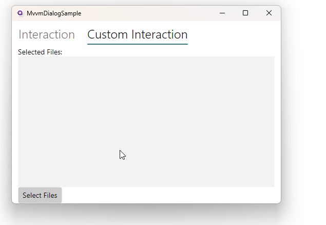
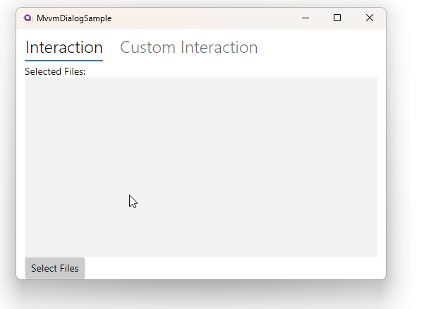

= MVVM Dialog Sample
// --- D O N ' T    T O U C H   T H I S    S E C T I O N ---
:toc:
:toc-placement!:
:tip-caption: :bulb:
:note-caption: :information_source:
:important-caption: :heavy_exclamation_mark:
:caution-caption: :fire:
:warning-caption: :warning:
// ----------------------------------------------------------

// Write a short summary here what this examples does
This example will show you how to use `Interactions` to show https://docs.avaloniaui.net/docs/next/basics/user-interface/file-dialogs[[dialogs\]] in your MVVM application

// --- D O N ' T    T O U C H   T H I S    S E C T I O N ---
toc::[]
// ---------------------------------------------------------

=== Difficulty
// Choose one of the below difficulties. You can just delete the ones you don't need.

🐔 Normal 🐔

=== Buzz-Words

// Write some buzz-words here. You can separate them by ", "
MVVM, Dialog, FileDialogs, TopLevel, Clipboard

== Before we start

We assume you already now how the MVVM pattern works and how dialogs, such as file dialogs, can be shown in general. You should also know what a https://docs.avaloniaui.net/docs/next/concepts/toplevel[[TopLevel\]]-control in Avalonia is and what it can be used for. 

== Solution 1 : Use ReactiveUI-Interactions

In this section you will learn how to use Reactive UI https://www.reactiveui.net/docs/handbook/interactions/[[`Interactions`\]] in order to interact with your `View`.

=== Step 1: Setup the ViewModel 

In our ViewModel we add a property for the `Interaction` which we can use later to interact with the `View`, for example inside a `Command`:

[source,c#]
----
public InteractionViewModel()
{
    _selectFilesInteraction = new Interaction<string?, string[]?>();
}

private readonly Interaction<string?, string[]?> _selectFilesInteraction;

/// 

/// Gets the select files interaction
/// 

public Interaction<string?, string[]?> SelectFilesInteraction => this.selectFilesInteraction;
----

The `Interaction` is a generic class, where the first parameter defines the input (in our case the file dialog title) and the second parameter defines the expected return type (in our case a list of files).

=== Step 2: Prepare the View

We add a `ReactiveUserControl` as your view. This control gives us the ability to register a handler for our interactions. Let's add this handler in the UserControls code behind:

[source,cs]
----
private async Task InteractionHandler(InteractionContext<string?, string[]?> context)
{
    // Get our parent top level control in order to get the needed service (in our sample the storage provider. Can also be the clipboard etc.)
    var topLevel = TopLevel.GetTopLevel(this);

    var storageFiles = await topLevel!.StorageProvider
        .OpenFilePickerAsync(
                    new FilePickerOpenOptions()
                    {
                        AllowMultiple = true,
                        Title = context.Input
                    });
       
    context.SetOutput(storageFiles?.Select(x => x.Name).ToArray());
}
---- 

NOTE: We are using an async Task to not block the UI. As parameter we need to pass an `InteractionContext` which has one generic parameter for the input (in our case a string for the dialog title) and one for the output (in our case an array of selected files). 

In the constructor of our `ReactiveUserControl` we need to setup the interaction inside `this.WhenActivated` like shown below: 

[source,C#]
----
public InteractionView()
{
    InitializeComponent();

    this.WhenActivated(d =>
    {
        d(ViewModel.SelectFilesInteraction.RegisterHandler(this.InteractionHandler));
    });
}
----

Now we can setup the `XAML` as following. Mind the binding of the `Button` to our `Command` in the `ViewModel`:

[source,xml]
----
<UserControl xmlns="https://github.com/avaloniaui"
             xmlns:x="http://schemas.microsoft.com/winfx/2006/xaml"
             xmlns:d="http://schemas.microsoft.com/expression/blend/2008"
             xmlns:mc="http://schemas.openxmlformats.org/markup-compatibility/2006"
             xmlns:vm="using:MvvmDialogSample.ViewModels"
			 mc:Ignorable="d" d:DesignWidth="800" d:DesignHeight="450"
             x:DataType="vm:InteractionViewModel"
			 x:Class="MvvmDialogSample.Views.InteractionView">
	<Grid RowDefinitions="Auto,*,Auto">
		<TextBlock Text="Selected Files:" />
		<ListBox ItemsSource="{Binding SelectedFiles}" Grid.Row="1" />
		<Button Content="Select Files"
				Command="{Binding SelectFilesCommand}"
				Grid.Row="2" />
	</Grid>
</UserControl>
----

=== Step 3: See it in action

Running the App you should be able to select any files on your system.

== Solution 2 : Write your own Interaction-class

If you don't want to use Reactive-UI you can also write your own `Interaction`-class to provide a similar functionality. In this section you will see one possible solution. 

NOTE: We are going to use the https://learn.microsoft.com/en-us/dotnet/communitytoolkit/mvvm/[[CommunityToolkit.Mvvm\]] in this sample, especially their source generators. If you are not familiar with it yet, read the online docs they provide first.

=== Step1: Create the Interaction-class

In our project (or in a class library we use) we add a folder called `Core`. Inside this folder we add a new generic class called `Interaction`, which has basically the below mentioned API.

The class will have two generic parameters:

TInput:: The type of the input we expect
TOutput:: The type of the output we expect

It will implement two interfaces:

ICommand:: This interface helps us to use the interaction like any other command
IDisposable:: This interface helps us to unregister from event listeners

In addition we will add two methods:

IDisposable RegisterHandler(Func<TInput, Task<TOutput>> handler):: This method will be used by the View to register the action to be performed.

Task<TOutput> HandleAsync(TInput input):: This method will be called from the `ViewModel` with a given input and the `View` will return the requested output.

And this is how the final class looks like:

[source,c#]
----
/// 

/// Simple implementation of Interaction pattern from ReactiveUI framework.
/// https://www.reactiveui.net/docs/handbook/interactions/
/// 

public sealed class Interaction<TInput, TOutput> : IDisposable, ICommand
{
    // this is a reference to the registered interaction handler. 
    private Func<TInput, Task<TOutput>>? _handler;

    /// 

    /// Performs the requested interaction <see langword="async"/>. Returns the result provided by the View
    /// 

    /// <param name="input">The input parameter</param>
    /// <returns>The result of the interaction</returns>
    /// <exception cref="InvalidOperationException"></exception>
    public Task<TOutput> HandleAsync(TInput input)
    {
        if (_handler is null)
        {
            throw new InvalidOperationException("Handler wasn't registered");
        }

        return _handler(input);
    }

    /// 

    /// Registers a handler to our Interaction
    /// 

    /// <param name="handler">the handler to register</param>
    /// <returns>a disposable object to clean up memory if not in use anymore/></returns>
    /// <exception cref="InvalidOperationException"></exception>
    public IDisposable RegisterHandler(Func<TInput, Task<TOutput>> handler)
    {
        if (_handler is not null)
        {
            throw new InvalidOperationException("Handler was already registered");
        }

        _handler = handler;
        CanExecuteChanged?.Invoke(this, EventArgs.Empty);
        return this;
    }

    public void Dispose()
    {
        _handler = null;
    }

    public bool CanExecute(object? parameter) => _handler is not null;

    public void Execute(object? parameter) => HandleAsync((TInput?)parameter!);

    public event EventHandler? CanExecuteChanged;
}
----

=== Step 2: Prepare the ViewModel

In our `CustomInteractionViewModel` we need to add a new instance of the `Interaction`. In our sample we want to provide a dialog title (`string`) as the input and we expect a list of selected files (`string[]?`)

[source,c#]
----
/// 

/// Gets an instance of our own Interaction class
/// 

public Interaction<string, string[]?> SelectFilesInteraction { get; } = new Interaction<string, string[]?>();
----

In a next step we add a Command which will call the interaction:

[source,c#]
----
[RelayCommand]
private async Task SelectFilesAsync()
{
    SelectedFiles = await SelectFilesInteraction.HandleAsync("Hello from Avalonia");
}
----

=== Step 3: Prepare the View

Somehow we need to register the `View` to the `Interaction` of the `ViewModel`. In Avalonia we have an event called `OnDataContextChanged` which we can listen to, or, if we are in code behind, simply override it.

[source, c#]
----
// Stores a reference to the disposable in order to clean it up if needed
IDisposable? _selectFilesInteractionDisposable;

protected override void OnDataContextChanged(EventArgs e)
{
    // Dispose any old handler
    _selectFilesInteractionDisposable?.Dispose();

    if (DataContext is CustomInteractionViewModel vm)
    {
        // register the interaction handler
        _selectFilesInteractionDisposable =
            vm.SelectFilesInteraction.RegisterHandler(InteractionHandler);
    }

    base.OnDataContextChanged(e);
}
----

WARNING: Remember that the DataContext can change several times. In order to not get any memory leak, we have to dispose any earlier registration to an older view model

The interaction handler itself is quite simple

[source,c#]
----
private async Task<string[]?> InteractionHandler(string input)
{
    // Get a reference to our TopLevel (in our case the parent Window)
    var topLevel = TopLevel.GetTopLevel(this);

    // Try to get the files
    var storageFiles = await topLevel!.StorageProvider.OpenFilePickerAsync(
                    new FilePickerOpenOptions() 
                    { 
                        AllowMultiple = true, 
                        Title = input
                    });

    // Transform the files as needed and return them. If no file was selected, null will be returned
    return storageFiles?.Select(x => x.Name)?.ToArray();
}
----

=== Step 4: See it in action

Run the App and try to select as many files as you like.

== Related 

There are more ways to show dialogs from the ViewModel, for example: 
  
* link:../DialogManagerSample[DialogManager Service]
* https://github.com/AvaloniaCommunity/awesome-avalonia#mvvm--mvp--mvu[third party libs]

// --------------- Ascii-Doc Cheat-Sheet ------------------

// visit: https://asciidoc.org 
// visit: https://powerman.name/doc/asciidoc-compact

// VS-Code has a great Add-In for Ascii docs: https://github.com/asciidoctor/asciidoctor-vscode/